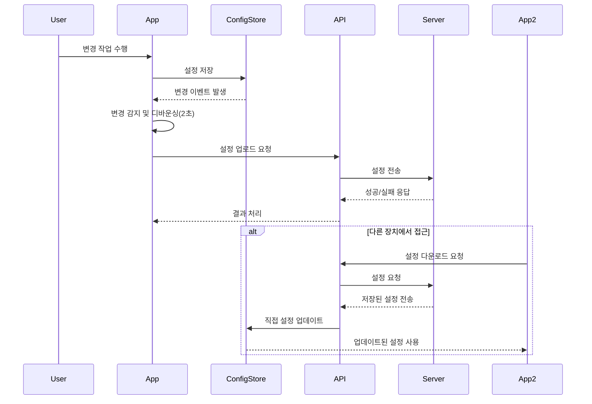

# Toast 앱 아키텍처

이 문서는 Toast 앱의 시스템 아키텍처, 구성 요소 및 데이터 흐름을 설명합니다.

## 목차

- [시스템 개요](#시스템-개요)
- [고수준 아키텍처](#고수준-아키텍처)
- [메인 프로세스 아키텍처](#메인-프로세스-아키텍처)
- [렌더러 프로세스 아키텍처](#렌더러-프로세스-아키텍처)
- [페이지 아키텍처](#페이지-아키텍처)
- [인증 시스템](#인증-시스템)
- [클라우드 동기화 시스템](#클라우드-동기화-시스템)

## 시스템 개요

Toast 앱은 macOS 및 Windows용 사용자 정의 단축키 실행기를 제공하는 Electron 기반 데스크톱 애플리케이션입니다. 이 애플리케이션은 메인 프로세스와 렌더러 프로세스 간의 명확한 관심사 분리와 함께 모듈식 아키텍처를 따릅니다.

## 고수준 아키텍처

Toast 앱은 Electron 프레임워크를 기반으로 하며, 다음 주요 컴포넌트로 구성됩니다:

```
┌─────────────────────────────────────────────────────────────┐
│                       Toast App                             │
│                                                             │
│ ┌─────────────────────────┐     ┌─────────────────────────┐ │
│ │                         │     │                         │ │
│ │    Main Process         │     │   Renderer Process      │ │
│ │                         │     │                         │ │
│ │  ┌─────────────┐        │     │   ┌─────────────────┐   │ │
│ │  │             │        │     │   │                 │   │ │
│ │  │ Core        │        │     │   │ Toast Window    │   │ │
│ │  │ Components  │◄──────┐│     │   │                 │   │ │
│ │  │             │       ││     │   └─────────────────┘   │ │
│ │  └─────────────┘       ││     │                         │ │
│ │                        ││     │   ┌─────────────────┐   │ │
│ │  ┌─────────────┐       ││     │   │                 │   │ │
│ │  │             │       │└─────┼──►│ Settings Window │   │ │
│ │  │ Business    │◄─────┐│      │   │                 │   │ │
│ │  │ Logic       │      ││      │   └─────────────────┘   │ │
│ │  │             │      ││      │                         │ │
│ │  └─────────────┘      ││      └─────────────────────────┘ │
│ │                       ││                                  │
│ │  ┌─────────────┐      ││      ┌─────────────────────────┐ │
│ │  │             │      │└──────┼──►                      │ │
│ │  │ Executors   │◄─────┘       │       Web APIs          │ │
│ │  │             │              │                         │ │
│ │  └─────────────┘              └─────────────────────────┘ │
│ │                                                           │
│ └───────────────────────────────────────────────────────────┘
```

### 주요 컴포넌트

1. **메인 프로세스**: 애플리케이션의 핵심 로직을 담당:
   - 시스템 트레이 통합
   - 창 관리
   - 글로벌 단축키
   - 액션 실행
   - 설정 관리
   - IPC 통신
   - 자동 업데이트

2. **렌더러 프로세스**: UI 레이어를 담당:
   - Toast 창: 빠른 액션 실행을 위한 주요 사용자 인터페이스
   - 설정 창: 애플리케이션 구성을 위한 인터페이스
   - 프리로드 스크립트: 렌더러와 메인 프로세스 간의 안전한 통신 채널

3. **웹 APIs**: 외부 서비스와의 통합:
   - 인증 서비스: 사용자 인증 및 구독 확인
   - 클라우드 동기화: 설정 및 버튼 동기화
   - 사용자 정의 스크립트 실행: JavaScript, AppleScript, PowerShell 등

### 인터프로세스 통신 (IPC)

메인 프로세스와 렌더러 프로세스는 Electron의 IPC 메커니즘을 통해 통신합니다:

1. **렌더러-메인 통신**:
   - `ipcRenderer.invoke` / `ipcMain.handle`: 양방향 요청-응답 패턴
   - `ipcRenderer.send` / `ipcMain.on`: 일방향 알림

2. **메인-렌더러 통신**:
   - `webContents.send` / `ipcRenderer.on`: 메인에서 렌더러로의 알림

### 데이터 흐름

애플리케이션 내 데이터 흐름:

1. **사용자 입력**: 렌더러 프로세스에서 사용자 액션 캡처
2. **액션 요청**: 렌더러가 IPC를 통해 메인 프로세스로 액션 요청 전송
3. **액션 실행**: 메인 프로세스에서 요청된 액션 실행
4. **결과 반환**: 메인 프로세스가 IPC를 통해 렌더러로 결과 반환
5. **상태 업데이트**: 렌더러 프로세스가 UI 업데이트 및 사용자에게 피드백 제공

## 메인 프로세스 아키텍처

메인 프로세스는 다음과 같은 모듈식 컴포넌트로 구성됩니다:

```
┌─────────────────────────────────────────────────────────────┐
│                     Main Process                            │
│                                                             │
│  ┌─────────────┐  ┌─────────────┐  ┌─────────────────────┐  │
│  │             │  │             │  │                     │  │
│  │  Windows    │  │   Config    │  │   Authentication    │  │
│  │  Manager    │  │   Store     │  │   Manager           │  │
│  │             │  │             │  │                     │  │
│  └──────┬──────┘  └──────┬──────┘  └───────────┬─────────┘  │
│         │                │                     │            │
│  ┌──────▼──────┐  ┌──────▼──────┐  ┌───────────▼─────────┐  │
│  │             │  │             │  │                     │  │
│  │    Tray     │  │     IPC     │  │      Cloud Sync     │  │
│  │   Manager   │  │   Handler   │  │      Manager        │  │
│  │             │  │             │  │                     │  │
│  └──────┬──────┘  └──────┬──────┘  └───────────┬─────────┘  │
│         │                │                     │            │
│  ┌──────▼──────┐  ┌──────▼──────┐              │            │
│  │             │  │             │              │            │
│  │  Shortcuts  │  │  Executor   │◄─────────────┘            │
│  │  Manager    │──►             │                           │
│  │             │  │             │                           │
│  └─────────────┘  └──────┬──────┘                           │
│                          │                                  │
│      ┌───────────────────┼───────────────────┐              │
│      │                   │                   │              │
│ ┌────▼─────┐       ┌─────▼─────┐       ┌─────▼─────┐        │
│ │          │       │           │       │           │        │
│ │   Exec   │       │   Open    │       │  Script   │        │
│ │  Action  │       │  Action   │       │  Action   │        │
│ │          │       │           │       │           │        │
│ └──────────┘       └───────────┘       └───────────┘        │
│                                                             │
└─────────────────────────────────────────────────────────────┘
```

### 구성 관리자 (`src/main/config.js`)

사용자 구성 및 설정을 관리하는 모듈:

- **기능**:
  - 설정의 지속적 저장 및 로드
  - 저장된 설정에 대한 CRUD 작업
  - 기본값 관리
  - 구성 변경 사항 감시
  - 설정 마이그레이션
  - 스키마 기반 데이터 검증

- **데이터 구조**:
  - 전역 단축키 (globalHotkey)
  - 페이지 및 버튼 구성
  - 외관 설정 (appearance)
  - 고급 설정 (advanced)
  - 구독 정보 (subscription)
  - 사용자 메타데이터

### 윈도우 관리자 (`src/main/windows.js`)

애플리케이션 창을 관리하는 모듈:

- **기능**:
  - 창 생성, 표시 및 숨기기
  - 창 위치 및 크기 관리
  - 초점 및 블러 이벤트 처리
  - 창 웹 콘텐츠 로드
  - 개발 도구 통합
  - 플랫폼별 창 처리(macOS, Windows, Linux)
  - 전체 화면 모드 지원

- **창 유형**:
  - **Toast 창**: 사용자가 액션을 실행할 수 있는 팝업 창
  - **설정 창**: 애플리케이션 구성을 위한 창

### 트레이 관리자 (`src/main/tray.js`)

시스템 트레이 통합을 관리하는 모듈:

- **기능**:
  - 트레이 아이콘 설정 및 업데이트
  - 컨텍스트 메뉴 구축
  - 플랫폼별 트레이 아이콘 관리
  - 트레이 툴팁 관리
  - 버전 정보 표시
  - 애플리케이션 종료 처리

### 단축키 관리자 (`src/main/shortcuts.js`)

글로벌 단축키 및 키보드 입력을 관리하는 모듈:

- **기능**:
  - 글로벌 단축키 등록 및 해제
  - 단축키 형식 변환 (`convertHotkeyToElectronFormat`)
  - 윈도우 위치 관리 (`positionToastWindow`)
  - 모니터 및 디스플레이 처리
  - 사용자 정의 위치 저장 및 로드

### IPC 핸들러 (`src/main/ipc.js`)

프로세스 간 통신을 관리하는 모듈:

- **기능**:
  - IPC 채널 등록
  - 요청-응답 핸들러
  - 비동기 소통
  - 메시지 직렬화/역직렬화
  - 오류 처리 및 보고
  - 모달 상태 관리
  - 창 속성 제어
  - 구성 관리 (가져오기/내보내기)
  - 인증 처리
  - 클라우드 동기화
  - 자동 업데이트 관리
  - 파일 대화 상자 처리
  - 로깅 핸들러

### 실행기 (`src/main/executor.js`)

액션 실행을 조정하는 모듈:

- **기능**:
  - 액션 유형 디스패치
  - 액션 실행 체인
  - 결과 처리
  - 오류 포착 및 보고
  - 실행 컨텍스트 관리
  - 액션 검증

### 액션 (`src/main/actions/*.js`)

다양한 액션 유형을 구현하는 모듈:

- **액션 유형**:
  - **exec**: 셸 명령 실행
  - **open**: URL 또는 파일 열기
  - **shortcut**: 키보드 단축키 시뮬레이션
  - **script**: 사용자 정의 스크립트 실행
  - **chain**: 여러 액션을 연속적으로 실행
  - **application**: 애플리케이션 관련 액션

## 렌더러 프로세스 아키텍처

렌더러 프로세스는 사용자 인터페이스를 담당하는 다음과 같은 구성 요소로 이루어져 있습니다:

### Toast 윈도우

Toast 윈도우는 사용자가 구성된 버튼을 통해 액션을 실행할 수 있는 기본 인터페이스입니다.

```
┌───────────────────────────────────────────────────────────┐
│                       Toast                              × │
├───────────────────────────────────────────────────────────┤
│ ┌───────────────────────────────────────────────────────┐ │
│ │   1   │   2   │   3   │   +   │   -                   │ │
│ └───────────────────────────────────────────────────────┘ │
│                                                           │
│ ┌─────────┐   ┌─────────┐   ┌─────────┐   ┌─────────┐     │
│ │   📁    │   │   🌐    │   │   ⌨️    │   │   📝    │     │
│ │         │   │         │   │         │   │         │     │
│ │ Files Q │   │Browser W│   │Terminal E│   │ Notes R │     │
│ └─────────┘   └─────────┘   └─────────┘   └─────────┘     │
│                                                           │
│ ┌─────────┐   ┌─────────┐   ┌─────────┐   ┌─────────┐     │
│ │   🔊    │   │   🔍    │   │   🔧    │   │   📸    │     │
│ │         │   │         │   │         │   │         │     │
│ │ Music A │   │Search S │   │Settings D│   │ Capture F│    │
│ └─────────┘   └─────────┘   └─────────┘   └─────────┘     │
│                                                           │
│ 상태: 준비됨                                  설정 ⚙️   │
└───────────────────────────────────────────────────────────┘
```

**구성 요소**:
- 페이지 네비게이션
- 버튼 그리드/목록
- 상태 표시줄
- 설정 토글

### 설정 윈도우

설정 윈도우는 사용자가 애플리케이션을 구성하기 위한 인터페이스를 제공합니다.

```
┌─────────────────────────────────────────────────────────────┐
│                     Toast 설정                              │
├─────────────┬───────────────────────────────────────────────┤
│             │                                               │
│  일반       │  일반 설정                                    │
│             │                                               │
│  버튼       │  전역 단축키: [Alt+Space]  [기록] [지우기]    │
│             │                                               │
│  외관       │  ☑ 로그인 시 시작                             │
│             │                                               │
│  고급       │                                               │
│             │                                               │
├─────────────┴───────────────────────────────────────────────┤
│  [저장]                                      [취소]         │
└─────────────────────────────────────────────────────────────┘
```

**구성 요소**:
- 사이드바 네비게이션
- 각 설정 섹션에 대한 컨텐츠 영역
- 버튼 에디터 대화 상자
- 저장 및 취소 작업

## 페이지 아키텍처

Toast 앱은 사용자에게 페이지라는 개념을 통해 버튼을 구성할 수 있게 합니다.

**페이지 특성**:
- 페이지 이름 및 단축키
- 각 페이지당 최대 15개 버튼
- 계정 상태에 따라 다음과 같이 제한됨
  - 무료 사용자: 1 페이지
  - 인증된 사용자: 최대 3 페이지
  - 프리미엄 구독자: 최대 9 페이지

**버튼 구성**:
- **이름**: 버튼의 표시 이름
- **단축키**: 버튼을 활성화하기 위한 키보드 단축키(단일 문자, Q-Z, A-M)
- **아이콘**: 이모지 또는 커스텀 아이콘
- **액션 유형**: 실행할 액션 유형(exec, open, script, shortcut, chain)
- **액션 매개변수**: 액션 유형에 따른 특정 매개변수

## 인증 시스템

인증 시스템은 Toast 웹 서비스와의 사용자 인증을 관리하고 여러 통합 컴포넌트를 통해 구독 상태를 처리합니다:

```
┌──────────────────────────────────────────────────────────────┐
│                   Authentication System                      │
│                                                              │
│  ┌────────────────┐      ┌────────────────┐                  │
│  │                │      │                │                  │
│  │  Auth Manager  │◄────►│  Auth Module   │                  │
│  │                │      │                │                  │
│  └───────┬────────┘      └────────┬───────┘                  │
│          │                        │                          │
│          ▼                        ▼                          │
│  ┌────────────────┐      ┌────────────────┐                  │
│  │                │      │                │                  │
│  │   User Data    │      │  API Client    │                  │
│  │    Manager     │      │                │                  │
│  │                │      │                │                  │
│  └────────────────┘      └────────────────┘                  │
│                                                              │
└──────────────────────────────────────────────────────────────┘
```

### 인증 컴포넌트

1. **인증 관리자 (`auth-manager.js`)**: 인증 작업의 중앙 코디네이터
   - 창 간에 인증 상태 동기화
   - 로그인/로그아웃 프로세스 관리
   - 토큰 새로고침 조정
   - UI 컴포넌트에 인증 상태 변경 알림

2. **인증 모듈 (`auth.js`)**: 핵심 인증 구현
   - OAuth 2.0 인증 흐름 구현
   - 토큰 안전하게 관리
   - 토큰 유효성 검사 및 새로고침 처리
   - 구독 수준 및 권한 관리
   - 프로토콜 핸들러 등록

3. **사용자 데이터 관리자 (`user-data-manager.js`)**: 사용자 프로필 및 설정 데이터 관리
   - 프로필 및 구독 정보 유지
   - 사용자 설정 동기화 처리
   - 사용자 데이터에 대한 캐시된 액세스 제공

4. **API 클라이언트**: 낮은 수준의 API 통신
   - 인증을 통한 API 요청 처리
   - 자동 토큰 새로고침 관리
   - 재시도 로직 및 오류 처리 구현

### 인증 흐름

1. **로그인 시작**:
   - 사용자가 설정 창에서 로그인 버튼 클릭
   - OAuth 2.0 인증 URL 생성
   - 외부 시스템 브라우저 열림
   - 사용자가 인증 후 Toast 앱으로 리디렉션

2. **토큰 처리**:
   - 브라우저가 인증 코드가 있는 사용자 정의 프로토콜 핸들러로 리디렉션
   - 코드가 액세스 및 새로고침 토큰으로 교환
   - 토큰이 안전하게 저장됨

3. **토큰 관리**:
   - 액세스 토큰은 1시간 후 만료
   - 시스템은 만료 접근 시 사전에 토큰 갱신
   - 새로고침 스로틀링 메커니즘 사용

4. **구독 처리**:
   - 시스템이 프로필 엔드포인트에서 구독 정보 가져오기
   - 구독 수준에 따라 동적으로 활성화되는 기능 플래그
   - 구독 계층 시행(페이지 제한: 계층에 따라 1/3/9 페이지)

## 클라우드 동기화 시스템

클라우드 동기화 시스템은 여러 기기 간에 사용자 설정 및 구성의 동기화를 관리합니다. 이 시스템은 사용자의 페이지, 버튼, 외관 및 고급 설정을 여러 장치에서 일관되게 유지합니다.

```
┌──────────────────────────────────────────────────────────────┐
│                 Cloud Synchronization System                 │
│                                                              │
│  ┌────────────────┐      ┌────────────────┐                  │
│  │                │      │                │                  │
│  │  Cloud Sync    │◄────►│  API Sync      │                  │
│  │  Manager       │      │  Module        │                  │
│  │                │      │                │                  │
│  └───────┬────────┘      └────────┬───────┘                  │
│          │                        │                          │
│          ▼                        ▼                          │
│  ┌────────────────┐      ┌────────────────┐                  │
│  │                │      │                │                  │
│  │     Config     │      │  Auth Manager  │                  │
│  │     Store      │      │                │                  │
│  │                │      │                │                  │
│  └────────────────┘      └────────────────┘                  │
│                                                              │
└──────────────────────────────────────────────────────────────┘
```

### 핵심 원칙 및 데이터 흐름

클라우드 동기화 시스템은 **"단일 진실 소스"** 원칙을 따릅니다:



1. **ConfigStore를 단일 소스로 사용**:
   - 모든 설정 데이터는 `ConfigStore`(electron-store)에서 중앙 관리
   - UI 변경, 서버 동기화 등 모든 데이터 변경은 ConfigStore에 직접 적용
   - 메타데이터만 별도 관리하여 데이터 중복 방지

2. **변경 감지 및 최적화**:
   - 구성 변경 실시간 모니터링
   - 디바운싱 메커니즘으로 빠른 연속 변경 시 불필요한 동기화 방지(기본 2초)
   - 변경 유형 감지 및 메타데이터 추적

3. **동기화 이벤트**:
   - **로그인 후 동기화**: 사용자 로그인 시 자동 동기화
   - **주기적 동기화**: 15분 간격 자동 동기화
   - **설정 변경 시 동기화**: 페이지, 외관, 고급 설정 변경 시 자동 동기화
   - **수동 동기화**: 사용자 요청 시 동기화

### 동기화 컴포넌트

1. **클라우드 동기화 관리자 (`cloud-sync.js`)**:
   - 동기화 프로세스 총괄 조정
   - 재시도 로직 및 오류 처리(최대 3회 재시도)
   - 디바운싱 및 스케줄링
   - 충돌 해결 전략 구현
   - 장치 식별 관리

2. **API 동기화 모듈 (`api/sync.js`)**:
   - 서버 API 통신 처리
   - 인증 토큰 관리 및 갱신
   - 서버 응답 검증 및 데이터 정규화
   - 다양한 구독 형식 지원

3. **구성 저장소 통합**:
   - 변경 이벤트를 감지하여 동기화 트리거
   - 다운로드된 설정을 직접 적용
   - 단일 소스 원칙에 따라 데이터 중복 방지

4. **인증 관리자 연계**:
   - 사용자 권한 및 구독 상태 확인
   - 토큰 관리 및 갱신 처리
   - 인증 상태에 따른 동기화 가능 여부 결정

### 동기화 프로세스 세부사항

1. **변경 감지 및 디바운싱**:
   ```javascript
   // 설정 변경 감지 및 디바운싱
   configStore.onDidChange('pages', async (newValue, oldValue) => {
     // 동기화 상태 확인
     if (!state.enabled || !(await canSync())) {
       return;
     }

     // 변경 유형 감지
     let changeType = detectChangeType(newValue, oldValue);

     // 메타데이터만 업데이트
     updateSyncMetadata();

     // 디바운스를 통한 동기화 예약 (2초 후)
     scheduleSync(changeType);
   });
   ```

2. **업로드 프로세스 및 재시도 로직**:
   - 설정 변경 시 디바운싱 후 업로드 요청
   - 네트워크 오류나 서버 문제 발생 시 최대 3회 재시도
   - 지수 백오프 전략으로 효율적인 재시도 간격 조정

3. **충돌 해결 전략**:
   - 타임스탬프 기반의 "가장 최근 변경 우선" 전략
   - 장치 식별자를 활용한 변경 출처 추적
   - 필요 시 수동으로 서버/로컬 설정 선택 가능

4. **사용자 인터페이스 통합**:
   - 설정 창의 Cloud Sync 탭을 통한 관리
   - 사용자 직접 동기화 액션 지원
   - 동기화 상태 및 오류 시각화

### 보안 및 성능 고려사항

1. **인증 및 데이터 보호**:
   - HTTPS를 통한 암호화된 통신
   - OAuth 2.0 기반 인증 및 토큰 관리
   - 민감한 로컬 설정 필터링

2. **성능 최적화**:
   - 디바운싱을 통한 불필요한 API 호출 감소
   - 부분 업데이트로 네트워크 부하 최소화
   - 백그라운드 처리로 사용자 경험 방해 최소화

자세한 클라우드 동기화 구현 내용은 [클라우드 동기화 문서](docs/CLOUD_SYNC.md)를 참조하세요.
