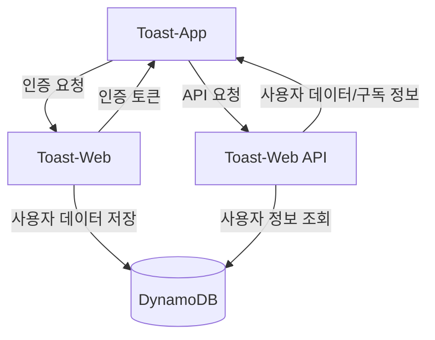
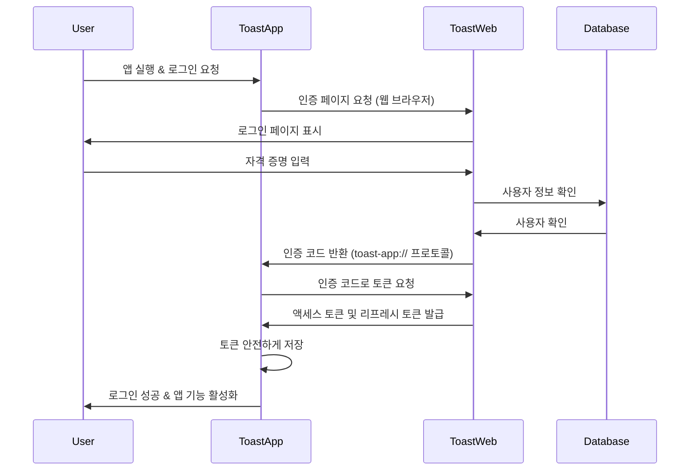

# Toast-App & Toast-Web 연동 가이드

이 문서는 Toast-App(Electron 애플리케이션)과 Toast-Web(Next.js 웹 서비스) 간의 연동 설정 및 구현 방법을 설명합니다.

## 목차

- [개요](#개요)
- [시스템 아키텍처](#시스템-아키텍처)
- [인증 구성](#인증-구성)
- [환경 변수 설정](#환경-변수-설정)
- [프로토콜 핸들러 설정](#프로토콜-핸들러-설정)
- [인증 흐름](#인증-흐름)
- [토큰 관리](#토큰-관리)
- [API 엔드포인트](#api-엔드포인트)
- [구독 정보 활용](#구독-정보-활용)
- [오류 처리](#오류-처리)
- [보안 고려사항](#보안-고려사항)

## 개요

Toast-App은 사용자의 단축키 액션을 수행하는 Electron 데스크톱 애플리케이션이며, Toast-Web은 사용자 인증, 구독 관리 등을 담당하는 Next.js 웹 애플리케이션입니다. 두 시스템은 OAuth 2.0 표준 프로토콜을 통해 안전하게 연동됩니다.

## 시스템 아키텍처



## 인증 구성

Toast-App은 OAuth 2.0 클라이언트로 동작하며, Toast-Web은 OAuth 2.0 서버 역할을 합니다. Toast-App은 Toast-Web에 등록된 클라이언트로, 인증을 위해 클라이언트 ID와 클라이언트 시크릿을 사용합니다.

### 핵심 개념

1. **인증 코드 흐름**: 사용자가 앱에서 로그인하면 시스템 브라우저가 열리고 웹 서비스에서 인증 후 `toast-app://auth` 프로토콜로 인증 코드가 반환됩니다.
2. **토큰 교환**: 인증 코드는 액세스 토큰 및 리프레시 토큰으로 교환됩니다.
3. **자원 접근**: 액세스 토큰을 사용하여 사용자 프로필, 구독 정보 등의 API에 접근합니다.

## 환경 변수 설정

Toast-App은 환경 변수를 통해 클라이언트 ID와 시크릿을 관리합니다. 개발 환경에서는 `.env.local` 파일을 통해 이러한 변수를 설정합니다.

```
# .env.example 파일 예시
CLIENT_ID=
CLIENT_SECRET=
```

1. 프로젝트 루트에 `.env.local` 파일을 생성합니다:

```
# .env.local 파일 예시
CLIENT_ID=your-client-id
CLIENT_SECRET=your-client-secret
```

2. 환경 변수 로드 설정:

```javascript
// src/main/config.js 또는 유사한 파일
const dotenv = require('dotenv');
const path = require('path');

// 개발 환경에서 .env.local 파일 로드
if (process.env.NODE_ENV !== 'production') {
  dotenv.config({ path: path.join(__dirname, '../../.env.local') });
}

// 환경 변수 내보내기
module.exports = {
  CLIENT_ID: process.env.CLIENT_ID || 'toast-app-client',
  CLIENT_SECRET: process.env.CLIENT_SECRET || 'default-secret',
  // 다른 설정들...
};
```

3. 코드에서 환경 변수 사용:

```javascript
const { CLIENT_ID, CLIENT_SECRET } = require('../config');

// 이제 CLIENT_ID와 CLIENT_SECRET을 사용할 수 있습니다
```

## 프로토콜 핸들러 설정

Toast-App은 `toast-app://` 프로토콜을 처리할 수 있도록 설정해야 합니다. 이는 OAuth 인증 후 리디렉션을 처리하기 위해 필요합니다.

```javascript
// app.js 또는 메인 프로세스 파일에서
function registerProtocolHandler() {
  if (process.defaultApp) {
    // 개발 모드에서는 앱 인수에 URL 스킴을 명시적으로 추가
    if (process.argv.length >= 2) {
      app.setAsDefaultProtocolClient('toast-app', process.execPath, [
        path.resolve(process.argv[1])
      ]);
    }
  } else {
    // 프로덕션 빌드에서는 간단하게 등록
    app.setAsDefaultProtocolClient('toast-app');
  }
}

// 앱 준비 이벤트에서 호출
app.on('ready', () => {
  registerProtocolHandler();
  // ...
});
```

### URL 핸들링

프로토콜 요청을 처리하는 이벤트 리스너 등록:

```javascript
// macOS
app.on('open-url', (event, url) => {
  event.preventDefault();
  handleAuthRedirect(url);
});

// Windows
app.on('second-instance', (event, commandLine) => {
  // 대부분의 경우, 마지막 인수가 URL
  const url = commandLine.pop();
  if (url.startsWith('toast-app://')) {
    handleAuthRedirect(url);
  }
});
```

## 인증 흐름

Toast-App과 Toast-Web 간의 인증 흐름은 OAuth 2.0 인증 코드 흐름을 따릅니다.



### 로그인 시작

```javascript
// config.js에서 가져온 클라이언트 ID 사용
const { CLIENT_ID } = require('../config');
const REDIRECT_URI = 'toast-app://auth';

async function initiateLogin() {
  const state = uuidv4(); // CSRF 방지용 상태 값

  // 상태 값을 안전하게 저장 (electron-store 등 사용)
  storeStateParam(state);

  const authUrl = new URL('https://web.toast.sh/api/oauth/authorize');
  authUrl.searchParams.append('response_type', 'code');
  authUrl.searchParams.append('client_id', CLIENT_ID);
  authUrl.searchParams.append('redirect_uri', REDIRECT_URI);
  authUrl.searchParams.append('scope', 'profile subscription');
  authUrl.searchParams.append('state', state);

  await shell.openExternal(authUrl.toString());
  return true;
}
```

### 인증 코드 처리

```javascript
function handleAuthRedirect(url) {
  const urlObj = new URL(url);

  // 인증 코드 추출
  const code = urlObj.searchParams.get('code');
  const state = urlObj.searchParams.get('state');

  // 상태 값 검증 (CSRF 방지)
  if (state !== retrieveStoredState()) {
    // 상태 불일치 - 잠재적 CSRF 공격
    emitLoginFailure('state-mismatch');
    return;
  }

  if (code) {
    // 토큰으로 교환
    exchangeCodeForToken(code).then(result => {
      if (result.success) {
        // 로그인 성공 처리
        emitLoginSuccess();
      } else {
        // 로그인 실패 처리
        emitLoginFailure(result.error);
      }
    });
  } else {
    // 오류 처리
    const error = urlObj.searchParams.get('error');
    emitLoginFailure(error || 'Unknown error');
  }
}
```

### 토큰 교환

```javascript
// config.js에서 클라이언트 ID와 시크릿 가져오기
const { CLIENT_ID, CLIENT_SECRET } = require('../config');

async function exchangeCodeForToken(code) {
  try {
    // 토큰 요청 데이터 준비
    const data = new URLSearchParams();
    data.append('grant_type', 'authorization_code');
    data.append('code', code);
    data.append('client_id', CLIENT_ID);
    data.append('client_secret', CLIENT_SECRET);
    data.append('redirect_uri', 'toast-app://auth');

    // 토큰 요청
    const response = await axios.post('https://web.toast.sh/api/oauth/token', data, {
      headers: {
        'Content-Type': 'application/x-www-form-urlencoded'
      }
    });

    const { access_token, refresh_token } = response.data;

    // 토큰 안전하게 저장
    await storeToken(access_token);
    if (refresh_token) {
      await storeRefreshToken(refresh_token);
    }

    return { success: true };
  } catch (error) {
    return {
      success: false,
      error: error.response?.data?.error || error.message
    };
  }
}
```

## 토큰 관리

Toast-App은 액세스 토큰과 리프레시 토큰을 안전하게 저장해야 합니다. 시스템의 보안 키체인/자격 증명 저장소를 사용하는 것이 권장됩니다.

```javascript
const keytar = require('keytar');

// 토큰 저장
async function storeToken(token) {
  await keytar.setPassword('toast-app', 'auth-token', token);
}

// 리프레시 토큰 저장
async function storeRefreshToken(refreshToken) {
  await keytar.setPassword('toast-app', 'refresh-token', refreshToken);
}

// 토큰 가져오기
async function getStoredToken() {
  return await keytar.getPassword('toast-app', 'auth-token');
}

// 리프레시 토큰 가져오기
async function getStoredRefreshToken() {
  return await keytar.getPassword('toast-app', 'refresh-token');
}

// 토큰 삭제 (로그아웃 시)
async function clearTokens() {
  await keytar.deletePassword('toast-app', 'auth-token');
  await keytar.deletePassword('toast-app', 'refresh-token');
}
```

### 토큰 갱신

```javascript
const { CLIENT_ID, CLIENT_SECRET } = require('../config');

async function refreshAccessToken() {
  try {
    const refreshToken = await getStoredRefreshToken();

    if (!refreshToken) {
      throw new Error('No refresh token available');
    }

    const data = new URLSearchParams();
    data.append('grant_type', 'refresh_token');
    data.append('refresh_token', refreshToken);
    data.append('client_id', CLIENT_ID);
    data.append('client_secret', CLIENT_SECRET);

    const response = await axios.post('https://web.toast.sh/api/oauth/token', data, {
      headers: {
        'Content-Type': 'application/x-www-form-urlencoded'
      }
    });

    const { access_token, refresh_token } = response.data;
    await storeToken(access_token);

    if (refresh_token) {
      await storeRefreshToken(refresh_token);
    }

    return true;
  } catch (error) {
    console.error('Failed to refresh token:', error);
    return false;
  }
}
```

## API 엔드포인트

### Toast-Web API 엔드포인트

| 경로 | 메서드 | 설명 | 필요 파라미터 | 필요 권한 |
|------|--------|------|--------------|-----------|
| `/api/oauth/authorize` | GET | 인증 코드 발급 | response_type, client_id, redirect_uri, scope(선택), state(선택) | 없음 |
| `/api/oauth/token` | POST | 인증 코드를 토큰으로 교환 | grant_type, client_id, client_secret, code, redirect_uri | 없음 |
| `/api/oauth/token` | POST | 리프레시 토큰으로 토큰 갱신 | grant_type, client_id, client_secret, refresh_token | 없음 |
| `/api/oauth/revoke` | POST | 토큰 무효화 (로그아웃) | token, client_id, client_secret | 없음 |
| `/api/users/profile` | GET | 사용자 프로필 정보 조회 | | 인증 필요 |
| `/api/users/subscription` | GET | 구독 정보 조회 | | 인증 필요 |
| `/api/users/settings` | GET/POST | 사용자 설정 조회/수정 | | 인증 필요 |

### API 요청 예시

```javascript
// 인증 헤더 가져오기
async function getAuthHeaders() {
  const token = await getStoredToken();

  if (!token) {
    throw new Error('No authentication token available');
  }

  return {
    'Authorization': `Bearer ${token}`,
    'Content-Type': 'application/json'
  };
}

// 사용자 프로필 정보 가져오기
async function fetchUserProfile() {
  return authenticatedRequest(async () => {
    const headers = await getAuthHeaders();
    const response = await axios.get('https://web.toast.sh/api/users/profile', { headers });
    return response.data;
  });
}
```

### Toast-App에서의 API 엔드포인트 설정

```javascript
// API 엔드포인트 상수
const API_BASE_URL = 'https://web.toast.sh/api';
const OAUTH_AUTHORIZE_URL = 'https://web.toast.sh/api/oauth/authorize';
const OAUTH_TOKEN_URL = `${API_BASE_URL}/oauth/token`;
const OAUTH_REVOKE_URL = `${API_BASE_URL}/oauth/revoke`;
const USER_PROFILE_URL = `${API_BASE_URL}/users/profile`;
const USER_SUBSCRIPTION_URL = `${API_BASE_URL}/users/subscription`;
```

## 구독 정보 활용

### 구독 상태와 제공 기능

| 상태 | 설명 | 제공 기능 | 페이지 수 |
|------|------|-----------|----------|
| `free` | 무료 기본 사용자 | 기본 단축키 기능 | 1개 페이지 |
| `authenticated` | 인증된 사용자 | 기본 기능 + 확장 기능 | 3개 페이지 |
| `premium` | 프리미엄 구독 사용자 | 모든 단축키 기능, 추가 액션 | 9개 페이지 |
| `trial` | 시험 사용 기간 중 | 모든 기능 한시적 이용 가능 | 9개 페이지 |
| `expired` | 구독 만료 | 기본 기능만 사용 가능 | 1개 페이지 |

### 구독 정보에 따른 앱 기능 조정 예시

```javascript
// 구독 정보 조회
async function fetchSubscription() {
  return authenticatedRequest(async () => {
    const headers = await getAuthHeaders();
    const response = await axios.get('https://web.toast.sh/api/users/subscription', { headers });
    return response.data;
  });
}

// 페이지 그룹 설정 업데이트
async function updatePageGroupSettings() {
  try {
    const config = createConfigStore();
    const isAuthenticated = await hasValidToken();

    // 기본값 설정: 인증되지 않은 사용자는 1개 페이지
    let pageGroups = 1;
    let isSubscribed = false;
    let subscribedUntil = '';

    // 인증된 사용자인 경우
    if (isAuthenticated) {
      // 인증된 상태 설정 (최소 3개 페이지)
      pageGroups = 3;

      try {
        // 구독 정보 가져오기
        const subscription = await fetchSubscription();

        // 구독 활성화 여부 확인
        if (subscription && subscription.active) {
          isSubscribed = true;
          subscribedUntil = subscription.expiresAt || '';
          pageGroups = 9; // 구독자는 9개 페이지
        }
      } catch (error) {
        console.error('Error fetching subscription info:', error);
        // 오류 발생 시 인증된 사용자 기본값 유지
      }
    }

    // 구성 파일 업데이트
    config.set('subscription', {
      isAuthenticated,
      isSubscribed,
      subscribedUntil,
      pageGroups
    });

    return {
      success: true,
      isAuthenticated,
      isSubscribed,
      subscribedUntil,
      pageGroups
    };
  } catch (error) {
    console.error('Failed to update page group settings:', error);
    return {
      success: false,
      error: error.message || 'Unknown error updating page group settings'
    };
  }
}
```

## 오류 처리

인증 및 API 통신 시 발생할 수 있는 오류에 대한 처리:

```javascript
// 인증이 필요한 API 호출을 처리하는 헬퍼 함수
async function authenticatedRequest(apiCall) {
  try {
    return await apiCall();
  } catch (error) {
    // 401 오류는 토큰 만료를 의미
    if (error.response && error.response.status === 401) {
      // 토큰 갱신 시도
      const refreshed = await refreshAccessToken();

      if (refreshed) {
        // 갱신된 토큰으로 재시도
        return await apiCall();
      } else {
        // 토큰 갱신 실패 - 사용자 재로그인 필요
        emitAuthError('session_expired');
        throw new Error('Authentication required');
      }
    }

    // 403 오류는 권한 부족을 의미
    if (error.response && error.response.status === 403) {
      emitAuthError('permission_denied');
    }

    throw error;
  }
}

// 인증 오류 이벤트 발생
function emitAuthError(type) {
  // 앱에서 구현한 이벤트 시스템에 오류 알림
  eventEmitter.emit('auth:error', { type });
}
```

## 보안 고려사항

1. **클라이언트 시크릿 보호**:
   - 클라이언트 시크릿은 소스 코드에 포함해서는 안됩니다.
   - 개발 환경에서는 `.env.local` 파일을 사용하고, 이 파일은 버전 관리에서 제외해야 합니다.
   - 프로덕션 빌드에서는 환경 변수나 빌드 프로세스를 통해 안전하게 주입해야 합니다.

2. **토큰 저장**:
   - 토큰은 항상 시스템의 안전한 저장소(keytar 등)를 사용하여 저장해야 합니다.
   - 메모리에 토큰을 캐시하는 경우, 앱 종료 시 메모리에서 안전하게 제거해야 합니다.

3. **CSRF 방지**:
   - OAuth 인증 요청 시 항상 고유한 `state` 파라미터를 포함하고, 인증 응답에서 이를 검증해야 합니다.

4. **토큰 무효화**:
   - 로그아웃 시 항상 서버에 토큰 무효화 요청을 보내고, 로컬 토큰도 삭제해야 합니다.

```javascript
const { CLIENT_ID, CLIENT_SECRET } = require('../config');

async function logout() {
  try {
    const token = await getStoredToken();

    if (token) {
      // 토큰 무효화 요청
      const data = new URLSearchParams();
      data.append('token', token);
      data.append('client_id', CLIENT_ID);
      data.append('client_secret', CLIENT_SECRET);

      await axios.post('https://web.toast.sh/api/oauth/revoke', data, {
        headers: {
          'Content-Type': 'application/x-www-form-urlencoded'
        }
      });
    }

    // 로컬 토큰 삭제
    await clearTokens();
    return true;
  } catch (error) {
    console.error('Logout error:', error);
    // 오류가 발생해도 로컬 토큰은 삭제
    await clearTokens();
    return false;
  }
}
