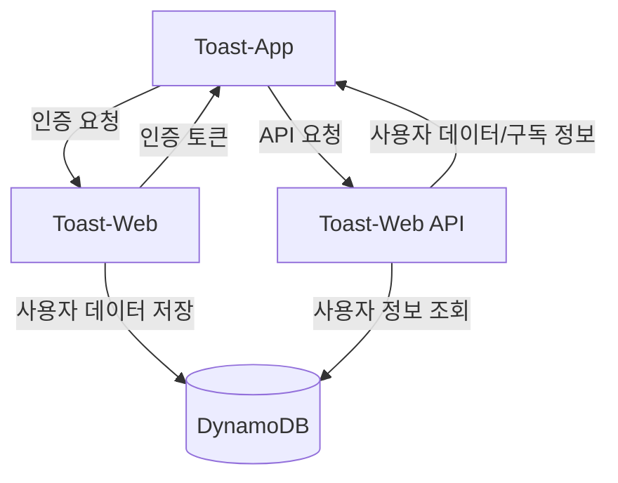
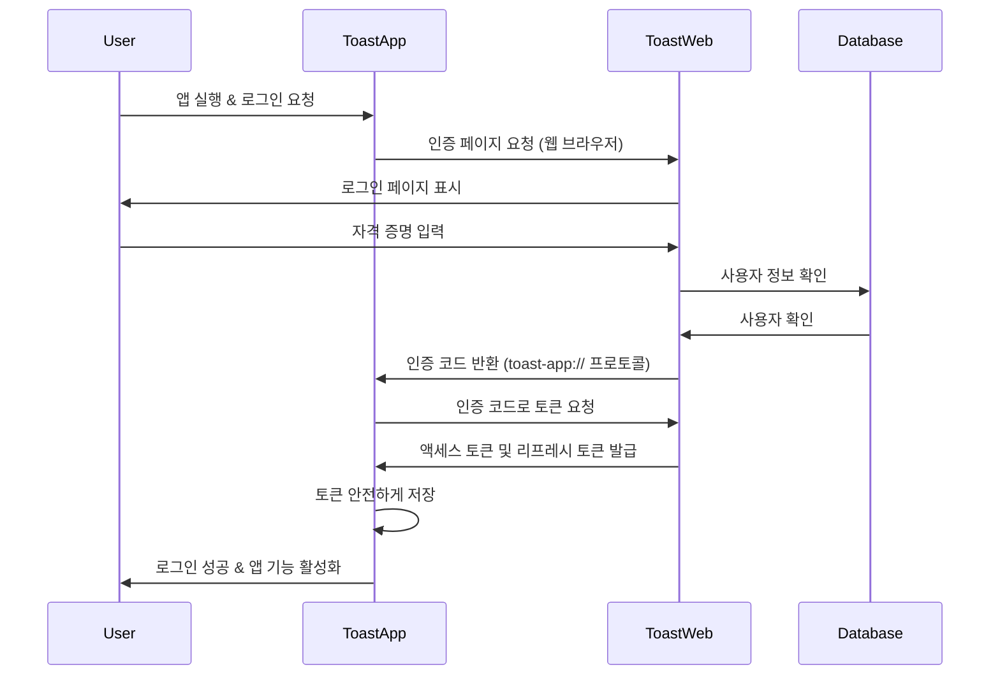
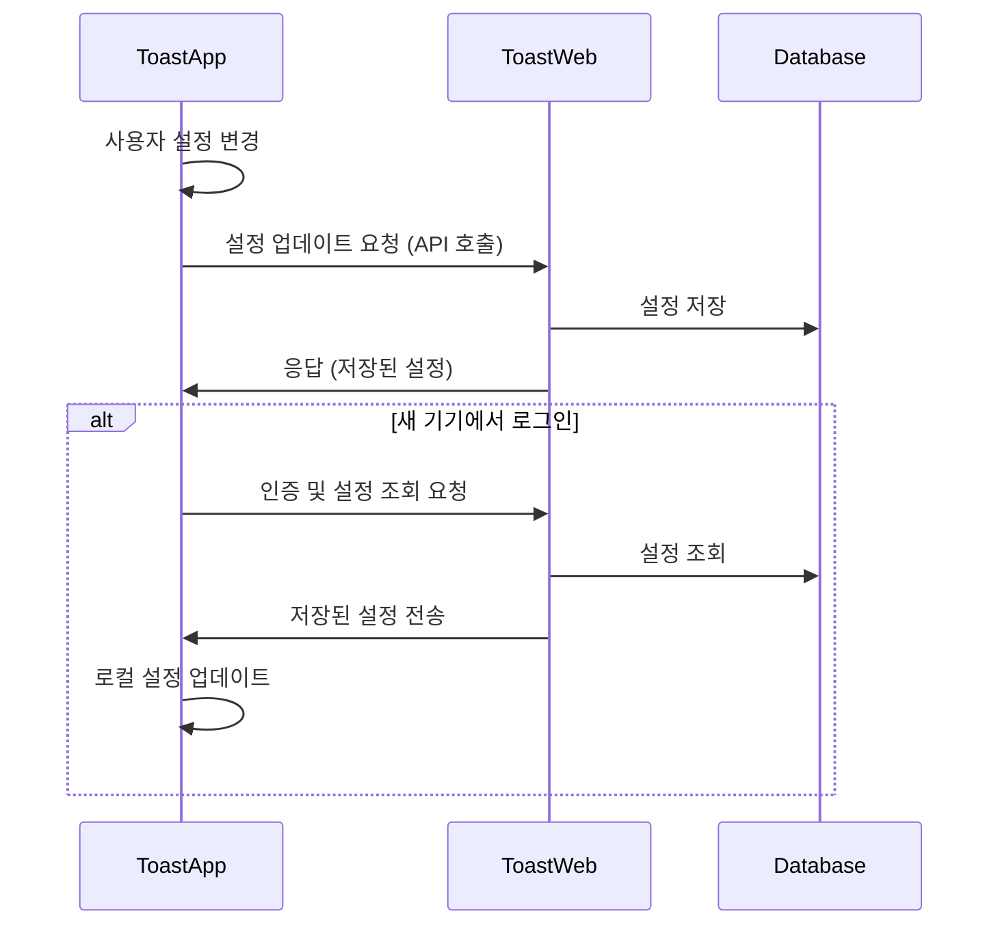
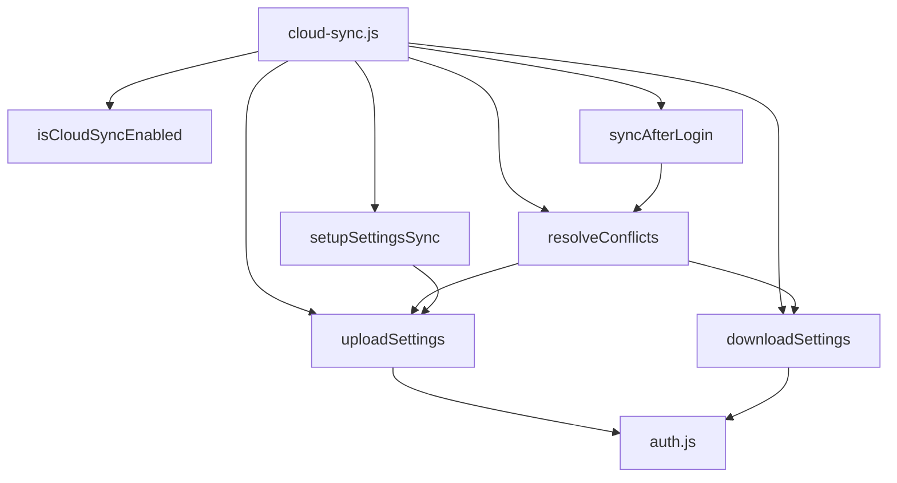

# Toast-App & Toast-Web 연동 가이드

이 문서는 Toast-App(Electron 앱)과 Toast-Web(Next.js 웹 서비스) 간의 연동 설정 및 구현 방법을 상세히 설명합니다.

## 목차

- [개요](#개요)
- [시스템 아키텍처](#시스템-아키텍처)
- [OAuth 2.0 인증 프로토콜](#oauth-20-인증-프로토콜)
- [환경 변수 설정](#환경-변수-설정)
- [프로토콜 핸들러 설정](#프로토콜-핸들러-설정)
- [인증 흐름](#인증-흐름)
- [토큰 관리](#토큰-관리)
- [API 엔드포인트](#api-엔드포인트)
- [사용자 및 구독 정보 API](#사용자-및-구독-정보-api)
- [구독 정보 활용](#구독-정보-활용)
- [오류 처리](#오류-처리)
- [보안 고려사항](#보안-고려사항)
- [변경 내역](#변경-내역)

## 개요

Toast-App은 사용자의 단축키 액션을 수행하는 Electron 데스크톱 애플리케이션이며, Toast-Web은 사용자 인증, 구독 관리 등을 담당하는 Next.js 웹 애플리케이션입니다. 두 시스템은 OAuth 2.0 표준 프로토콜을 통해 안전하게 연동됩니다.

Toast-App은 다음과 같은 기능을 위해 Toast-Web과 통신합니다:
- 사용자 인증 (로그인/로그아웃)
- 구독 상태 확인 및 동기화
- 사용자 프로필 정보 접근

## 시스템 아키텍처



## OAuth 2.0 인증 프로토콜

OAuth 2.0은 사용자 인증 및 권한 부여를 위한 업계 표준 프로토콜로 다음과 같은 이유로 선택되었습니다:

- 안전한 토큰 기반 인증 제공
- 제3자 애플리케이션에 대한 제한된 접근 권한 부여
- 사용자의 자격 증명(비밀번호 등)을 애플리케이션에 직접 노출하지 않음
- 다양한 클라이언트 애플리케이션(데스크톱, 모바일, 웹)에서 일관된 인증 경험 제공

### 핵심 개념

1. **인증 코드 흐름**: 사용자가 앱에서 로그인하면 시스템 브라우저가 열리고, 웹 서비스에서 인증 후 `toast-app://auth` 프로토콜로 인증 코드가 반환됩니다.
2. **토큰 교환**: 인증 코드는 액세스 토큰 및 리프레시 토큰으로 교환됩니다.
3. **자원 접근**: 액세스 토큰을 사용하여 사용자 프로필, 구독 정보 등의 API에 접근합니다.

### 인증 흐름 (Authorization Code Flow)

Toast-App은 OAuth 2.0의 Authorization Code Flow를 사용합니다:

1. 사용자가 설정 페이지에서 "로그인" 버튼을 클릭합니다.
2. Toast-App은 시스템 기본 브라우저를 열어 웹 서비스의 인증 페이지(https://web.toast.sh/api/oauth/authorize)로 리디렉션합니다.
3. 사용자는 웹 서비스에서 로그인하고 Toast-App에 대한 접근 권한을 승인합니다.
4. 웹 서비스는 사용자를 커스텀 URI 스킴(toast-app://auth)으로 리디렉션하고 인증 코드를 전달합니다.
5. Toast-App은 이 URI를 인터셉트하여 인증 코드를 획득합니다.
6. Toast-App은 획득한 인증 코드와 클라이언트 비밀키를 사용하여 웹 서비스의 토큰 엔드포인트에 접근 토큰을 요청합니다.
7. 웹 서비스는 유효한 인증 코드에 대한 접근 토큰(access token)과 갱신 토큰(refresh token)을 발급합니다.
8. Toast-App은 이 토큰을 안전하게 저장하고 API 요청 시 사용합니다.

## 환경 변수 설정

Toast-App은 환경 변수를 통해 클라이언트 ID와 시크릿을 관리합니다. 개발 환경에서는 `.env.local` 파일을 통해 이러한 변수를 설정합니다.

```bash
# .env.example 파일 예시
CLIENT_ID=
CLIENT_SECRET=
TOAST_URL=https://web.toast.sh
```

1. 프로젝트 루트에 `.env.local` 파일을 생성합니다:

```bash
# .env.local 파일 예시
CLIENT_ID=your-client-id
CLIENT_SECRET=your-client-secret
TOAST_URL=https://web.toast.sh
```

2. 환경 변수 로드 설정:

```javascript
// src/main/config/env.js
const dotenv = require('dotenv');
const path = require('path');

// 개발 환경에서 .env.local 파일 로드
if (process.env.NODE_ENV !== 'production') {
  dotenv.config({ path: path.join(__dirname, '../../../.env.local') });
}

/**
 * 환경 변수를 가져오는 함수
 * @param {string} key - 환경 변수 키
 * @param {string} defaultValue - 기본값
 * @returns {string} 환경 변수 값 또는 기본값
 */
function getEnv(key, defaultValue = '') {
  return process.env[key] || defaultValue;
}

module.exports = {
  getEnv
};
```

3. 코드에서 환경 변수 사용:

```javascript
const { getEnv } = require('./config/env');
const CLIENT_ID = getEnv('CLIENT_ID', 'toast-app-client');
const CLIENT_SECRET = getEnv('CLIENT_SECRET', 'default-secret');
```

## 프로토콜 핸들러 설정

Toast-App은 `toast-app://` 프로토콜을 처리할 수 있도록 설정해야 합니다. 이는 OAuth 인증 후 리디렉션을 처리하기 위해 필요합니다.

```javascript
// src/main/auth.js 또는 유사한 파일에서
function registerProtocolHandler() {
  if (process.platform === 'darwin' || process.platform === 'win32') {
    if (process.defaultApp) {
      // 개발 모드에서는 앱 인수에 URL 스킴을 명시적으로 추가
      if (process.argv.length >= 2) {
        app.setAsDefaultProtocolClient('toast-app', process.execPath, [
          path.resolve(process.argv[1])
        ]);
      }
    } else {
      // 프로덕션 빌드에서는 간단하게 등록
      app.setAsDefaultProtocolClient('toast-app');
    }
  }
}

// 앱 준비 이벤트에서 호출
app.on('ready', () => {
  registerProtocolHandler();
  // ...
});
```

### URL 핸들링

프로토콜 요청을 처리하는 이벤트 리스너 등록:

```javascript
// macOS
app.on('open-url', (event, url) => {
  event.preventDefault();
  handleAuthRedirect(url);
});

// Windows
app.on('second-instance', (event, commandLine) => {
  // 대부분의 경우 마지막 인수가 URL
  const url = commandLine.pop();
  if (url.startsWith('toast-app://')) {
    handleAuthRedirect(url);
  }
});
```

## 인증 흐름

Toast-App과 Toast-Web 간의 인증 흐름은 OAuth 2.0 인증 코드 흐름을 따릅니다.



### 로그인 시작

```javascript
const { v4: uuidv4 } = require('uuid');
const { URL } = require('url');
const { shell } = require('electron');

async function initiateLogin() {
  try {
    // 상태 값은 CSRF 공격 방지를 위해 사용됨
    const state = uuidv4();

    // 상태 값 저장
    storeStateParam(state);

    // 인증 URL 구성
    const authUrl = new URL(`${TOAST_URL}/api/oauth/authorize`);
    authUrl.searchParams.append('response_type', 'code');
    authUrl.searchParams.append('client_id', CLIENT_ID);
    authUrl.searchParams.append('redirect_uri', REDIRECT_URI);
    authUrl.searchParams.append('scope', 'profile subscription');
    authUrl.searchParams.append('state', state);

    // 기본 브라우저에서 인증 페이지 열기
    await shell.openExternal(authUrl.toString());

    return true;
  } catch (error) {
    console.error('Failed to initiate login:', error);
    throw error;
  }
}
```

### 인증 코드 처리

```javascript
async function handleAuthRedirect(url) {
  try {
    console.log('Processing auth redirect:', url);
    const urlObj = new URL(url);

    // 인증 코드 추출
    const code = urlObj.searchParams.get('code');
    const state = urlObj.searchParams.get('state');
    const error = urlObj.searchParams.get('error');

    // 오류 파라미터가 있는 경우
    if (error) {
      console.error('Auth error from server:', error);
      return {
        success: false,
        error: error || 'Unknown error'
      };
    }

    // 코드가 없는 경우
    if (!code) {
      console.error('No auth code in redirect URL');
      return {
        success: false,
        error: 'Missing authorization code'
      };
    }

    // 상태 값 검증 (CSRF 방지)
    const storedState = retrieveStoredState();
    if (!storedState || state !== storedState) {
      console.error('State mismatch. Possible CSRF attack');
      return {
        success: false,
        error: 'state_mismatch',
        message: 'State parameter mismatch. Security validation failed.'
      };
    }

    // 토큰으로 교환
    const result = await exchangeCodeForTokenAndUpdateSubscription(code);
    return result;
  } catch (error) {
    console.error('Failed to handle auth redirect:', error);
    return {
      success: false,
      error: error.message || 'Unknown error'
    };
  }
}
```

### 토큰 교환

```javascript
const axios = require('axios');

async function exchangeCodeForToken(code) {
  try {
    console.log('인증 코드를 토큰으로 교환 시작:', code.substring(0, 8) + '...');

    // 토큰 요청 데이터 준비
    const data = new URLSearchParams();
    data.append('grant_type', 'authorization_code');
    data.append('code', code);
    data.append('client_id', CLIENT_ID);
    data.append('client_secret', CLIENT_SECRET);
    data.append('redirect_uri', REDIRECT_URI);

    // 토큰 요청
    const response = await axios.post(OAUTH_TOKEN_URL, data, {
      headers: {
        'Content-Type': 'application/x-www-form-urlencoded'
      }
    });

    const { access_token, refresh_token, expires_in } = response.data;

    // 토큰 저장
    if (!access_token) {
      console.error('서버에서 액세스 토큰을 반환하지 않음!');
      return {
        success: false,
        error: 'No access token returned from server'
      };
    }

    // 메모리와 안전한 저장소에 토큰 저장
    await storeToken(access_token);
    if (refresh_token) {
      await storeRefreshToken(refresh_token);
    }

    return {
      success: true,
      access_token,
      refresh_token,
      expires_in
    };
  } catch (error) {
    console.error('토큰 교환 중 오류 발생:', error);
    return {
      success: false,
      error: error.response?.data?.error || error.message
    };
  }
}
```

## 토큰 관리

Toast-App은 액세스 토큰과 리프레시 토큰을 안전하게 저장해야 합니다. 시스템의 보안 키체인/자격 증명 저장소를 사용하는 것이 권장됩니다.

```javascript
const keytar = require('keytar');

// 보안 상수
const AUTH_SERVICE_NAME = 'toast-app';
const TOKEN_KEY = 'auth-token';
const REFRESH_TOKEN_KEY = 'refresh-token';

// 토큰 저장소 (메모리)
let currentToken = null;
let currentRefreshToken = null;

// 토큰 저장
async function storeToken(token) {
  try {
    currentToken = token;
    await keytar.setPassword(AUTH_SERVICE_NAME, TOKEN_KEY, token);
  } catch (error) {
    console.error('Failed to store token in secure storage:', error);
    throw error;
  }
}

// 리프레시 토큰 저장
async function storeRefreshToken(refreshToken) {
  try {
    currentRefreshToken = refreshToken;
    await keytar.setPassword(AUTH_SERVICE_NAME, REFRESH_TOKEN_KEY, refreshToken);
  } catch (error) {
    console.error('Failed to store refresh token in secure storage:', error);
    throw error;
  }
}

// 토큰 가져오기
async function getStoredToken() {
  try {
    return await keytar.getPassword(AUTH_SERVICE_NAME, TOKEN_KEY);
  } catch (error) {
    console.error('Failed to get token from secure storage:', error);
    return null;
  }
}

// 리프레시 토큰 가져오기
async function getStoredRefreshToken() {
  try {
    return await keytar.getPassword(AUTH_SERVICE_NAME, REFRESH_TOKEN_KEY);
  } catch (error) {
    console.error('Failed to get refresh token from secure storage:', error);
    return null;
  }
}

// 토큰 삭제 (로그아웃 시)
async function clearTokens() {
  try {
    currentToken = null;
    currentRefreshToken = null;
    await keytar.deletePassword(AUTH_SERVICE_NAME, TOKEN_KEY);
    await keytar.deletePassword(AUTH_SERVICE_NAME, REFRESH_TOKEN_KEY);
  } catch (error) {
    console.error('Failed to clear tokens from secure storage:', error);
    throw error;
  }
}
```

### 토큰 갱신

```javascript
async function refreshAccessToken() {
  try {
    // 리프레시 토큰 가져오기
    const refreshToken = currentRefreshToken || await getStoredRefreshToken();

    if (!refreshToken) {
      throw new Error('No refresh token available');
    }

    // 토큰 갱신 요청 데이터 준비
    const data = new URLSearchParams();
    data.append('grant_type', 'refresh_token');
    data.append('refresh_token', refreshToken);
    data.append('client_id', CLIENT_ID);
    data.append('client_secret', CLIENT_SECRET);

    // 토큰 갱신 요청
    const response = await axios.post(OAUTH_TOKEN_URL, data, {
      headers: {
        'Content-Type': 'application/x-www-form-urlencoded'
      }
    });

    const { access_token, refresh_token } = response.data;

    if (!access_token) {
      throw new Error('No access token in response');
    }

    // 새 토큰 저장
    await storeToken(access_token);
    if (refresh_token) {
      await storeRefreshToken(refresh_token);
    }

    return { success: true };
  } catch (error) {
    console.error('Failed to refresh token:', error);
    return {
      success: false,
      error: error.message
    };
  }
}
```

## API 엔드포인트

### 기본 URL
```
https://web.toast.sh/api
```

### 인증 관련 엔드포인트

| 엔드포인트 | 메서드 | 설명 |
|------------|--------|------|
| `/oauth/authorize` | GET | 사용자 인증 및 앱 승인을 위한 웹 페이지 |
| `/oauth/token` | POST | 액세스 토큰 및 리프레시 토큰 발급/갱신 |
| `/oauth/revoke` | POST | 토큰 무효화(로그아웃) |

### 사용자 및 구독 관련 엔드포인트

| 엔드포인트 | 메서드 | 설명 |
|------------|--------|------|
| `/users/profile` | GET | 사용자 프로필 정보 조회 |
| `/users/subscription` | GET | 현재 구독 상태 및 정보 조회 |
| `/users/settings` | GET/POST | 사용자 설정 조회/수정 |

### 인증 요청 매개변수

#### 인증 요청 (`/oauth/authorize`)

```
https://web.toast.sh/api/oauth/authorize?
  response_type=code&
  client_id=YOUR_CLIENT_ID&
  redirect_uri=toast-app://auth&
  scope=profile subscription&
  state=RANDOM_STATE_STRING
```

| 매개변수 | 설명 |
|----------|------|
| `response_type` | `code`로 고정 (인증 코드 흐름 사용) |
| `client_id` | Toast App의 클라이언트 ID |
| `redirect_uri` | 인증 후 리디렉션할 URI (toast-app://auth) |
| `scope` | 요청 권한 범위 (profile: 사용자 정보, subscription: 구독 정보) |
| `state` | CSRF 공격 방지를 위한 임의의 문자열. 콜백에서 검증해야 함 |

#### 토큰 요청 (`/oauth/token`)

```http
POST /api/oauth/token HTTP/1.1
Host: web.toast.sh
Content-Type: application/x-www-form-urlencoded

grant_type=authorization_code&
code=AUTHORIZATION_CODE&
client_id=YOUR_CLIENT_ID&
client_secret=YOUR_CLIENT_SECRET&
redirect_uri=toast-app://auth
```

| 매개변수 | 설명 |
|----------|------|
| `grant_type` | `authorization_code` (인증 코드 교환) 또는 `refresh_token` (토큰 갱신) |
| `code` | 이전 단계에서 받은 인증 코드 (grant_type이 authorization_code인 경우) |
| `refresh_token` | 이전에 받은 리프레시 토큰 (grant_type이 refresh_token인 경우) |
| `client_id` | Toast App의 클라이언트 ID |
| `client_secret` | Toast App의 클라이언트 비밀키 |
| `redirect_uri` | 인증 단계에서 사용한 것과 동일한 리디렉션 URI |

### 토큰 응답

```json
{
  "access_token": "eyJhbGciOiJIUzI1NiIsInR5cCI6IkpXVCJ9...",
  "token_type": "Bearer",
  "expires_in": 3600,
  "refresh_token": "eyJhbGciOiJIUzI1NiIsInR5cCI6IkpXVCJ9...",
  "scope": "profile subscription"
}
```

| 필드 | 설명 |
|------|------|
| `access_token` | API 요청에 사용할 액세스 토큰 |
| `token_type` | 토큰 타입 ("Bearer") |
| `expires_in` | 액세스 토큰 만료 시간(초) |
| `refresh_token` | 새 액세스 토큰을 얻기 위한 리프레시 토큰 |
| `scope` | 부여된 권한 범위 |

## 사용자 및 구독 정보 API

### API 요청 헤더 설정

```javascript
async function getAuthHeaders() {
  // 현재 토큰이 없으면 저장소에서 가져오기
  if (!currentToken) {
    currentToken = await getStoredToken();
  }

  if (!currentToken) {
    throw new Error('No authentication token available');
  }

  return {
    'Authorization': `Bearer ${currentToken}`,
    'Content-Type': 'application/json'
  };
}
```

### 사용자 프로필 조회

```http
GET /api/users/profile HTTP/1.1
Host: web.toast.sh
Authorization: Bearer ACCESS_TOKEN
```

#### 응답

```json
{
  "id": "user123",
  "email": "user@example.com",
  "name": "홍길동",
  "created_at": "2024-01-15T09:30:45Z",
  "avatar_url": "https://web.toast.sh/avatars/user123.jpg"
}
```

### 구독 정보 조회

```http
GET /api/users/subscription HTTP/1.1
Host: web.toast.sh
Authorization: Bearer ACCESS_TOKEN
```

#### 응답 (표준화된 형식)

```json
{
  "id": "sub_premium_12345",
  "userId": "user123",
  "plan": "premium",
  "status": "active",
  "active": true,
  "is_subscribed": true,
  "features": {
    "page_groups": 9,
    "advanced_actions": true,
    "cloud_sync": true
  },
  "features_array": [
    "premium_shortcuts",
    "advanced_actions",
    "cloud_sync"
  ],
  "created_at": "2024-02-01T00:00:00Z",
  "updated_at": "2024-03-15T00:00:00Z",
  "expiresAt": "2025-12-31T23:59:59Z",
  "subscribed_until": "2025-12-31T23:59:59Z",
  "isVip": false
}
```

| 필드 | 설명 | 호환성 노트 |
|------|------|------------|
| `is_subscribed` | 구독 여부 (true/false) | 기본 필드 |
| `active` | 구독 활성화 상태 (true/false) | is_subscribed와 동일 |
| `plan` | 구독 계획 (free, premium, trial 등) | |
| `subscribed_until` | 구독 만료일 (ISO8601 형식) | 기본 필드 |
| `expiresAt` | 구독 만료일 (동일 정보) | subscribed_until과 동일 |
| `features` | 활성화된 기능 (객체) | 기능별 true/false 값과 page_groups 수치 포함 |
| `features_array` | 활성화된 기능 (배열) | features와 동일 정보의 배열 형식 |
| `status` | 구독 상태 (active, inactive 등) | |
| `isVip` | VIP 사용자 여부 | 특별 접근 권한을 가진 사용자 |

## 구독 정보 활용

### 구독 상태와 제공 기능

| 사용자 유형 | 설명 | 제공 기능 | 페이지 수 |
|------------|------|-----------|----------|
| 인증되지 않은 사용자 | 로그인하지 않은 상태 | 기본 단축키 기능만 제공 | 1개 페이지 |
| 인증된 사용자 | 로그인한 기본 사용자 | 기본 기능 + 표준 액션 | 3개 페이지 |
| 구독 사용자 | 프리미엄/프로 구독자 | 모든 단축키 기능, 추가 액션 | 9개 페이지 |
| VIP 사용자 | 특별 접근 권한 보유자 | 구독자와 동일한 모든 기능 | 9개 페이지 |

### 구독 정보 조회 및 처리

```javascript
async function fetchSubscription() {
  // 기본 구독 정보 (인증 실패나 오류 발생 시 사용)
  const defaultSubscription = {
    id: 'sub_free_anonymous',
    userId: 'anonymous',
    plan: 'free',
    status: 'active',
    active: false,
    is_subscribed: false,
    features: {
      page_groups: PAGE_GROUPS.ANONYMOUS
    },
    features_array: ['basic_shortcuts'],
    created_at: new Date().toISOString(),
    updated_at: new Date().toISOString(),
    expiresAt: null,
    subscribed_until: null,
    isVip: false
  };

  const options = {
    allowUnauthenticated: true,
    defaultValue: defaultSubscription,
    isSubscriptionRequest: true
  };

  return authenticatedRequest(async () => {
    try {
      const headers = await getAuthHeaders();
      const response = await axios.get(USER_SUBSCRIPTION_URL, { headers });

      // API 응답 형식이 apiSuccess({ ... }) 형태인 경우 data 필드 추출
      let subscriptionData;
      if (response.data && response.data.success === true && response.data.data) {
        subscriptionData = response.data.data;
      } else {
        subscriptionData = response.data;
      }

      // 구독 데이터 검증 및 필드 호환성 보장
      const normalizedSubscription = {
        ...defaultSubscription,
        ...subscriptionData,
        // 활성 여부 필드 동기화 (is_subscribed 또는 active)
        active: subscriptionData.active || subscriptionData.is_subscribed || false,
        is_subscribed: subscriptionData.is_subscribed || subscriptionData.active || false,
        // 만료일 필드 동기화 (expiresAt 또는 subscribed_until)
        expiresAt: subscriptionData.expiresAt || subscriptionData.subscribed_until || null,
        subscribed_until: subscriptionData.subscribed_until || subscriptionData.expiresAt || null
      };

      // features 객체가 없으면 기본값 사용
      if (!normalizedSubscription.features) {
        normalizedSubscription.features = defaultSubscription.features;
      }

      // features_array 필드가 없으면 기본값 사용
      if (!normalizedSubscription.features_array) {
        normalizedSubscription.features_array = defaultSubscription.features_array;
      }

      return normalizedSubscription;
    } catch (error) {
      console.error('구독 정보 조회 중 오류 발생:', error);
      return defaultSubscription;
    }
  }, options);
}
```

### 구독 정보 업데이트

```javascript
async function updatePageGroupSettings(subscription) {
  try {
    const config = createConfigStore();

    // 활성 상태 및 구독 여부 확인
    const isActive = subscription.active || subscription.is_subscribed || false;
    const isVip = subscription.isVip || false;

    // 페이지 그룹 수 계산 (사용자 유형에 따라 다름)
    let pageGroups = PAGE_GROUPS.ANONYMOUS; // 기본값: 1

    if (isActive || isVip) {
      if (subscription.plan === 'premium' || subscription.plan === 'pro' || isVip) {
        pageGroups = PAGE_GROUPS.PREMIUM; // 프리미엄/VIP: 9
      } else {
        pageGroups = PAGE_GROUPS.AUTHENTICATED; // 인증된 사용자: 3
      }
    } else if (subscription.userId && subscription.userId !== 'anonymous') {
      // 비활성 사용자지만 로그인은 된 경우
      pageGroups = PAGE_GROUPS.AUTHENTICATED; // 3
    }

    // subscribedUntil 값이 항상 문자열인지 확인
    let subscribedUntilStr = '';
    if (subscription.subscribed_until) {
      subscribedUntilStr = String(subscription.subscribed_until);
    } else if (subscription.expiresAt) {
      subscribedUntilStr = String(subscription.expiresAt);
    }

    // 구독 정보 저장
    config.set('subscription', {
      isAuthenticated: true,
      isSubscribed: isActive,
      plan: subscription.plan || 'free',
      subscribedUntil: subscribedUntilStr,
      pageGroups: subscription.features?.page_groups || pageGroups,
      isVip: isVip,
      additionalFeatures: {
        advancedActions: subscription.features?.advanced_actions || false,
        cloudSync: subscription.features?.cloud_sync || false
      }
    });

    console.log('구독 설정 업데이트 완료:', {
      isAuthenticated: true,
      isSubscribed: isActive,
      plan: subscription.plan || 'free',
      pageGroups: pageGroups
    });

    return true;
  } catch (error) {
    console.error('페이지 그룹 설정 업데이트 오류:', error);
    throw error;
  }
}
```

## 오류 처리

인증 및 API 통신 과정에서 발생할 수 있는 다양한 오류 상황을 효과적으로 처리하는 것이 중요합니다.

### 인증 오류 처리

```javascript
// 인증이 필요한 API 호출을 처리하는 헬퍼 함수
async function authenticatedRequest(apiCall, options = {}) {
  const {
    allowUnauthenticated = false,
    defaultValue = null,
    isSubscriptionRequest = false
  } = options;

  // 인증된 API 요청 준비 및 토큰 상태 확인
  if (!currentToken) {
    const storedToken = await getStoredToken();
    if (storedToken) {
      console.log('저장된 토큰을 메모리로 로드');
      currentToken = storedToken;
    } else {
      console.error('액세스 토큰이 없음: 메모리와 안전 저장소 모두 확인 실패');

      // 인증 허용 설정이면 기본값 반환
      if (allowUnauthenticated && defaultValue) {
        console.log('인증 없이 기본값 반환');
        return defaultValue;
      }

      return {
        error: {
          code: 'NO_TOKEN',
          message: '인증 정보가 없습니다. 로그인이 필요합니다.'
        }
      };
    }
  }

  try {
    // API 호출 시도
    const result = await apiCall();
    return result;
  } catch (error) {
    // 401 오류 (Unauthorized) 특별 처리
    if (error.response && error.response.status === 401) {
      console.log('401 오류 발생, 토큰 문제 감지');

      // 토큰 갱신 시도
      const refreshResult = await refreshAccessToken();

      if (refreshResult.success) {
        console.log('토큰 갱신 성공, API 재호출');
        try {
          // 갱신된 토큰으로 API 호출 재시도
          return await apiCall();
        } catch (retryError) {
          console.error('토큰 갱신 후 API 재호출 실패:', retryError.message);
          // 재시도 실패 시 기본값 또는 오류 객체 반환
          if (allowUnauthenticated && defaultValue) {
            return defaultValue;
          }
          throw retryError;
        }
      }

      // 토큰 갱신 실패 - 재로그인 필요
      console.error('토큰 갱신 실패:', refreshResult.error);

      if (allowUnauthenticated && defaultValue) {
        return defaultValue;
      }

      return {
        error: {
          code: 'AUTH_ERROR',
          message: '인증 세션이 만료되었습니다. 다시 로그인해 주세요.',
          requireRelogin: true
        }
      };
    }

    // 그 외 오류 처리
    console.error('API 요청 오류:', error.message);

    if (allowUnauthenticated && defaultValue) {
      return defaultValue;
    }

    // 상세 오류 정보 반환
    return {
      error: {
        code: error.response?.status ? `HTTP_${error.response.status}` : 'API_ERROR',
        message: error.message,
        statusCode: error.response?.status,
        url: error.config?.url
      }
    };
  }
}
```

### 사용자에게 오류 표시

```javascript
// 앱에서 인증 오류 처리 및 사용자에게 알림
function handleAuthError(error) {
  if (error.code === 'SESSION_EXPIRED' || error.requireRelogin) {
    // 로그인 세션 만료 - 로그인 화면으로 리디렉션
    showLoginPrompt('로그인 세션이 만료되었습니다. 다시 로그인해 주세요.');
  } else if (error.code === 'NO_TOKEN') {
    // 인증 토큰 없음 - 로그인 권장
    showLoginPrompt('로그인하면 더 많은 기능을 사용할 수 있습니다.');
  } else {
    // 기타 오류 - 일반 오류 메시지 표시
    showErrorMessage(`인증 오류: ${error.message || '알 수 없는 오류가 발생했습니다.'}`);
  }
}
```

## 보안 고려사항

### 1. 클라이언트 보안

* **클라이언트 시크릿 관리**: 클라이언트 시크릿은 소스 코드에 하드코딩하지 말고 환경 변수나 보안 저장소를 통해 관리해야 합니다.
* **토큰 저장**: 액세스 토큰과 리프레시 토큰은 시스템의 안전한 저장소(keytar 등)를 사용하여 저장해야 합니다.
* **CSRF 방지**: OAuth 인증 요청 시 항상 임의의 상태 값을 포함하고, 인증 응답에서 이를 검증해야 합니다.

### 2. 통신 보안

* **HTTPS 사용**: 모든 API 통신은 HTTPS를 통해 이루어져야 합니다.
* **인증 헤더**: API 요청 시 인증 토큰은 항상 Authorization 헤더를 통해 전송해야 합니다.
* **최소 권한 원칙**: 필요한 범위(scope)만 요청하고 부여받아야 합니다.

### 3. 사용자 데이터 처리

* **개인정보 최소화**: 필요한 최소한의 사용자 정보만 요청하고 저장해야 합니다.
* **데이터 암호화**: 민감한 정보는 항상 암호화하여 저장해야 합니다.
* **세션 관리**: 토큰 만료 시간을 적절히 설정하고 주기적으로 갱신해야 합니다.

### 4. 기타 보안 고려사항

* **잠재적 취약점 모니터링**: 사용하는 라이브러리의 보안 업데이트를 주기적으로 확인하고 적용해야 합니다.
* **로그 관리**: 인증 관련 이벤트는 적절히 로깅하되, 민감한 정보는 로그에 포함시키지 않아야 합니다.
* **에러 처리**: 사용자에게 보여주는 오류 메시지에 민감한 정보나 기술적 세부사항을 포함시키지 않아야 합니다.

## 설정 동기화

Toast-App의 설정을 Toast-Web과 동기화하여 사용자가 여러 기기에서 일관된 경험을 유지할 수 있습니다. **이 기능은 인증된 사용자만 사용할 수 있습니다.**

### 설정 동기화 원리



### 클라우드 동기화 모듈

Toast-App은 `cloud-sync.js` 모듈을 통해 설정 동기화를 구현합니다. 이 모듈은 다음과 같은 주요 기능을 제공합니다:

1. **자동 설정 동기화**: 사용자가 설정을 변경하면 자동으로 서버에 업로드
2. **로그인 시 동기화**: 사용자가 로그인하면 서버에서 설정을 다운로드
3. **충돌 해결**: 로컬 설정과 서버 설정 간 충돌 해결
4. **동기화 상태 모니터링**: 동기화 성공/실패 상태 추적

#### 클라우드 동기화 모듈 아키텍처



#### 주요 함수

| 함수 | 설명 |
|------|------|
| `isCloudSyncEnabled()` | 클라우드 동기화 가능 여부 확인 (인증 상태, 구독 기능 등) |
| `uploadSettings()` | 로컬 설정을 서버에 업로드 |
| `downloadSettings()` | 서버 설정을 로컬로 다운로드 |
| `resolveConflicts()` | 로컬과 서버 간 설정 충돌 해결 |
| `syncAfterLogin()` | 로그인 성공 후 동기화 실행 |
| `manualSync(action)` | 수동 동기화 액션 실행 (upload/download/resolve) |

#### 동기화 데이터 구조

Toast-App은 다음 설정 데이터를 웹 서버와 동기화합니다:

```javascript
// 서버에 보낼 설정 데이터 예시
const settingsToSync = {
  // 테마 설정
  theme: 'dark', // 또는 'light', 'system'

  // 페이지(버튼) 설정 - 가장 중요한 동기화 데이터
  pages: [
    {
      id: 'page1',
      name: '기본',
      buttons: [
        {
          id: 'btn1',
          name: '웹사이트 열기',
          key: 'q',
          action: {
            type: 'url',
            data: 'https://example.com'
          }
        },
        // ... 더 많은 버튼
      ]
    },
    // ... 더 많은 페이지
  ],

  // 동기화 메타데이터
  lastSyncedDevice: 'toast-app-macbook-12345',
  lastSyncedAt: 1682123456789
};
```

#### 사용자 계정 정보 로깅

동기화 프로세스 중에는 계정 정보가 로깅되어 문제 해결 및 디버깅에 도움을 줍니다:

```javascript
// 로그인 시 계정 정보 로깅 예시
console.log('====== 계정 정보 ======');
console.log('사용자 이메일:', userEmail);
console.log('사용자 이름:', userName);
console.log('구독 플랜:', userPlan);
console.log('VIP 상태:', isVip ? 'VIP 사용자' : '일반 사용자');
console.log('=======================');
```

#### 구현 예시: 설정 업로드

```javascript
/**
 * 페이지 설정을 서버로 업로드
 * @returns {Promise<boolean>} 동기화 성공 여부
 */
async function uploadSettings() {
  try {
    // 동기화 가능 여부 확인 (인증 상태 체크)
    if (!await isCloudSyncEnabled()) {
      console.log('클라우드 동기화가 비활성화되어 있어 업로드하지 않습니다.');
      return false;
    }

    // 진행 중인 동기화가 있으면 중복 방지
    if (isSyncing) {
      console.log('이미 동기화가 진행 중입니다.');
      return false;
    }

    isSyncing = true;

    // 액세스 토큰 가져오기 (인증 필수)
    const token = await auth.getAccessToken();
    if (!token) {
      console.error('액세스 토큰을 가져오지 못했습니다.');
      isSyncing = false;
      return false;
    }

    // 계정 정보 로깅
    try {
      const userProfile = await auth.fetchUserProfile();
      const subscription = await auth.fetchSubscription();

      console.log('====== 동기화 계정 정보 ======');
      console.log('사용자 이메일:', userProfile?.email || subscription?.userId || 'unknown');
      console.log('사용자 이름:', userProfile?.name || 'unknown user');
      console.log('구독 플랜:', subscription?.plan || 'free');
      console.log('구독 상태:', subscription?.active ? '활성' : '비활성');
      console.log('==============================');
    } catch (error) {
      console.log('계정 정보 로깅 중 오류:', error.message);
    }

    const config = createConfigStore();

    // 서버에 보낼 설정 데이터 준비
    const settingsToSync = {
      // 테마 설정
      theme: config.get('appearance.theme'),

      // 페이지(버튼) 설정 - 가장 중요한 동기화 데이터
      pages: config.get('pages', []),

      // 동기화 메타데이터
      lastSyncedDevice: deviceId,
      lastSyncedAt: Date.now()
    };

    console.log(`설정 업로드 시작: ${settingsToSync.pages.length}개 페이지`);

    // 서버로 설정 업로드
    const response = await axios.put(
      USER_SETTINGS_URL,
      settingsToSync,
      {
        headers: {
          'Authorization': `Bearer ${token}`,
          'Content-Type': 'application/json'
        }
      }
    );

    // 응답 처리
    if (response.status === 200 && response.data.success) {
      console.log('설정 업로드 성공:', response.data.data);

      // 동기화 성공 시간 업데이트
      config.set('cloudSync.lastSyncedAt', Date.now());
      lastSyncTime = Date.now();

      isSyncing = false;
      return true;
    } else {
      console.error('설정 업로드 실패:', response.data.error || '알 수 없는 오류');
      isSyncing = false;
      return false;
    }
  } catch (error) {
    console.error('설정 업로드 중 오류 발생:', error);
    isSyncing = false;
    return false;
  }
}
```

#### 설정 변경 감지 및 자동 동기화

```javascript
/**
 * 설정 변경 감지 및 동기화 설정
 * @param {object} config - 설정 저장소 인스턴스
 * @returns {Function} 설정 변경 감지 해제 함수
 */
function setupSettingsSync(config) {
  // 페이지 설정 변경 감지
  const unsubscribePages = config.onDidChange('pages', async (newValue, oldValue) => {
    // 설정 변경이 서버에서 다운로드한 것이면 다시 업로드하지 않음
    if (Date.now() - lastSyncTime < 2000) {
      return;
    }

    // 동기화 가능 여부 확인
    const canSync = await isCloudSyncEnabled();
    if (!canSync) {
      return;
    }

    console.log('페이지 설정 변경 감지, 동기화 예약...');

    // 디바운스 처리: 마지막 변경 후 2초 후에 동기화
    clearTimeout(syncTimer);
    syncTimer = setTimeout(async () => {
      await uploadSettings();
    }, 2000);
  });

  // 설정 정리 함수 반환
  return () => {
    unsubscribePages();
    if (syncTimer) {
      clearTimeout(syncTimer);
      syncTimer = null;
    }
  };
}
```

### 설정 동기화 구현

```javascript
/**
 * 로컬 설정을 웹 서버에 동기화
 * @param {Store} config - 설정 저장소 인스턴스
 * @returns {Promise<boolean>} 동기화 성공 여부
 */
async function syncSettingsToWeb(config) {
  try {
    // 현재 인증이 유효한지 확인
    const hasToken = await auth.hasValidToken();
    if (!hasToken) {
      console.log('설정 동기화를 위한 인증 토큰이 없습니다');
      return false;
    }

    // 현재 액세스 토큰 가져오기
    const token = await auth.getAccessToken();
    if (!token) {
      console.error('액세스 토큰을 가져오지 못했습니다');
      return false;
    }

    // 서버에 보낼 설정 데이터 준비
    // 민감하지 않고 동기화가 필요한 설정만 포함
    const settingsToSync = {
      // 테마 설정
      theme: config.get('appearance.theme'),

      // 알림 설정
      notifications: {
        email: true, // 기본값
        app: true,   // 기본값
        subscriptionReminders: true, // 기본값
        paymentReminders: true       // 기본값
      },

      // 언어 설정
      language: config.get('language', 'ko'),

      // 페이지 설정 (버튼 구성)
      pages: config.get('pages', [])
    };

    // API 호출하여 설정 업데이트
    const response = await axios.put(
      `${TOAST_URL}/api/users/settings`,
      settingsToSync,
      {
        headers: {
          'Authorization': `Bearer ${token}`,
          'Content-Type': 'application/json'
        }
      }
    );

    // 응답 처리
    if (response.status === 200 && response.data.success) {
      console.log('웹 서버에 설정 동기화 성공:', response.data.data);
      return true;
    } else {
      console.error('웹 서버 설정 동기화 실패:', response.data.error || '알 수 없는 오류');
      return false;
    }
  } catch (error) {
    console.error('설정 동기화 중 오류 발생:', error);
    return false;
  }
}

/**
 * 웹 서버에서 설정 가져와 로컬에 적용
 * @param {Store} config - 설정 저장소 인스턴스
 * @returns {Promise<boolean>} 동기화 성공 여부
 */
async function syncSettingsFromWeb(config) {
  try {
    // 현재 인증이 유효한지 확인
    const hasToken = await auth.hasValidToken();
    if (!hasToken) {
      console.log('설정 동기화를 위한 인증 토큰이 없습니다');
      return false;
    }

    // 현재 액세스 토큰 가져오기
    const token = await auth.getAccessToken();
    if (!token) {
      console.error('액세스 토큰을 가져오지 못했습니다');
      return false;
    }

    // 서버에서 설정 가져오기
    const response = await axios.get(
      `${TOAST_URL}/api/users/settings`,
      {
        headers: {
          'Authorization': `Bearer ${token}`,
          'Content-Type': 'application/json'
        }
      }
    );

    // 응답 처리
    if (response.status === 200 && response.data.success) {
      const webSettings = response.data.data;

      // 테마 설정 적용 (웹 설정에 있는 경우만)
      if (webSettings.theme) {
        config.set('appearance.theme', webSettings.theme);
      }

      // 언어 설정 적용 (웹 설정에 있는 경우만)
      if (webSettings.language) {
        config.set('language', webSettings.language);
      }

      // 페이지(버튼) 설정 적용 - 가장 중요한 동기화 대상
      if (webSettings.pages && Array.isArray(webSettings.pages)) {
        config.set('pages', webSettings.pages);
        console.log('페이지(버튼) 설정 동기화 완료: ', webSettings.pages.length + '개 페이지');
      }

      console.log('웹 서버에서 설정 가져오기 성공');
      return true;
    } else {
      console.error('웹 서버 설정 가져오기 실패:', response.data.error || '알 수 없는 오류');
      return false;
    }
  } catch (error) {
    console.error('웹 설정 동기화 중 오류 발생:', error);
    return false;
  }
}
```

### 설정 동기화 이벤트 처리

```javascript
// src/main/config.js 확장

// 설정 변경 감지 및 동기화
function setupConfigSync(config) {
  // 마지막 동기화 시간을 저장할 변수
  let lastSyncTime = Date.now();

  // 디바운스 타이머를 저장할 변수
  let syncTimer = null;

  // 설정 변경 감지 이벤트 리스너
  config.onDidChange('appearance.theme', (newValue, oldValue) => {
    // 변경이 없거나, 서버에서 설정을 가져온 직후에는 동기화 불필요
    if (newValue === oldValue || Date.now() - lastSyncTime < 2000) {
      return;
    }

    // 디바운스 처리: 마지막 변경 후 3초 후에 동기화
    clearTimeout(syncTimer);
    syncTimer = setTimeout(() => {
      syncSettingsToWeb(config)
        .then(success => {
          if (success) {
            console.log('테마 설정 동기화 완료');
          }
        });
    }, 3000);
  });

  // 언어 설정 변경 감지
  config.onDidChange('language', (newValue, oldValue) => {
    if (newValue === oldValue || Date.now() - lastSyncTime < 2000) {
      return;
    }

    clearTimeout(syncTimer);
    syncTimer = setTimeout(() => {
      syncSettingsToWeb(config)
        .then(success => {
          if (success) {
            console.log('언어 설정 동기화 완료');
          }
        });
    }, 3000);
  });

  // 페이지(버튼) 설정 변경 감지 - 가장 중요한 동기화 대상
  config.onDidChange('pages', (newValue, oldValue) => {
    if (Date.now() - lastSyncTime < 2000) {
      return;
    }

    // 버튼 설정 변경은 즉시 동기화 필요성이 높음 (1초 디바운스)
    clearTimeout(syncTimer);
    syncTimer = setTimeout(() => {
      console.log('페이지(버튼) 설정 변경 감지, 동기화 시작...');
      syncSettingsToWeb(config)
        .then(success => {
          if (success) {
            console.log('페이지(버튼) 설정 동기화 완료');
          }
        });
    }, 1000); // 디바운스 시간을 짧게 설정
  });
}

// 로그인 성공 시 웹에서 설정 가져오기
authManager.on('login-success', () => {
  const config = createConfigStore();
  syncSettingsFromWeb(config)
    .then(success => {
      if (success) {
        console.log('로그인 후 웹 설정 동기화 완료');
        lastSyncTime = Date.now(); // 동기화 시간 갱신
      }
    });
});
```

## 변경 내역

### 2025-04-22 업데이트
- 토큰 교환 과정 오류 처리 개선
- 계정 정보 로깅 추가로 디버깅 용이성 향상
- 동기화 상태 진단 로직 추가
- 자세한 설정 동기화 프로세스 문서화

### 2025-04-21 업데이트
- 설정 동기화 기능 추가 (앱 설정을 웹에 저장하고 불러오는 기능)
- **페이지(버튼) 설정 동기화 구현** - 사용자의 버튼 구성을 기기 간 동기화
- 테마, 언어 등 사용자 선호 설정 동기화 지원
- 설정 변경 감지 및 자동 동기화 구현
- 로그인 시 웹에서 설정 자동 로드 기능
- `cloud-sync.js` 모듈 추가로 동기화 기능 캡슐화

### 2025-04-20 업데이트
- 구독 상태와 만료일 필드 일관성 개선 (active/is_subscribed, expiresAt/subscribed_until)
- subscribedUntil 값을 항상 문자열로 저장하도록 개선
- 구독 타입별 페이지 그룹 수 명확화 (1/3/9)
- 사용자 인증 상태에 따른 기능 제공 논리 개선
- 오류 처리 강화 및 기본값 제공 로직 향상

### 2025-03-15 업데이트
- VIP 사용자 식별 로직 추가
- 토큰 갱신 실패 시 명확한 오류 메시지 제공
- 기본 필드와 호환성 필드 동기화 구현

### 2025-02-10 업데이트
- authenticatedRequest 함수 개선으로 구독 API에 대한 오류 처리 강화
- 기능 및 권한 관리 일관성 향상
- API 응답 형식 통일화

### 2025-01-15 최초 작성
- OAuth 2.0 인증 흐름 구현
- 토큰 관리 및 저장 메커니즘 구축
- 기본 API 통신 기능 구현
