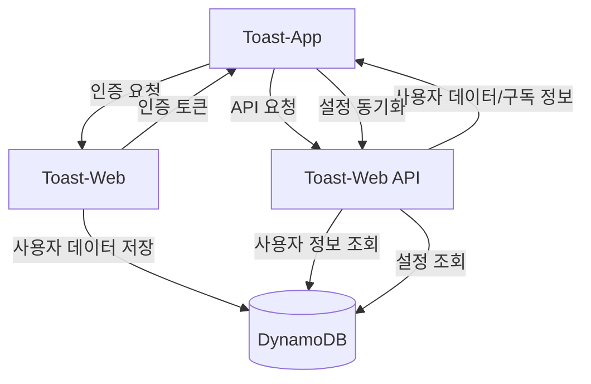
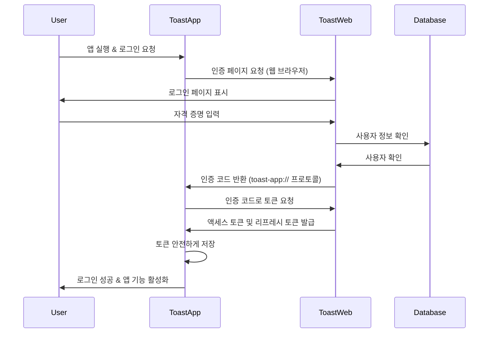
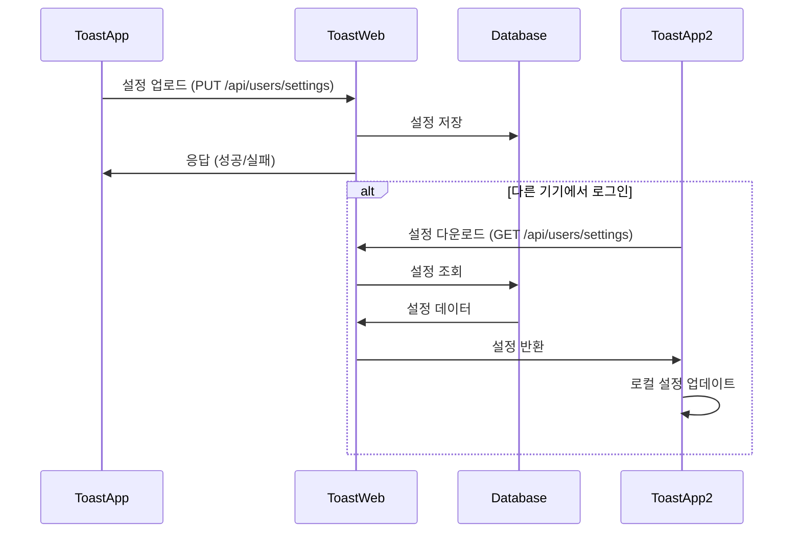

# Toast-App & Toast-Web 연동 가이드

이 문서는 Toast-App(Electron 앱)과 Toast-Web(Next.js 웹 서비스) 간의 연동 설정 및 구현 방법을 상세히 설명합니다.

## 목차

- [개요](#개요)
- [시스템 아키텍처](#시스템-아키텍처)
- [OAuth 2.0 인증 프로토콜](#oauth-20-인증-프로토콜)
- [환경 변수 설정](#환경-변수-설정)
- [프로토콜 핸들러 설정](#프로토콜-핸들러-설정)
- [인증 흐름](#인증-흐름)
- [토큰 관리](#토큰-관리)
- [API 엔드포인트](#api-엔드포인트)
- [사용자 및 구독 정보 API](#사용자-및-구독-정보-api)
- [구독 정보 활용](#구독-정보-활용)
- [설정 동기화](#설정-동기화)
- [오류 처리](#오류-처리)
- [보안 고려사항](#보안-고려사항)
- [변경 내역](#변경-내역)

## 개요

Toast-App은 사용자의 단축키 액션을 수행하는 Electron 데스크톱 애플리케이션이며, Toast-Web은 사용자 인증, 구독 관리 등을 담당하는 Next.js 웹 애플리케이션입니다. 두 시스템은 OAuth 2.0 표준 프로토콜을 통해 안전하게 연동됩니다.

Toast-App은 다음과 같은 기능을 위해 Toast-Web과 통신합니다:
- 사용자 인증 (로그인/로그아웃)
- 구독 상태 확인 및 동기화
- 사용자 프로필 정보 접근
- 설정 정보 동기화 (페이지 구성, 테마 등)

## 시스템 아키텍처



## OAuth 2.0 인증 프로토콜

OAuth 2.0은 사용자 인증 및 권한 부여를 위한 업계 표준 프로토콜로 다음과 같은 이유로 선택되었습니다:

- 안전한 토큰 기반 인증 제공
- 제3자 애플리케이션에 대한 제한된 접근 권한 부여
- 사용자의 자격 증명(비밀번호 등)을 애플리케이션에 직접 노출하지 않음
- 다양한 클라이언트 애플리케이션(데스크톱, 모바일, 웹)에서 일관된 인증 경험 제공

### 핵심 개념

1. **인증 코드 흐름**: 사용자가 앱에서 로그인하면 시스템 브라우저가 열리고, 웹 서비스에서 인증 후 `toast-app://auth` 프로토콜로 인증 코드가 반환됩니다.
2. **토큰 교환**: 인증 코드는 액세스 토큰 및 리프레시 토큰으로 교환됩니다.
3. **자원 접근**: 액세스 토큰을 사용하여 사용자 프로필, 구독 정보 등의 API에 접근합니다.

### 인증 흐름 (Authorization Code Flow)

Toast-App은 OAuth 2.0의 Authorization Code Flow를 사용합니다:

1. 사용자가 설정 페이지에서 "로그인" 버튼을 클릭합니다.
2. Toast-App은 시스템 기본 브라우저를 열어 웹 서비스의 인증 페이지(https://web.toast.sh/api/oauth/authorize)로 리디렉션합니다.
3. 사용자는 웹 서비스에서 로그인하고 Toast-App에 대한 접근 권한을 승인합니다.
4. 웹 서비스는 사용자를 커스텀 URI 스킴(toast-app://auth)으로 리디렉션하고 인증 코드를 전달합니다.
5. Toast-App은 이 URI를 인터셉트하여 인증 코드를 획득합니다.
6. Toast-App은 획득한 인증 코드와 클라이언트 비밀키를 사용하여 웹 서비스의 토큰 엔드포인트에 접근 토큰을 요청합니다.
7. 웹 서비스는 유효한 인증 코드에 대한 접근 토큰(access token)과 갱신 토큰(refresh token)을 발급합니다.
8. Toast-App은 이 토큰을 안전하게 저장하고 API 요청 시 사용합니다.

## 환경 변수 설정

Toast-App은 환경 변수를 통해 클라이언트 ID와 시크릿을 관리합니다. 개발 환경에서는 `.env.local` 파일을 통해 이러한 변수를 설정합니다.

```bash
# .env.example 파일 예시
CLIENT_ID=
CLIENT_SECRET=
TOAST_URL=https://web.toast.sh
```

1. 프로젝트 루트에 `.env.local` 파일을 생성합니다:

```bash
# .env.local 파일 예시
CLIENT_ID=your-client-id
CLIENT_SECRET=your-client-secret
TOAST_URL=https://web.toast.sh
```

2. 환경 변수 로드 설정:

```javascript
// src/main/config/env.js
const dotenv = require('dotenv');
const path = require('path');

// 개발 환경에서 .env.local 파일 로드
if (process.env.NODE_ENV !== 'production') {
  dotenv.config({ path: path.join(__dirname, '../../../.env.local') });
}

/**
 * 환경 변수를 가져오는 함수
 * @param {string} key - 환경 변수 키
 * @param {string} defaultValue - 기본값
 * @returns {string} 환경 변수 값 또는 기본값
 */
function getEnv(key, defaultValue = '') {
  return process.env[key] || defaultValue;
}

module.exports = {
  getEnv
};
```

3. 코드에서 환경 변수 사용:

```javascript
const { getEnv } = require('./config/env');
const CLIENT_ID = getEnv('CLIENT_ID', 'toast-app-client');
const CLIENT_SECRET = getEnv('CLIENT_SECRET', 'default-secret');
```

## 프로토콜 핸들러 설정

Toast-App은 `toast-app://` 프로토콜을 처리할 수 있도록 설정해야 합니다. 이는 OAuth 인증 후 리디렉션을 처리하기 위해 필요합니다.

```javascript
// src/main/auth.js 또는 유사한 파일에서
function registerProtocolHandler() {
  if (process.platform === 'darwin' || process.platform === 'win32') {
    if (process.defaultApp) {
      // 개발 모드에서는 앱 인수에 URL 스킴을 명시적으로 추가
      if (process.argv.length >= 2) {
        app.setAsDefaultProtocolClient('toast-app', process.execPath, [
          path.resolve(process.argv[1])
        ]);
      }
    } else {
      // 프로덕션 빌드에서는 간단하게 등록
      app.setAsDefaultProtocolClient('toast-app');
    }
  }
}

// 앱 준비 이벤트에서 호출
app.on('ready', () => {
  registerProtocolHandler();
  // ...
});
```

### URL 핸들링

프로토콜 요청을 처리하는 이벤트 리스너 등록:

```javascript
// macOS
app.on('open-url', (event, url) => {
  event.preventDefault();
  handleAuthRedirect(url);
});

// Windows
app.on('second-instance', (event, commandLine) => {
  // 대부분의 경우 마지막 인수가 URL
  const url = commandLine.pop();
  if (url.startsWith('toast-app://')) {
    handleAuthRedirect(url);
  }
});
```

## 인증 흐름

Toast-App과 Toast-Web 간의 인증 흐름은 OAuth 2.0 인증 코드 흐름을 따릅니다.



### 로그인 시작

```javascript
const { v4: uuidv4 } = require('uuid');
const { URL } = require('url');
const { shell } = require('electron');

async function initiateLogin() {
  try {
    // 상태 값은 CSRF 공격 방지를 위해 사용됨
    const state = uuidv4();

    // 상태 값 저장
    storeStateParam(state);

    // 인증 URL 구성
    const authUrl = new URL(`${TOAST_URL}/api/oauth/authorize`);
    authUrl.searchParams.append('response_type', 'code');
    authUrl.searchParams.append('client_id', CLIENT_ID);
    authUrl.searchParams.append('redirect_uri', REDIRECT_URI);
    authUrl.searchParams.append('scope', 'profile subscription');
    authUrl.searchParams.append('state', state);

    // 기본 브라우저에서 인증 페이지 열기
    await shell.openExternal(authUrl.toString());

    return true;
  } catch (error) {
    console.error('Failed to initiate login:', error);
    throw error;
  }
}
```

### 인증 코드 처리

```javascript
async function handleAuthRedirect(url) {
  try {
    console.log('Processing auth redirect:', url);
    const urlObj = new URL(url);

    // 인증 코드 추출
    const code = urlObj.searchParams.get('code');
    const state = urlObj.searchParams.get('state');
    const error = urlObj.searchParams.get('error');

    // 오류 파라미터가 있는 경우
    if (error) {
      console.error('Auth error from server:', error);
      return {
        success: false,
        error: error || 'Unknown error'
      };
    }

    // 코드가 없는 경우
    if (!code) {
      console.error('No auth code in redirect URL');
      return {
        success: false,
        error: 'Missing authorization code'
      };
    }

    // 상태 값 검증 (CSRF 방지)
    const storedState = retrieveStoredState();
    if (!storedState || state !== storedState) {
      console.error('State mismatch. Possible CSRF attack');
      return {
        success: false,
        error: 'state_mismatch',
        message: 'State parameter mismatch. Security validation failed.'
      };
    }

    // 토큰으로 교환
    const result = await exchangeCodeForTokenAndUpdateSubscription(code);
    return result;
  } catch (error) {
    console.error('Failed to handle auth redirect:', error);
    return {
      success: false,
      error: error.message || 'Unknown error'
    };
  }
}
```

### 토큰 교환

```javascript
const axios = require('axios');

async function exchangeCodeForToken(code) {
  try {
    console.log('인증 코드를 토큰으로 교환 시작:', code.substring(0, 8) + '...');

    // 토큰 요청 데이터 준비
    const data = new URLSearchParams();
    data.append('grant_type', 'authorization_code');
    data.append('code', code);
    data.append('client_id', CLIENT_ID);
    data.append('client_secret', CLIENT_SECRET);
    data.append('redirect_uri', REDIRECT_URI);

    // 토큰 요청
    const response = await axios.post(OAUTH_TOKEN_URL, data, {
      headers: {
        'Content-Type': 'application/x-www-form-urlencoded'
      }
    });

    const { access_token, refresh_token, expires_in } = response.data;

    // 토큰 저장
    if (!access_token) {
      console.error('서버에서 액세스 토큰을 반환하지 않음!');
      return {
        success: false,
        error: 'No access token returned from server'
      };
    }

    // 메모리와 안전한 저장소에 토큰 저장
    await storeToken(access_token);
    if (refresh_token) {
      await storeRefreshToken(refresh_token);
    }

    return {
      success: true,
      access_token,
      refresh_token,
      expires_in
    };
  } catch (error) {
    console.error('토큰 교환 중 오류 발생:', error);
    return {
      success: false,
      error: error.response?.data?.error || error.message
    };
  }
}
```

## 토큰 관리

Toast-App은 액세스 토큰과 리프레시 토큰을 안전하게 저장해야 합니다. 시스템의 보안 키체인/자격 증명 저장소를 사용하는 것이 권장됩니다.

```javascript
const keytar = require('keytar');

// 보안 상수
const AUTH_SERVICE_NAME = 'toast-app';
const TOKEN_KEY = 'auth-token';
const REFRESH_TOKEN_KEY = 'refresh-token';

// 토큰 저장소 (메모리)
let currentToken = null;
let currentRefreshToken = null;

// 토큰 저장
async function storeToken(token) {
  try {
    currentToken = token;
    await keytar.setPassword(AUTH_SERVICE_NAME, TOKEN_KEY, token);
  } catch (error) {
    console.error('Failed to store token in secure storage:', error);
    throw error;
  }
}

// 리프레시 토큰 저장
async function storeRefreshToken(refreshToken) {
  try {
    currentRefreshToken = refreshToken;
    await keytar.setPassword(AUTH_SERVICE_NAME, REFRESH_TOKEN_KEY, refreshToken);
  } catch (error) {
    console.error('Failed to store refresh token in secure storage:', error);
    throw error;
  }
}

// 토큰 가져오기
async function getStoredToken() {
  try {
    return await keytar.getPassword(AUTH_SERVICE_NAME, TOKEN_KEY);
  } catch (error) {
    console.error('Failed to get token from secure storage:', error);
    return null;
  }
}

// 리프레시 토큰 가져오기
async function getStoredRefreshToken() {
  try {
    return await keytar.getPassword(AUTH_SERVICE_NAME, REFRESH_TOKEN_KEY);
  } catch (error) {
    console.error('Failed to get refresh token from secure storage:', error);
    return null;
  }
}

// 토큰 삭제 (로그아웃 시)
async function clearTokens() {
  try {
    currentToken = null;
    currentRefreshToken = null;
    await keytar.deletePassword(AUTH_SERVICE_NAME, TOKEN_KEY);
    await keytar.deletePassword(AUTH_SERVICE_NAME, REFRESH_TOKEN_KEY);
  } catch (error) {
    console.error('Failed to clear tokens from secure storage:', error);
    throw error;
  }
}
```

### 토큰 갱신

```javascript
async function refreshAccessToken() {
  try {
    // 리프레시 토큰 가져오기
    const refreshToken = currentRefreshToken || await getStoredRefreshToken();

    if (!refreshToken) {
      throw new Error('No refresh token available');
    }

    // 토큰 갱신 요청 데이터 준비
    const data = new URLSearchParams();
    data.append('grant_type', 'refresh_token');
    data.append('refresh_token', refreshToken);
    data.append('client_id', CLIENT_ID);
    data.append('client_secret', CLIENT_SECRET);

    // 토큰 갱신 요청
    const response = await axios.post(OAUTH_TOKEN_URL, data, {
      headers: {
        'Content-Type': 'application/x-www-form-urlencoded'
      }
    });

    const { access_token, refresh_token } = response.data;

    if (!access_token) {
      throw new Error('No access token in response');
    }

    // 새 토큰 저장
    await storeToken(access_token);
    if (refresh_token) {
      await storeRefreshToken(refresh_token);
    }

    return { success: true };
  } catch (error) {
    console.error('Failed to refresh token:', error);
    return {
      success: false,
      error: error.message
    };
  }
}
```

## API 엔드포인트

### 기본 URL
```
https://web.toast.sh/api
```

### 인증 관련 엔드포인트

| 엔드포인트 | 메서드 | 설명 |
|------------|--------|------|
| `/oauth/authorize` | GET | 사용자 인증 및 앱 승인을 위한 웹 페이지 |
| `/oauth/token` | POST | 액세스 토큰 및 리프레시 토큰 발급/갱신 |
| `/oauth/revoke` | POST | 토큰 무효화(로그아웃) |

### 사용자 및 구독 관련 엔드포인트

| 엔드포인트 | 메서드 | 설명 |
|------------|--------|------|
| `/users/profile` | GET | 사용자 프로필 정보 조회 |
| `/users/subscription` | GET | 현재 구독 상태 및 정보 조회 |
| `/users/settings` | GET/PUT | 사용자 설정 조회/수정 |

### 인증 요청 매개변수

#### 인증 요청 (`/oauth/authorize`)

```
https://web.toast.sh/api/oauth/authorize?
  response_type=code&
  client_id=YOUR_CLIENT_ID&
  redirect_uri=toast-app://auth&
  scope=profile subscription&
  state=RANDOM_STATE_STRING
```

| 매개변수 | 설명 |
|----------|------|
| `response_type` | `code`로 고정 (인증 코드 흐름 사용) |
| `client_id` | Toast App의 클라이언트 ID |
| `redirect_uri` | 인증 후 리디렉션할 URI (toast-app://auth) |
| `scope` | 요청 권한 범위 (profile: 사용자 정보, subscription: 구독 정보) |
| `state` | CSRF 공격 방지를 위한 임의의 문자열. 콜백에서 검증해야 함 |

#### 토큰 요청 (`/oauth/token`)

```http
POST /api/oauth/token HTTP/1.1
Host: web.toast.sh
Content-Type: application/x-www-form-urlencoded

grant_type=authorization_code&
code=AUTHORIZATION_CODE&
client_id=YOUR_CLIENT_ID&
client_secret=YOUR_CLIENT_SECRET&
redirect_uri=toast-app://auth
```

| 매개변수 | 설명 |
|----------|------|
| `grant_type` | `authorization_code` (인증 코드 교환) 또는 `refresh_token` (토큰 갱신) |
| `code` | 이전 단계에서 받은 인증 코드 (grant_type이 authorization_code인 경우) |
| `refresh_token` | 이전에 받은 리프레시 토큰 (grant_type이 refresh_token인 경우) |
| `client_id` | Toast App의 클라이언트 ID |
| `client_secret` | Toast App의 클라이언트 비밀키 |
| `redirect_uri` | 인증 단계에서 사용한 것과 동일한 리디렉션 URI |

### 토큰 응답

```json
{
  "access_token": "eyJhbGciOiJIUzI1NiIsInR5cCI6IkpXVCJ9...",
  "token_type": "Bearer",
  "expires_in": 3600,
  "refresh_token": "eyJhbGciOiJIUzI1NiIsInR5cCI6IkpXVCJ9...",
  "scope": "profile subscription"
}
```

| 필드 | 설명 |
|------|------|
| `access_token` | API 요청에 사용할 액세스 토큰 |
| `token_type` | 토큰 타입 ("Bearer") |
| `expires_in` | 액세스 토큰 만료 시간(초) |
| `refresh_token` | 새 액세스 토큰을 얻기 위한 리프레시 토큰 |
| `scope` | 부여된 권한 범위 |

## 사용자 및 구독 정보 API

### API 요청 헤더 설정

```javascript
async function getAuthHeaders() {
  // 현재 토큰이 없으면 저장소에서 가져오기
  if (!currentToken) {
    currentToken = await getStoredToken();
  }

  if (!currentToken) {
    throw new Error('No authentication token available');
  }

  return {
    'Authorization': `Bearer ${currentToken}`,
    'Content-Type': 'application/json'
  };
}
```

### 사용자 프로필 조회

```http
GET /api/users/profile HTTP/1.1
Host: web.toast.sh
Authorization: Bearer ACCESS_TOKEN
```

#### 응답

```json
{
  "id": "user123",
  "email": "user@example.com",
  "name": "홍길동",
  "created_at": "2024-01-15T09:30:45Z",
  "avatar_url": "https://web.toast.sh/avatars/user123.jpg"
}
```

### 구독 정보 조회

```http
GET /api/users/subscription HTTP/1.1
Host: web.toast.sh
Authorization: Bearer ACCESS_TOKEN
```

#### 응답 (표준화된 형식)

```json
{
  "id": "sub_premium_12345",
  "userId": "user123",
  "plan": "premium",
  "status": "active",
  "active": true,
  "is_subscribed": true,
  "features": {
    "page_groups": 9,
    "advanced_actions": true,
    "cloud_sync": true
  },
  "features_array": [
    "premium_shortcuts",
    "advanced_actions",
    "cloud_sync"
  ],
  "created_at": "2024-02-01T00:00:00Z",
  "updated_at": "2024-03-15T00:00:00Z",
  "expiresAt": "2025-12-31T23:59:59Z",
  "subscribed_until": "2025-12-31T23:59:59Z",
  "isVip": false
}
```

| 필드 | 설명 | 호환성 노트 |
|------|------|------------|
| `is_subscribed` | 구독 여부 (true/false) | 기본 필드 |
| `active` | 구독 활성화 상태 (true/false) | is_subscribed와 동일 |
| `plan` | 구독 계획 (free, premium, trial 등) | |
| `subscribed_until` | 구독 만료일 (ISO8601 형식) | 기본 필드 |
| `expiresAt` | 구독 만료일 (동일 정보) | subscribed_until과 동일 |
| `features` | 활성화된 기능 (객체) | 기능별 true/false 값과 page_groups 수치 포함 |
| `features_array` | 활성화된 기능 (배열) | features와 동일 정보의 배열 형식 |
| `status` | 구독 상태 (active, inactive 등) | |
| `isVip` | VIP 사용자 여부 | 특별 접근 권한을 가진 사용자 |

## 구독 정보 활용

### 구독 상태와 제공 기능

| 사용자 유형 | 설명 | 제공 기능 | 페이지 수 |
|------------|------|-----------|----------|
| 인증되지 않은 사용자 | 로그인하지 않은 상태 | 기본 단축키 기능만 제공 | 1개 페이지 |
| 인증된 사용자 | 로그인한 기본 사용자 | 기본 기능 + 표준 액션 | 3개 페이지 |
| 구독 사용자 | 프리미엄/프로 구독자 | 모든 단축키 기능, 추가 액션 | 9개 페이지 |
| VIP 사용자 | 특별 접근 권한 보유자 | 구독자와 동일한 모든 기능 | 9개 페이지 |

## 설정 동기화

Toast-App과 Toast-Web 간에는 앱의 주요 설정(페이지 구성, 테마 등)을 동기화하는 기능이 있습니다. 이를 통해 사용자는 여러 기기에서 일관된 경험을 얻을 수 있습니다.

### 클라우드 동기화 구조



### 동기화 구현 세부사항

설정 동기화는 페이지와 버튼 구성에 초점을 맞추고 있으며, 다음과 같은 주요 기능을 제공합니다:

1. **자동 변경 감지**: 사용자가 페이지를 추가/삭제하거나 버튼을 수정할 때 변경 사항을 자동으로 감지하고 서버에 동기화합니다.
2. **디바운싱 처리**: 연속적인 변경이 있을 경우 마지막 변경 후 2초 후에 한 번만 동기화하여 서버 부하를 줄입니다.
3. **로그인 후 동기화**: 사용자가 로그인하면 서버와 설정을 자동으로 동기화합니다.
4. **구독 기반 접근 제어**: cloud_sync 기능은 구독자에게만 제공됩니다.

#### 코드 구현

동기화 기능은 `cloud-sync.js` 모듈에서 구현되어 있으며, 다음과 같은 주요 컴포넌트로 구성됩니다:

```javascript
// 페이지 설정 변경 감지
const unsubscribePages = config.onDidChange('pages', async (newValue, oldValue) => {
  // 동기화가 비활성화되었거나 로그인하지 않은 경우 동기화 스킵
  if (!syncEnabled) {
    console.log('동기화 비활성화됨, 설정 변경 무시');
    return;
  }

  // 설정이 서버에서 다운로드된 경우 다시 업로드하지 않음 (루프 방지)
  if (Date.now() - lastSyncTime < 1000) {
    console.log('다운로드한 설정 감지됨, 동기화 스킵');
    return;
  }

  // 구독 및 동기화 가능 여부 확인
  const canSync = await isCloudSyncEnabled();
  if (!canSync) {
    console.log('클라우드 동기화 비활성화됨: 인증되지 않았거나 구독이 없음');
    return;
  }

  console.log('페이지 설정 변경 감지됨, 동기화 예약...');

  // 디바운스 처리: 연속적인 변경이 있을 경우 마지막 변경 후 2초 후에 동기화
  clearTimeout(syncTimer);
  syncTimer = setTimeout(async () => {
    await uploadSettings();
  }, SYNC_DEBOUNCE_MS);
});
```

#### 설정 업로드 프로세스

사용자가 페이지나 버튼을 수정하면 다음과 같은 프로세스로 설정이 서버에 업로드됩니다:

1. 페이지 설정 변경 감지 (electron-store의 `onDidChange` 이벤트)
2. 동기화 가능 여부 확인 (사용자 인증 및 구독 상태)
3. 디바운싱 처리 (마지막 변경 후 2초 대기)
4. 액세스 토큰 가져오기
5. 페이지 설정 데이터와 함께 PUT 요청 전송
6. 응답 처리 및 동기화 상태 업데이트

```javascript
// 서버에 설정 업로드
console.log(`서버에 ${pages.length}개 페이지 설정 업로드 중...`);

const response = await axios.put(SETTINGS_API_URL, {
  pages,
  lastSyncedDevice: deviceInfo,
  lastSyncedAt: Date.now()
}, {
  headers: {
    'Authorization': `Bearer ${token}`,
    'Content-Type': 'application/json'
  }
});
```

#### 설정 다운로드 프로세스

다른 기기에서 로그인하거나 수동 동기화를 요청할 때 다음과 같은 프로세스로 설정이 서버에서 다운로드됩니다:

1. 액세스 토큰 가져오기
2. GET 요청을 통해 서버에서 설정 데이터 조회
3. 받은의 데이터 유효성 검사
4. 서버에서 받은 페이지 설정을 로컬에 적용
5. 동기화 상태 업데이트

### 인증 및 구독 연동

설정 동기화는 인증 및 구독 시스템과 긴밀하게 연동됩니다:

1. **로그인 후 동기화**: 사용자가 로그인에 성공하면 서버에서 설정을 자동으로 다운로드합니다.
2. **구독 기능 확인**: 구독 정보에서 `cloud_sync` 기능이 활성화되어 있는지 확인합니다.
3. **로그아웃 시 비활성화**: 사용자가 로그아웃하면 동기화 기능이 자동으로 비활성화됩니다.

```javascript
// 로그인 성공 후 구독 기능 확인 및 동기화 설정
const hasSyncFeature = result.subscription?.features?.cloud_sync === true;
cloudSync.updateCloudSyncSettings(hasSyncFeature);

// 페이지 설정 동기화 시작
syncManager.syncAfterLogin().then(syncResult => {
  console.log('로그인 후 클라우드 동기화 결과:', syncResult);

  if (syncResult) {
    // 설정 동기화 성공 시 양쪽 창에 알림
    notifySettingsSynced();
  }
});
```

### 사용자 알림

동기화 상태는 사용자에게 투명하게 표시됩니다:

1. **동기화 성공 알림**: 동기화가 성공적으로 완료되면 사용자에게 알림이 표시됩니다.
2. **상태 표시**: 마지막 동기화 시간과 상태가 추적되어 사용자에게 표시될 수 있습니다.
3. **오류 처리**: 동기화 중 오류가 발생하면 사용자에게 적절한 오류 메시지가 표시됩니다.

### 동기화 API 엔드포인트

| 엔드포인트 | 메서드 | 설명 |
|------------|--------|------|
| `/api/users/settings` | GET | 사용자 설정 조회 |
| `/api/users/settings` | PUT | 사용자 설정 업데이트 |

#### 설정 데이터 형식 (예시)

```json
{
  "pages": [
    {
      "id": "page1",
      "name": "기본 페이지",
      "buttons": [
        {
          "id": "button1",
          "name": "웹사이트 열기",
          "icon": "globe",
          "action": {
            "type": "open",
            "payload": {
              "url": "https://example.com"
            }
          },
          "color": "blue",
          "shortcut": "Cmd+1"
        }
      ]
    }
  ],
  "lastSyncedDevice": "darwin-macbook-john",
  "lastSyncedAt": 1680000000000
}
```
