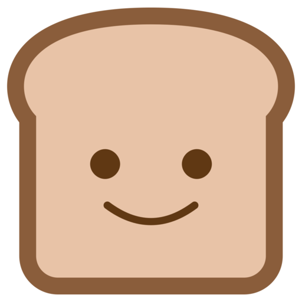
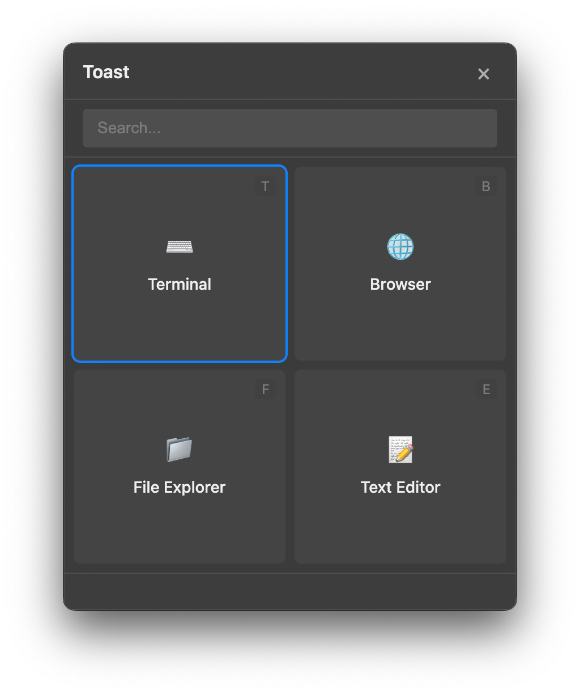

# Toast App

<p align="center">
  
</p>

<p align="center">
  A customizable shortcut launcher for macOS and Windows built with Electron.
</p>

## Overview

Toast App is a productivity tool that allows users to define custom shortcuts and actions. When triggered with a global hotkey Toast displays a popup with user-defined buttons. Each button can be assigned a specific action or command to execute.

<p align="center">
  
</p>

## Features

- Global hotkey to trigger the Toast popup
- Multiple pages of customizable buttons for better organization:
  - Free users: 1 page
  - Authenticated users: Up to 3 pages
  - Subscribers: Up to 9 pages
- Settings Mode for quick button and page editing
- Customizable buttons with user-defined actions
- Support for keyboard shortcuts to trigger specific actions
- Multiple action types:
  - Execute commands
  - Open URLs and files
  - Trigger keyboard shortcuts
  - Run scripts (JavaScript, AppleScript, PowerShell, Bash)
  - Chain actions together in sequence
- Cross-platform support (macOS and Windows)
- Theme support (light, dark or system)
- Customizable position and size
- Minimal and non-intrusive UI
- Runs in the background with system tray integration
- Automatic updates
- Integration with Toast Web for authentication and subscription management

## Installation

### Download

You can download the latest version of Toast App from the [GitHub Releases](https://github.com/opspresso/toast-app/releases) page.

최신 릴리스 페이지에서 각 운영체제에 맞는 설치 파일을 다운로드할 수 있습니다:

- macOS: `Toast-App-mac.dmg`
- Windows: `Toast-App-win.exe`

### Homebrew (macOS)

macOS 사용자는 Homebrew를 통해 Toast App을 설치할 수 있습니다:

```bash
brew install opspresso/tap/toast
```

제거하려면 다음 명령어를 사용하세요:

```bash
brew uninstall opspresso/tap/toast
```

### Development Prerequisites

- Node.js (v16 or later)
- npm or yarn

### Development Setup

1. Clone the repository:
```bash
git clone https://github.com/opspresso/toast-app.git
cd toast-app
```

2. Install dependencies:
```bash
npm install
```

3. Start the development server:
```bash
npm run dev
```

### Building for Production

Build for your current platform:
```bash
npm run build
```

Build for specific platforms:
```bash
npm run build:mac
npm run build:win
```

## Usage

1. After installation Toast App will run in the background with an icon in the system tray/menu bar.
2. Press the global hotkey (default: `Alt+Space`) to open the Toast popup.
3. Navigate between pages using the number keys (1-9) or by clicking the page tabs.
4. Click on a button or use the corresponding shortcut key to execute an action.
5. Right-click on the system tray icon to access settings, add new buttons, or quit the application.
6. Toggle settings mode by clicking the gear icon (⚙️) or pressing the comma key (,) to edit buttons and pages.

## Configuration

Toast App can be configured through the settings UI or by directly editing the configuration file located at:

- macOS: `~/Library/Application Support/toast-app/config.json`
- Windows: `%APPDATA%\toast-app\config.json`

Example configuration:
```json
{
  "globalHotkey": "Alt+Space",
  "pages": [
    {
      "name": "Applications",
      "shortcut": "1",
      "buttons": [
        {
          "name": "Terminal",
          "shortcut": "T",
          "icon": "⌨️",
          "action": "exec",
          "command": "open -a Terminal"
        },
        {
          "name": "Browser",
          "shortcut": "B",
          "icon": "🌐",
          "action": "open",
          "url": "https://www.google.com"
        }
      ]
    },
    {
      "name": "Development",
      "shortcut": "2",
      "buttons": [
        {
          "name": "VS Code",
          "shortcut": "C",
          "icon": "💻",
          "action": "exec",
          "command": "open -a 'Visual Studio Code'"
        },
        {
          "name": "GitHub",
          "shortcut": "G",
          "icon": "🐙",
          "action": "open",
          "url": "https://github.com"
        }
      ]
    }
  ],
  "appearance": {
    "theme": "system",
    "position": "center",
    "size": "medium",
    "opacity": 0.95,
    "buttonLayout": "grid"
  },
  "advanced": {
    "launchAtLogin": true,
    "hideAfterAction": true,
    "hideOnBlur": true,
    "hideOnEscape": true,
    "showInTaskbar": false
  }
}
```

## Integration with Toast Web

Toast App integrates with [Toast Web](https://app.toast.sh) for user authentication and subscription management. This integration enables:

- User account creation and authentication
- Subscription management for premium features
- Secure access to paid features based on subscription status
- Seamless login experience via system browser

For developers working on Toast App, refer to [INTEGRATION_WITH_TOAST_WEB.md](docs/INTEGRATION_WITH_TOAST_WEB.md) for detailed integration documentation.

Users can create an account and manage their subscription at [https://app.toast.sh](https://app.toast.sh).

## Documentation

Comprehensive documentation is available in the repository:

- [User Guide](docs/USER_GUIDE.md) - Complete guide for end users
- [Architecture](ARCHITECTURE.md) - System architecture and design decisions
- [API Documentation](docs/API_DOCUMENTATION.md) - Internal API documentation
- [Configuration Schema](docs/CONFIG_SCHEMA.md) - Configuration options and schema
- [Pages and Navigation](PAGES.md) - Page layout and navigation structure
- [Project Structure](docs/PROJECT_STRUCTURE.md) - Project structure and code organization
- [Technical Requirements](docs/TECHNICAL_REQUIREMENTS.md) - Technical specifications and requirements
- [Development Roadmap](docs/DEVELOPMENT_ROADMAP.md) - Future development plans
- [Testing Strategy](docs/TESTING_STRATEGY.md) - Testing approach and methodologies

## Project Structure

```
toast-app/
├── assets/                # Application assets
│   └── icons/             # Application icons
├── docs/                  # Documentation assets
│   └── images/            # Documentation images
├── src/                   # Source code
│   ├── main/              # Main process code
│   │   ├── actions/       # Action implementations
│   │   ├── auth.js        # Authentication handling
│   │   ├── config.js      # Configuration management
│   │   ├── executor.js    # Action execution
│   │   ├── ipc.js         # IPC handling
│   │   ├── shortcuts.js   # Global shortcuts
│   │   ├── tray.js        # System tray
│   │   └── windows.js     # Window management
│   ├── renderer/          # Renderer process code
│   │   ├── pages/         # Application pages
│   │   │   ├── toast/     # Toast popup UI
│   │   │   └── settings/  # Settings UI
│   │   └── preload/       # Preload scripts
│   └── index.js           # Application entry point
├── tests/                 # Test files
│   ├── unit/              # Unit tests
│   ├── integration/       # Integration tests
│   └── e2e/               # End-to-end tests
└── package.json           # Project metadata and dependencies
```

## Contributing

We welcome contributions to Toast App! Please see our [Contributing Guidelines](CONTRIBUTING.md) for more information.

### Development Workflow

1. Fork the repository
2. Create a feature branch (`git checkout -b feature/amazing-feature`)
3. Make your changes
4. Run tests (`npm test`)
5. Commit your changes (`git commit -m 'Add amazing feature'`)
6. Push to the branch (`git push origin feature/amazing-feature`)
7. Open a Pull Request

## License

MIT License - 자세한 내용은 [LICENSE](LICENSE) 파일을 참조하세요.

## Acknowledgements

- [Electron](https://www.electronjs.org/) - Framework for building cross-platform desktop apps
- [electron-store](https://github.com/sindresorhus/electron-store) - Simple data persistence for Electron apps
- [@nut-tree-fork/nut-js](https://github.com/nut-tree/nut.js) - Native UI automation for keyboard shortcuts
- [electron-updater](https://github.com/electron-userland/electron-builder/tree/master/packages/electron-updater) - Auto-update functionality
- [All Contributors](https://github.com/opspresso/toast-app/graphs/contributors)
