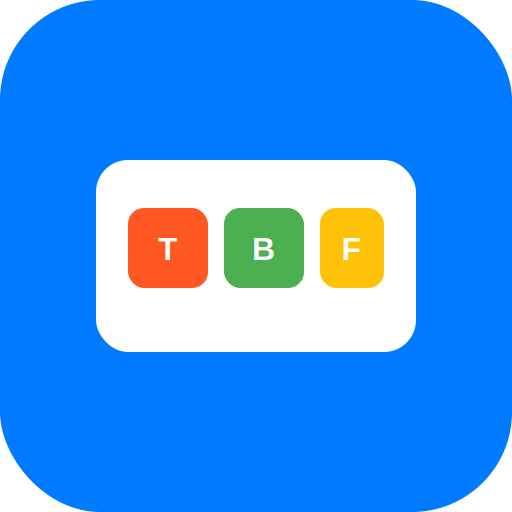

# Toast App

<p align="center">
  
</p>

<p align="center">
  A customizable shortcut launcher for macOS and Windows built with Electron.
</p>

## Overview

Toast App is a productivity tool that allows users to define custom shortcuts and actions. When triggered with a global hotkey, Toast displays a popup with user-defined buttons. Each button can be assigned a specific action or command to execute.

<p align="center">
  
</p>

## Features

- Global hotkey to trigger the Toast popup
- Customizable buttons with user-defined actions
- Support for keyboard shortcuts to trigger specific actions
- Cross-platform support (macOS and Windows)
- Minimal and non-intrusive UI
- Runs in the background with system tray integration

## Installation

### Prerequisites

- Node.js (v16 or later)
- npm or yarn

### Development Setup

1. Clone the repository:
```bash
git clone https://github.com/opspresso/toast-app.git
cd toast-app
```

2. Install dependencies:
```bash
npm install
```

3. Start the development server:
```bash
npm run dev
```

### Building for Production

Build for your current platform:
```bash
npm run build
```

Build for specific platforms:
```bash
npm run build:mac
npm run build:win
```

## Usage

1. After installation, Toast App will run in the background with an icon in the system tray/menu bar.
2. Press the global hotkey (default: `Alt+Space`) to open the Toast popup.
3. Click on a button or use the corresponding shortcut key to execute an action.
4. Right-click on the system tray icon to access settings, add new buttons, or quit the application.

## Configuration

Toast App can be configured through the settings UI or by directly editing the configuration file located at:

- macOS: `~/Library/Application Support/toast-app/config.json`
- Windows: `%APPDATA%\toast-app\config.json`

Example configuration:
```json
{
  "globalHotkey": "Alt+Space",
  "buttons": [
    {
      "name": "Open Terminal",
      "shortcut": "T",
      "action": "exec",
      "command": "open -a Terminal"
    },
    {
      "name": "Open Browser",
      "shortcut": "B",
      "action": "exec",
      "command": "open -a 'Google Chrome'"
    }
  ]
}
```

## Documentation

Comprehensive documentation is available in the repository:

- [User Guide](USER_GUIDE.md) - Complete guide for end users
- [Architecture](ARCHITECTURE.md) - System architecture and design decisions
- [API Documentation](API_DOCUMENTATION.md) - Internal API documentation
- [Configuration Schema](CONFIG_SCHEMA.md) - Configuration options and schema
- [Technical Requirements](TECHNICAL_REQUIREMENTS.md) - Technical specifications and requirements
- [Development Roadmap](DEVELOPMENT_ROADMAP.md) - Future development plans
- [Testing Strategy](TESTING_STRATEGY.md) - Testing approach and methodologies

## Project Structure

```
toast-app/
├── assets/                # Application assets
│   └── icons/             # Application icons
├── src/                   # Source code
│   ├── main/              # Main process code
│   │   ├── actions/       # Action implementations
│   │   ├── config.js      # Configuration management
│   │   ├── executor.js    # Action execution
│   │   ├── ipc.js         # IPC handling
│   │   ├── shortcuts.js   # Global shortcuts
│   │   ├── tray.js        # System tray
│   │   └── windows.js     # Window management
│   ├── renderer/          # Renderer process code
│   │   ├── pages/         # Application pages
│   │   │   ├── toast/     # Toast popup UI
│   │   │   └── settings/  # Settings UI
│   │   └── preload/       # Preload scripts
│   └── index.js           # Application entry point
├── tests/                 # Test files
│   ├── unit/              # Unit tests
│   ├── integration/       # Integration tests
│   └── e2e/               # End-to-end tests
└── package.json           # Project metadata and dependencies
```

## Contributing

We welcome contributions to Toast App! Please see our [Contributing Guidelines](CONTRIBUTING.md) for more information.

### Development Workflow

1. Fork the repository
2. Create a feature branch (`git checkout -b feature/amazing-feature`)
3. Make your changes
4. Run tests (`npm test`)
5. Commit your changes (`git commit -m 'Add amazing feature'`)
6. Push to the branch (`git push origin feature/amazing-feature`)
7. Open a Pull Request

## License

ISC License

## Acknowledgements

- [Electron](https://www.electronjs.org/) - Framework for building cross-platform desktop apps
- [electron-store](https://github.com/sindresorhus/electron-store) - Simple data persistence for Electron apps
- [All Contributors](https://github.com/opspresso/toast-app/graphs/contributors)
