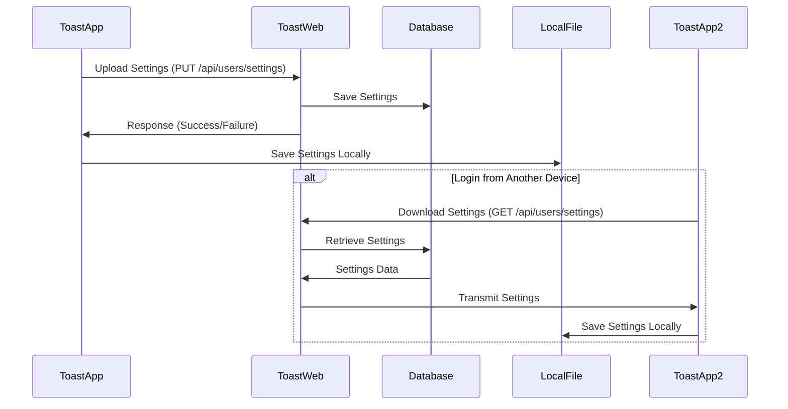

# Cloud Synchronization Guide

This document provides a detailed explanation of the cloud synchronization functionality implemented in Toast App (Electron application).

## Table of Contents

- [Overview](#overview)
- [Cloud Synchronization Architecture](#cloud-synchronization-architecture)
- [Synchronization Events](#synchronization-events)
- [Settings Download API](#settings-download-api)
- [Settings Upload API](#settings-upload-api)
- [Synchronization Implementation](#synchronization-implementation)
- [Local Data Management](#local-data-management)
- [Error Handling Strategies](#error-handling-strategies)
- [Security Considerations](#security-considerations)
- [Unified Settings Store Implementation](#unified-settings-store-implementation)

## Overview

Toast App synchronizes user settings (page configurations, button layouts, themes, etc.) to the cloud, providing a consistent experience across multiple devices. This document explains the cloud synchronization implementation and related APIs.

## Cloud Synchronization Architecture



## Synchronization Events

Settings synchronization occurs at specific timing events:

### Download from Server Triggers
1. **On Successful Login**: When a user successfully logs in, the latest settings are immediately downloaded from the server.
   ```javascript
   // Example of settings download after login
   async function handleLoginSuccess() {
     try {
       await downloadSettings();
       console.log('Settings download completed after login');
     } catch (error) {
       console.error('Failed to download settings:', error);
     }
   }
   ```

### Local File Save Triggers
1. **When Adding a Page**: When a user adds a new page, changes are immediately saved to the local file (user-settings.json).
2. **When Deleting a Page**: When a user deletes a page, changes are immediately saved to the local file.
3. **When Modifying Buttons**: When a user adds, edits, or deletes a button, changes are saved to the local file.

Each change is immediately saved to the local file, with changes detected by configStore automatically saving to the user-settings.json file.

### Server Synchronization Triggers
1. **Periodic Synchronization**: Automatically attempts synchronization at set intervals (15 minutes).
2. **On App Startup**: Synchronizes when the app starts if the user is already logged in.
3. **On Network Recovery**: Attempts synchronization when transitioning from offline to online status.

## Settings Download API

```http
GET /api/users/settings HTTP/1.1
Host: app.toast.sh
Authorization: Bearer ACCESS_TOKEN
```

### Response

```json
{
  "pages": [...],
  "appearance": {...},
  "advanced": {...},
  "lastSyncedAt": "2024-04-01T12:30:45Z"
}
```

## Settings Upload API

```http
PUT /api/users/settings HTTP/1.1
Host: app.toast.sh
Authorization: Bearer ACCESS_TOKEN
Content-Type: application/json

{
  "pages": [...],
  "appearance": {...},
  "advanced": {...}
}
```

### Response

```json
{
  "success": true,
  "message": "Settings updated successfully",
  "lastSyncedAt": "2024-04-01T12:45:30Z"
}
```

## Synchronization Implementation

Settings synchronization is managed in the `cloud-sync.js` module:

```javascript
const { sync: apiSync } = require('./api');
const { createConfigStore } = require('./config');

// Synchronization related constants
const SYNC_DEBOUNCE_MS = 2000; // Synchronize 2 seconds after the last change
const PERIODIC_SYNC_INTERVAL_MS = 15 * 60 * 1000; // Automatic synchronization every 15 minutes

// Detecting setting changes and saving to local file
configStore.onDidChange('pages', async (newValue, oldValue) => {
  // Detect change type (page added, deleted, button modified)
  if (Array.isArray(newValue) && Array.isArray(oldValue)) {
    if (newValue.length > oldValue.length) {
      // Page addition detected
      console.log('Page addition detected, saving to local file...');
    } else if (newValue.length < oldValue.length) {
      // Page deletion detected
      console.log('Page deletion detected, saving to local file...');
    } else if (JSON.stringify(newValue) !== JSON.stringify(oldValue)) {
      // Button modification detected
      console.log('Button modification detected, saving to local file...');
    }
  }

  // Save to user-settings.json file
  if (userDataManagerRef) {
    try {
      const currentSettings = await userDataManagerRef.getUserSettings();
      if (currentSettings) {
        const timestamp = getCurrentTimestamp();
        const updatedSettings = {
          ...currentSettings,
          pages: newValue,
          lastModifiedAt: timestamp,
          lastModifiedDevice: deviceInfo
        };

        userDataManagerRef.updateSettings(updatedSettings);
        console.log('Page information saved to local settings file');
      }
    } catch (error) {
      console.error('Settings file update error:', error);
    }
  }

  // Periodic server synchronization is performed with a separate timer
});
```

## Local Data Management

Toast App stores and manages user profiles, subscription information, settings, etc. as local files. This allows the app to function normally even in an offline state.

### Local File Storage Location

User data is stored in standard locations for each operating system:

- **Windows**: `C:\Users\{Username}\AppData\Roaming\toast-app\`
- **macOS**: `/Users/{Username}/Library/Application Support/toast-app/`
- **Linux**: `/home/{username}/.config/toast-app/`

### Types of Stored Files

| Filename | Description | Contents |
|--------|------|------|
| `auth-tokens.json` | Authentication token information | Access token, refresh token, expiration time |
| `user-profile.json` | User profile information | Name, email, avatar, subscription information, etc. |
| `user-settings.json` | User settings information | Page configuration, theme, shortcuts, timestamps, etc. |
| `config.json` | App configuration information | General settings, window size, position, etc. |

### Timestamp Management

All local settings files include timestamp information to prevent conflicts during synchronization and identify the latest data:

```javascript
// Example of adding timestamp when saving settings
function saveSettings(settingsData) {
  // Add current time as timestamp
  const dataWithTimestamp = {
    ...settingsData,
    lastModifiedAt: Date.now(),
    lastModifiedDevice: getDeviceIdentifier()
  };

  return writeToFile(SETTINGS_FILE_PATH, dataWithTimestamp);
}

// Example of checking timestamp when loading settings
function loadSettings() {
  const settingsData = readFromFile(SETTINGS_FILE_PATH);

  if (settingsData && !settingsData.lastModifiedAt) {
    // Add current time as timestamp if none exists
    settingsData.lastModifiedAt = Date.now();
    settingsData.lastModifiedDevice = getDeviceIdentifier();
    writeToFile(SETTINGS_FILE_PATH, settingsData);
  }

  return settingsData;
}
```

Timestamps are used for:

1. **Change Detection**: Compare local settings and server settings change times to identify the latest version
2. **Conflict Resolution**: When changes occur simultaneously on multiple devices, merge or prioritize based on timestamps
3. **Synchronization Optimization**: Prevent unnecessary network requests if no changes since last synchronization

```json
// user-settings.json example
{
  "pages": [...],
  "appearance": {
    "theme": "dark"
  },
  "lastModifiedAt": 1682932134590,
  "lastModifiedDevice": "macbook-pro-m1",
  "lastSyncedAt": 1682932134590
}
```

### File Management Module

User data file management is handled in the `user-data-manager.js` module:

```javascript
const { app } = require('electron');
const path = require('path');
const fs = require('fs');

// File path constants
const USER_DATA_PATH = app.getPath('userData');
const PROFILE_FILE_PATH = path.join(USER_DATA_PATH, 'user-profile.json');
const SETTINGS_FILE_PATH = path.join(USER_DATA_PATH, 'user-settings.json');

// Read file
function readFromFile(filePath) {
  try {
    if (!fs.existsSync(filePath)) {
      return null;
    }
    const data = fs.readFileSync(filePath, 'utf8');
    return JSON.parse(data);
  } catch (error) {
    console.error(`File reading error (${filePath}):`, error);
    return null;
  }
}

// Write file
function writeToFile(filePath, data) {
  try {
    const dirPath = path.dirname(filePath);
    if (!fs.existsSync(dirPath)) {
      fs.mkdirSync(dirPath, { recursive: true });
    }
    fs.writeFileSync(filePath, JSON.stringify(data, null, 2), 'utf8');
    return true;
  } catch (error) {
    console.error(`File saving error (${filePath}):`, error);
    return false;
  }
}

// Delete file
function deleteFile(filePath) {
  try {
    if (fs.existsSync(filePath)) {
      fs.unlinkSync(filePath);
      return true;
    }
    return false;
  } catch (error) {
    console.error(`File deletion error (${filePath}):`, error);
    return false;
  }
}
```

### Periodic Data Refresh

Profile and settings information is automatically refreshed at set intervals:

```javascript
// Periodic refresh settings
const REFRESH_INTERVAL_MS = 30 * 60 * 1000; // Refresh every 30 minutes
let profileRefreshTimer = null;
let settingsRefreshTimer = null;

// Start periodic profile refresh
function startProfileRefresh() {
  // Stop existing timer if running
  stopProfileRefresh();

  // Run immediately once, then start timer
  getUserProfile(true).then(profile => {
    console.log('Initial profile refresh complete');
  });

  // Set periodic refresh timer
  profileRefreshTimer = setInterval(async () => {
    try {
      await getUserProfile(true);
      console.log('Periodic profile refresh complete');
    } catch (error) {
      console.error('Periodic profile refresh error:', error);
    }
  }, REFRESH_INTERVAL_MS);
}

// Similar approach for settings information periodic refresh
```

### Data Cleanup on Logout

```javascript
// Data cleanup on logout
function cleanupOnLogout() {
  try {
    // Stop periodic refreshes
    stopProfileRefresh();
    stopSettingsRefresh();

    // Delete saved files
    deleteFile(PROFILE_FILE_PATH);
    // deleteFile(SETTINGS_FILE_PATH); // Not deleted

    console.log('User data cleanup complete');
    return true;
  } catch (error) {
    console.error('Logout data cleanup error:', error);
    return false;
  }
}
```

## Error Handling Strategies

Toast App handles various network errors and API response errors appropriately to maintain the user experience.

### Main Error Handling Strategies

1. **Network Connection Errors**: Maintain offline functionality using locally stored data
2. **Token Expiration Errors**: Automatically attempt renewal using refresh token
3. **API Request Failures**: Appropriate retry logic and user notification

### Error Handling Methods

| Error Type | Description | Handling Method |
|-----------|------|-----------|
| `NETWORK_ERROR` | Network connection error | Use local data, synchronize upon reconnection |
| `API_ERROR` | API server error | Retry after a certain time |
| `CONFLICT` | Data conflict occurred | Apply the most recent data based on timestamps |
| `QUOTA_EXCEEDED` | Data size limit exceeded | Clean up non-essential data and retry |

### Empty File Handling

Provide default values to prevent errors when files are corrupted or empty:

```javascript
function getUserSettings() {
  try {
    const settingsData = readFromFile(SETTINGS_FILE_PATH);

    if (!settingsData) {
      // Return default settings if file is missing or empty
      return {
        pages: [],
        appearance: { theme: 'system' },
        advanced: { autoStart: true }
      };
    }

    return settingsData;
  } catch (error) {
    // Return default settings on error
    console.error('Error retrieving settings:', error);
    return getDefaultSettings();
  }
}
```

## Security Considerations

Measures to maintain cloud synchronization-related data security:

1. **Transmission Security**: All API communications are encrypted via HTTPS
2. **Storage Security**: Local files are protected through OS user directory permissions
3. **Authentication Security**: Synchronization is only possible through valid access tokens
4. **Data Minimization**: Only essential data is synchronized to minimize sensitive information exposure

### Synchronization Conflict Resolution

When settings are changed simultaneously on multiple devices, conflicts are resolved with the following strategies:

1. **Timestamp-Based**: Most recently changed settings take precedence
2. **Merging Strategy**: When possible, non-conflicting fields are merged to preserve data
3. **User Notification**: Users are notified when conflicts occur and provided with selection options

## Unified Settings Store Implementation

A unified settings store approach was implemented to improve cloud synchronization reliability and data consistency. This section explains the implementation method and details.

### Implementation Background

The previous system had the following issues:

1. **Dual Settings Storage**:
   - `config.json` (managed by electron-store): Stores app basic settings, UI settings, page information, etc.
   - `user-settings.json` (directly saved to file system): Stores user settings information to be synchronized with API

2. **Synchronization Discrepancies**:
   - `cloud-sync.js` detects configStore changes and saves to `user-settings.json` file
   - `api/sync.js` directly saves settings downloaded from server to `configStore`
   - Actual data is in `config.json`, but cloud synchronization references `user-settings.json`

3. **Unnatural Synchronization Flow**:
   - User change → configStore change → user-settings.json update → Upload to API
   - Server download → Direct configStore update → Only user-settings.json timestamp update
   - Potential data inconsistency due to this

### Unified Settings Store Implementation

The unified settings store approach uses electron-store (configStore) as the primary data source, with `user-settings.json` used only for storing synchronization metadata.

#### 1. Modified uploadSettings Function

```javascript
// Modified uploadSettings function in cloud-sync.js
async function uploadSettings() {
  // Extract data directly from configStore instead of previous code
  const pages = configStore.get('pages') || [];
  const appearance = configStore.get('appearance');
  const advanced = configStore.get('advanced');

  // Update timestamp
  const timestamp = getCurrentTimestamp();

  // Compose data to upload
  const uploadData = {
    pages,
    lastSyncedDevice: state.deviceId,
    lastSyncedAt: timestamp,
    appearance,
    advanced
  };

  // API call...

  // On success, only save last synchronization information to user-settings.json
  const metaData = {
    lastSyncedAt: timestamp,
    lastSyncedDevice: state.deviceId
  };
  userDataManager.updateSyncMetadata(metaData);

  // ...
}
```

#### 2. Added Synchronization Metadata Management Function

```javascript
// Added metadata saving function to user-data-manager.js
function updateSyncMetadata(metadata) {
  try {
    const currentSettings = readFromFile(SETTINGS_FILE_PATH) || {};
    const updatedSettings = {
      ...currentSettings,
      lastSyncedAt: metadata.lastSyncedAt,
      lastSyncedDevice: metadata.lastSyncedDevice
    };

    return writeToFile(SETTINGS_FILE_PATH, updatedSettings);
  } catch (error) {
    console.error('Synchronization metadata update error:', error);
    return false;
  }
}
```

#### 3. Improved Settings Change Detection Logic

```javascript
// Modified setupConfigListeners function in cloud-sync.js
function setupConfigListeners() {
  // Page settings change detection
  configStore.onDidChange('pages', async (newValue, oldValue) => {
    // Skip synchronization if disabled or not logged in
    if (!state.enabled || !await canSync()) {
      return;
    }

    // Change type detection...

    // Update only metadata instead of duplicating all data to user-settings.json
    const timestamp = getCurrentTimestamp();
    userDataManager.updateSyncMetadata({
      lastModifiedAt: timestamp,
      lastModifiedDevice: state.deviceId
    });

    // Schedule synchronization...
  });

  // Modify other onDidChange event handlers similarly...
}
```

#### 4. Improved Download Logic

```javascript
// Modified downloadSettings function in cloud-sync.js
async function downloadSettings() {
  // Existing logic...

  if (result.success) {
    // Update only metadata in user-settings.json
    const timestamp = getCurrentTimestamp();
    userDataManager.updateSyncMetadata({
      lastSyncedAt: timestamp,
      lastModifiedAt: timestamp,
      lastModifiedDevice: state.deviceId
    });
  }

  // ...
}
```

### Implementation Changes Summary

1. **api/sync.js**:
   - No changes (already uses configStore for settings storage and retrieval)

2. **cloud-sync.js**:
   - Changed data source from user-settings.json to configStore in `uploadSettings` function
   - Only update metadata when detecting settings changes

3. **user-data-manager.js**:
   - Added `updateSyncMetadata` function that only manages synchronization metadata

### Migration Strategy

A migration strategy for smoothly transitioning from the existing data structure to the unified storage approach:

1. **Data Migration Utility Development**:
   - Automatically migrate data from user-settings.json to config.json at app startup if not already present
   - Implement transparently for users

2. **Gradual Code Transition**:
   - First stage: Modify uploadSettings and settings change detection logic
   - Later gradually modify other related code

3. **Backward Compatibility**:
   - Support both methods during transition period to maintain compatibility with previous versions
   - Simplify user-settings.json data structure to metadata-only after a specific version
