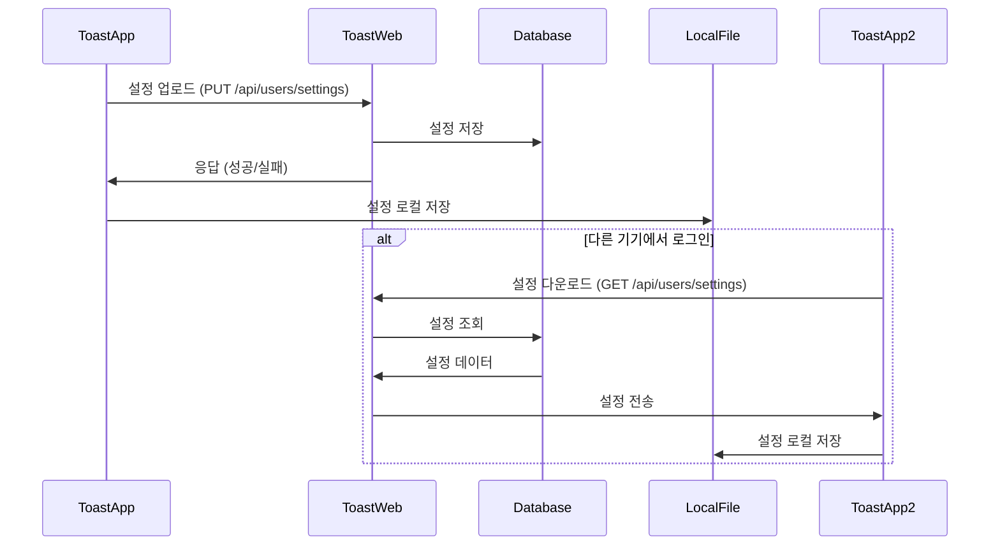

# 클라우드 동기화 가이드

이 문서는 Toast-App(Electron 앱)에서 구현된 클라우드 동기화 기능에 대해 설명합니다.

## 목차

- [개요](#개요)
- [클라우드 동기화 구조](#클라우드-동기화-구조)
- [동기화 이벤트](#동기화-이벤트)
- [설정 다운로드 API](#설정-다운로드-api)
- [설정 업로드 API](#설정-업로드-api)
- [동기화 구현](#동기화-구현)
- [로컬 데이터 관리](#로컬-데이터-관리)
- [오류 처리 전략](#오류-처리-전략)
- [보안 고려사항](#보안-고려사항)

## 개요

Toast-App은 사용자의 설정(페이지 구성, 버튼 배치, 테마 등)을 클라우드에 동기화하여 여러 기기에서 일관된 경험을 제공합니다. 이 문서는 클라우드 동기화 구현 방식과 관련 API를 설명합니다.

## 클라우드 동기화 구조



## 동기화 이벤트

설정 동기화는 다음과 같은 특정 타이밍에 발생합니다:

### 서버에서 다운로드하는 시점
1. **로그인 성공 시**: 사용자가 로그인에 성공하면 즉시 서버에서 최신 설정을 다운로드합니다.
   ```javascript
   // 로그인 후 설정 다운로드 예시
   async function handleLoginSuccess() {
     try {
       await downloadSettings();
       console.log('로그인 후 설정 다운로드 완료');
     } catch (error) {
       console.error('설정 다운로드 실패:', error);
     }
   }
   ```

### 서버로 업로드하는 시점
1. **페이지 추가 시**: 사용자가 새 페이지를 추가하면 변경사항을 즉시 서버에 업로드합니다.
2. **페이지 삭제 시**: 사용자가 페이지를 삭제하면 변경사항을 즉시 서버에 업로드합니다.
3. **버튼 수정 시**: 사용자가 버튼을 추가, 수정 또는 삭제하면 변경사항을 서버에 업로드합니다.

각 변경은 디바운싱을 통해 최적화됩니다. 여러 빠른 변경이 연속해서 발생할 경우, 마지막 변경 후 2초 후에 한 번만 동기화합니다.

### 추가 동기화 시점
1. **주기적 동기화**: 설정된 간격(15분)마다 자동으로 동기화를 시도합니다.
2. **앱 시작 시**: 사용자가 이미 로그인된 상태에서 앱을 시작할 때 동기화합니다.
3. **네트워크 복구 시**: 오프라인 상태에서 온라인 상태로 전환될 때 동기화를 시도합니다.

## 설정 다운로드 API

```http
GET /api/users/settings HTTP/1.1
Host: app.toast.sh
Authorization: Bearer ACCESS_TOKEN
```

### 응답

```json
{
  "pages": [...],
  "appearance": {...},
  "advanced": {...},
  "lastSyncedAt": "2024-04-01T12:30:45Z"
}
```

## 설정 업로드 API

```http
PUT /api/users/settings HTTP/1.1
Host: app.toast.sh
Authorization: Bearer ACCESS_TOKEN
Content-Type: application/json

{
  "pages": [...],
  "appearance": {...},
  "advanced": {...}
}
```

### 응답

```json
{
  "success": true,
  "message": "Settings updated successfully",
  "lastSyncedAt": "2024-04-01T12:45:30Z"
}
```

## 동기화 구현

설정 동기화는 `cloud-sync.js` 모듈에서 관리됩니다:

```javascript
const { sync: apiSync } = require('./api');
const { createConfigStore } = require('./config');

// 동기화 관련 상수
const SYNC_DEBOUNCE_MS = 2000; // 마지막 변경 후 2초 후에 동기화
const PERIODIC_SYNC_INTERVAL_MS = 15 * 60 * 1000; // 15분마다 자동 동기화

// 설정 변경 감지 및 동기화
configStore.onDidChange('pages', async (newValue, oldValue) => {
  // 변경 유형 감지 (페이지 추가, 삭제, 버튼 수정)
  if (Array.isArray(newValue) && Array.isArray(oldValue)) {
    if (newValue.length > oldValue.length) {
      // 페이지 추가 감지
      console.log('페이지 추가 감지, 동기화 시작...');
    } else if (newValue.length < oldValue.length) {
      // 페이지 삭제 감지
      console.log('페이지 삭제 감지, 동기화 시작...');
    } else if (JSON.stringify(newValue) !== JSON.stringify(oldValue)) {
      // 버튼 수정 감지
      console.log('버튼 수정 감지, 동기화 시작...');
    }
  }

  // 디바운스 처리: 연속적인 변경이 있을 경우 마지막 변경 후 2초 후에 동기화
  clearTimeout(syncTimer);
  syncTimer = setTimeout(async () => {
    await uploadSettings();
  }, SYNC_DEBOUNCE_MS);
});
```

## 로컬 데이터 관리

Toast-App은 사용자 프로필, 구독 정보, 설정 등을 로컬 파일로 저장하고 관리합니다. 이를 통해 오프라인 상태에서도 앱이 정상적으로 동작할 수 있습니다.

### 로컬 파일 저장 위치

사용자 데이터는 각 운영체제의 표준 위치에 저장됩니다:

- **Windows**: `C:\Users\{Username}\AppData\Roaming\toast-app\`
- **macOS**: `/Users/{Username}/Library/Application Support/toast-app/`
- **Linux**: `/home/{username}/.config/toast-app/`

### 저장되는 파일 종류

| 파일명 | 설명 | 내용 |
|--------|------|------|
| `auth-tokens.json` | 인증 토큰 정보 | 액세스 토큰, 리프레시 토큰, 만료 시간 |
| `user-profile.json` | 사용자 프로필 정보 | 이름, 이메일, 아바타, 구독 정보 등 |
| `user-settings.json` | 사용자 설정 정보 | 페이지 구성, 테마, 단축키, 타임스탬프 등 |
| `config.json` | 앱 구성 정보 | 일반 설정, 창 크기, 위치 등 |

### 타임스탬프 관리

모든 로컬 설정 파일에는 타임스탬프 정보가 포함되어 동기화 시 충돌을 방지하고 최신 데이터를 식별합니다:

```javascript
// 설정 저장 시 타임스탬프 추가 예시
function saveSettings(settingsData) {
  // 현재 시간을 타임스탬프로 추가
  const dataWithTimestamp = {
    ...settingsData,
    lastModifiedAt: Date.now(),
    lastModifiedDevice: getDeviceIdentifier()
  };

  return writeToFile(SETTINGS_FILE_PATH, dataWithTimestamp);
}

// 설정 로드 시 타임스탬프 확인 예시
function loadSettings() {
  const settingsData = readFromFile(SETTINGS_FILE_PATH);

  if (settingsData && !settingsData.lastModifiedAt) {
    // 타임스탬프가 없는 경우 현재 시간으로 추가
    settingsData.lastModifiedAt = Date.now();
    settingsData.lastModifiedDevice = getDeviceIdentifier();
    writeToFile(SETTINGS_FILE_PATH, settingsData);
  }

  return settingsData;
}
```

타임스탬프는 다음과 같은 용도로 사용됩니다:

1. **변경 감지**: 로컬 설정과 서버 설정의 변경 시점을 비교하여 최신 버전 식별
2. **충돌 해결**: 여러 기기에서 동시에 변경이 발생한 경우, 타임스탬프를 기준으로 병합 또는 우선순위 결정
3. **동기화 최적화**: 마지막 동기화 이후 변경이 없는 경우 불필요한 네트워크 요청 방지

```json
// user-settings.json 예시
{
  "pages": [...],
  "appearance": {
    "theme": "dark"
  },
  "lastModifiedAt": 1682932134590,
  "lastModifiedDevice": "macbook-pro-m1",
  "lastSyncedAt": 1682932134590
}
```

### 파일 관리 모듈

사용자 데이터 파일 관리는 `user-data-manager.js` 모듈에서 처리합니다:

```javascript
const { app } = require('electron');
const path = require('path');
const fs = require('fs');

// 파일 경로 상수
const USER_DATA_PATH = app.getPath('userData');
const PROFILE_FILE_PATH = path.join(USER_DATA_PATH, 'user-profile.json');
const SETTINGS_FILE_PATH = path.join(USER_DATA_PATH, 'user-settings.json');

// 파일 읽기
function readFromFile(filePath) {
  try {
    if (!fs.existsSync(filePath)) {
      return null;
    }
    const data = fs.readFileSync(filePath, 'utf8');
    return JSON.parse(data);
  } catch (error) {
    console.error(`파일 읽기 오류 (${filePath}):`, error);
    return null;
  }
}

// 파일 쓰기
function writeToFile(filePath, data) {
  try {
    const dirPath = path.dirname(filePath);
    if (!fs.existsSync(dirPath)) {
      fs.mkdirSync(dirPath, { recursive: true });
    }
    fs.writeFileSync(filePath, JSON.stringify(data, null, 2), 'utf8');
    return true;
  } catch (error) {
    console.error(`파일 저장 오류 (${filePath}):`, error);
    return false;
  }
}

// 파일 삭제
function deleteFile(filePath) {
  try {
    if (fs.existsSync(filePath)) {
      fs.unlinkSync(filePath);
      return true;
    }
    return false;
  } catch (error) {
    console.error(`파일 삭제 오류 (${filePath}):`, error);
    return false;
  }
}
```

### 주기적 데이터 갱신

프로필 및 설정 정보는 일정 시간마다 자동으로 갱신됩니다:

```javascript
// 주기적 갱신 설정
const REFRESH_INTERVAL_MS = 30 * 60 * 1000; // 30분마다 갱신
let profileRefreshTimer = null;
let settingsRefreshTimer = null;

// 주기적 프로필 갱신 시작
function startProfileRefresh() {
  // 이미 실행 중인 타이머가 있으면 중지
  stopProfileRefresh();

  // 즉시 한 번 실행 후 타이머 시작
  getUserProfile(true).then(profile => {
    console.log('초기 프로필 갱신 완료');
  });

  // 주기적 갱신 타이머 설정
  profileRefreshTimer = setInterval(async () => {
    try {
      await getUserProfile(true);
      console.log('주기적 프로필 갱신 완료');
    } catch (error) {
      console.error('주기적 프로필 갱신 오류:', error);
    }
  }, REFRESH_INTERVAL_MS);
}

// 유사한 방식으로 설정 정보도 주기적 갱신
```

### 로그아웃 시 데이터 정리

```javascript
// 로그아웃 시 데이터 정리
function cleanupOnLogout() {
  try {
    // 주기적 갱신 중지
    stopProfileRefresh();
    stopSettingsRefresh();

    // 저장된 파일 삭제
    deleteFile(PROFILE_FILE_PATH);
    deleteFile(SETTINGS_FILE_PATH);

    console.log('사용자 데이터 정리 완료');
    return true;
  } catch (error) {
    console.error('로그아웃 데이터 정리 오류:', error);
    return false;
  }
}
```

## 오류 처리 전략

Toast-App은 다양한 네트워크 오류와 API 응답 오류를 적절히 처리하여 사용자 경험을 유지합니다.

### 주요 오류 처리 전략

1. **네트워크 연결 오류**: 로컬에 저장된 데이터를 사용하여 오프라인 기능 유지
2. **토큰 만료 오류**: 자동으로 리프레시 토큰으로 갱신 시도
3. **API 요청 실패**: 적절한 재시도 로직 및 사용자에게 통보

### 오류 대응 방법

| 오류 유형 | 설명 | 처리 방법 |
|-----------|------|-----------|
| `NETWORK_ERROR` | 네트워크 연결 오류 | 로컬 데이터 사용, 재연결 시 동기화 |
| `API_ERROR` | API 서버 오류 | 일정 시간 후 재시도 |
| `CONFLICT` | 데이터 충돌 발생 | 타임스탬프 기반으로 최신 데이터 우선 적용 |
| `QUOTA_EXCEEDED` | 데이터 크기 제한 초과 | 비필수 데이터 정리 후 재시도 |

### 비어있는 파일 처리

파일이 손상되었거나 비어있는 경우 기본값을 제공하여 오류를 방지합니다:

```javascript
function getUserSettings() {
  try {
    const settingsData = readFromFile(SETTINGS_FILE_PATH);

    if (!settingsData) {
      // 파일이 없거나 비어있는 경우 기본 설정 반환
      return {
        pages: [],
        appearance: { theme: 'system' },
        advanced: { autoStart: true }
      };
    }

    return settingsData;
  } catch (error) {
    // 오류 발생 시 기본 설정 반환
    console.error('설정 정보 가져오기 오류:', error);
    return getDefaultSettings();
  }
}
```

## 보안 고려사항

클라우드 동기화 관련 데이터 보안을 유지하기 위한 조치:

1. **전송 보안**: 모든 API 통신은 HTTPS를 통해 암호화
2. **저장 보안**: 로컬 파일은 OS의 사용자 디렉토리 권한 통해 보호
3. **인증 보안**: 동기화는 유효한 액세스 토큰을 통해서만 가능
4. **데이터 최소화**: 필수 데이터만 동기화하여 민감 정보 노출 최소화

### 동기화 충돌 해결

여러 기기에서 동시에 설정이 변경될 경우 다음 전략으로 충돌을 해결합니다:

1. **타임스탬프 기반**: 가장 최근에 변경된 설정이 우선
2. **병합 전략**: 가능한 경우 충돌 없는 필드는 병합하여 데이터 보존
3. **사용자 알림**: 충돌 발생 시 사용자에게 통보하고 선택 옵션 제공
