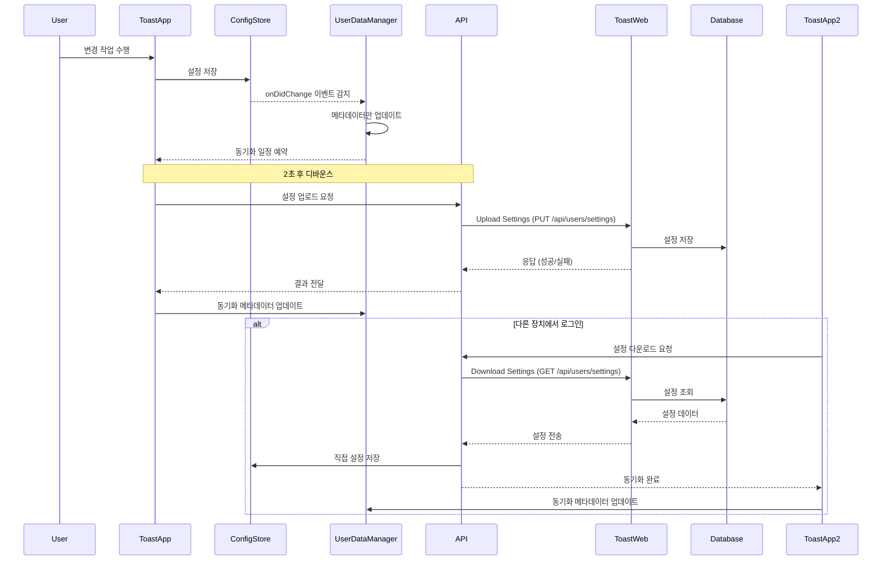

# 클라우드 동기화 가이드

이 문서는 Toast 앱(Electron 애플리케이션)에 구현된 클라우드 동기화 기능에 대한 상세한 설명을 제공합니다.

## 목차

- [개요](#개요)
- [클라우드 동기화 아키텍처](#클라우드-동기화-아키텍처)
- [단일 데이터 소스 원칙](#단일-데이터-소스-원칙)
- [동기화 이벤트](#동기화-이벤트)
- [API 엔드포인트](#API-엔드포인트)
- [동기화 구현](#동기화-구현)
- [로컬 데이터 관리](#로컬-데이터-관리)
- [오류 처리 전략](#오류-처리-전략)
- [충돌 해결 전략](#충돌-해결-전략)
- [보안 고려사항](#보안-고려사항)

## 개요

Toast 앱은 사용자 설정(페이지 구성, 버튼 레이아웃, 테마 등)을 클라우드에 동기화하여 여러 장치에서 일관된 경험을 제공합니다. 이 문서는 클라우드 동기화 구현과 관련 API를 설명합니다.

## 클라우드 동기화 아키텍처



## 단일 데이터 소스 원칙

클라우드 동기화 시스템은 "단일 데이터 소스" 원칙을 따릅니다:

1. **ConfigStore를 단일 소스로 사용**:
   - 모든 설정 데이터는 Electron-Store로 관리되는 `ConfigStore`에서 읽고 씁니다.
   - UI 변경, API 다운로드 등 모든 데이터 변경은 `ConfigStore`에 직접 적용됩니다.

2. **UserSettings 파일의 역할 변경**:
   - `user-settings.json` 파일은 전체 설정 복제본이 아닌 메타데이터(타임스탬프, 장치 정보)만 저장
   - 이 파일의 주요 목적은 동기화 상태 및 충돌 감지를 위한 정보 유지

3. **데이터 흐름 최적화**:
   - 사용자 변경 → ConfigStore 저장 → 메타데이터 갱신 → API 업로드
   - API 다운로드 → ConfigStore 직접 갱신 → 메타데이터 갱신

이 구조는 불필요한 데이터 복제를 방지하고 일관성을 유지하여 데이터 불일치 가능성을 최소화합니다.

## 동기화 이벤트

설정 동기화는 다음 이벤트에서 발생합니다:

### 서버에서 다운로드 트리거
1. **로그인 성공 시**: 사용자가 성공적으로 로그인하면 최신 설정이 즉시 서버에서 다운로드됩니다.
   ```javascript
   // 로그인 후 설정 다운로드 예시
   async function syncAfterLogin() {
     logger.info('Performing cloud synchronization after login');
     const result = await downloadSettings();

     // 다운로드 성공 후 UI 업데이트
     if (result.success) {
       const configData = {
         pages: configStore.get('pages'),
         appearance: configStore.get('appearance'),
         advanced: configStore.get('advanced'),
         subscription: configStore.get('subscription'),
       };
       authManager.notifySettingsSynced(configData);
     }

     // 주기적 동기화 시작
     if (state.enabled) {
       startPeriodicSync();
     }

     return result;
   }
   ```

2. **앱 시작 시**: 사용자가 이미 로그인한 상태라면 앱 시작 시 동기화합니다.

### 설정 변경 트리거
1. **페이지 변경 시**: configStore의 'pages' 변경 감지 시
2. **앱 외관 변경 시**: configStore의 'appearance' 변경 감지 시
3. **고급 설정 변경 시**: configStore의 'advanced' 변경 감지 시

각 변경은 메타데이터를 업데이트하고 2초 디바운스 후 동기화를 예약합니다:

```javascript
// 설정 변경 감지 예시
configStore.onDidChange('pages', async (newValue, oldValue) => {
  // 동기화 가능 상태 확인
  if (!state.enabled || !(await canSync())) {
    return;
  }

  // 변경 유형 감지
  let changeType = 'Unknown change';
  if (Array.isArray(newValue) && Array.isArray(oldValue)) {
    if (newValue.length > oldValue.length) {
      changeType = 'Page added';
    } else if (newValue.length < oldValue.length) {
      changeType = 'Page deleted';
    } else {
      changeType = 'Button modified';
    }
  }

  // 메타데이터만 업데이트
  const timestamp = getCurrentTimestamp();
  userDataManager.updateSyncMetadata({
    lastModifiedAt: timestamp,
    lastModifiedDevice: state.deviceId,
  });

  // 동기화 예약
  scheduleSync(changeType);
});
```

### 기타 트리거
1. **주기적 동기화**: 기본 15분 간격으로 자동 동기화 (`SYNC_INTERVAL_MS`)
2. **네트워크 복구 시**: (미구현 - 향후 추가 가능)
3. **수동 동기화 요청 시**: 사용자가 수동으로 동기화 요청 시

## API 엔드포인트

### 설정 다운로드 API

```http
GET /api/users/settings HTTP/1.1
Host: app.toast.sh
Authorization: Bearer ACCESS_TOKEN
```

#### 응답

```json
{
  "pages": [...],
  "appearance": {...},
  "advanced": {...},
  "lastSyncedAt": "2025-04-01T12:30:45Z",
  "lastModifiedAt": "2025-04-01T12:30:45Z",
  "lastSyncedDevice": "macbook-pro-m1",
  "lastModifiedDevice": "macbook-pro-m1"
}
```

### 설정 업로드 API

```http
PUT /api/users/settings HTTP/1.1
Host: app.toast.sh
Authorization: Bearer ACCESS_TOKEN
Content-Type: application/json

{
  "pages": [...],
  "appearance": {...},
  "advanced": {...},
  "lastSyncedAt": "2025-04-01T12:45:30Z",
  "lastSyncedDevice": "macbook-pro-m1"
}
```

#### 응답

```json
{
  "success": true,
  "message": "Settings updated successfully",
  "lastSyncedAt": "2025-04-01T12:45:30Z"
}
```

## 동기화 구현

클라우드 동기화는 세 가지 핵심 모듈로 구현됩니다:

### 1. Cloud-Sync 모듈 (src/main/cloud-sync.js)

동기화 프로세스를 조정하고 다양한 이벤트를 처리합니다:

```javascript
// 주요 상수
const SYNC_INTERVAL_MS = 15 * 60 * 1000; // 15분마다 자동 동기화
const SYNC_DEBOUNCE_MS = 2000; // 마지막 변경 후 2초 후에 동기화
const MAX_RETRY_COUNT = 3; // 최대 재시도 횟수

// 모듈 상태 관리
const state = {
  enabled: true,
  isSyncing: false,
  lastSyncTime: 0,
  lastChangeType: null,
  pendingSync: false,
  retryCount: 0,
  deviceId: null,
  timers: {
    sync: null,
    debounce: null,
  },
};

// 동기화 가능 여부 확인
async function canSync() {
  if (!state.enabled || !authManager) {
    return false;
  }

  return await apiSync.isCloudSyncEnabled({
    hasValidToken: authManager.hasValidToken,
    configStore,
  });
}

// 설정 업로드 함수
async function uploadSettings() {
  // 동기화 상태 확인
  if (!state.enabled || !(await canSync()) || state.isSyncing) {
    return { success: false, error: '동기화 불가 상태' };
  }

  try {
    state.isSyncing = true;

    // ConfigStore에서 직접 데이터 추출 (단일 소스)
    const advanced = configStore.get('advanced');
    const appearance = configStore.get('appearance');
    const pages = configStore.get('pages') || [];

    // 타임스탬프 업데이트
    const timestamp = getCurrentTimestamp();

    // 업로드 데이터 구성
    const uploadData = {
      advanced,
      appearance,
      lastSyncedAt: timestamp,
      lastSyncedDevice: state.deviceId,
      pages,
    };

    // API 호출
    const result = await apiSync.uploadSettings({
      hasValidToken: authManager.hasValidToken,
      onUnauthorized: authManager.refreshAccessToken,
      configStore,
      directData: uploadData,
    });

    // 성공 시 메타데이터만 업데이트
    if (result.success) {
      state.lastSyncTime = timestamp;
      userDataManager.updateSyncMetadata({
        lastSyncedAt: timestamp,
        lastSyncedDevice: state.deviceId,
      });
    }

    return result;
  } catch (error) {
    return {
      success: false,
      error: error.message || '알 수 없는 오류',
    };
  } finally {
    state.isSyncing = false;
  }
}
```

### 2. API Sync 모듈 (src/main/api/sync.js)

API 호출을 처리하고 서버와 통신합니다:

```javascript
// 클라우드 동기화 가능 여부 확인
async function isCloudSyncEnabled({ hasValidToken, configStore }) {
  // 인증 상태 확인
  const isAuthenticated = await hasValidToken();
  if (!isAuthenticated) {
    return false;
  }

  // 구독 정보 확인
  const subscription = configStore.get('subscription') || {};
  let hasSyncFeature = false;

  // 다양한 구독 형식 지원
  if (subscription.isSubscribed || subscription.active || subscription.is_subscribed) {
    hasSyncFeature = true;
  }

  // features 객체에서 확인
  if (subscription.features?.cloud_sync === true) {
    hasSyncFeature = true;
  }

  // Premium/Pro 플랜 확인
  if (subscription.plan &&
      (subscription.plan.toLowerCase().includes('premium') ||
       subscription.plan.toLowerCase().includes('pro'))) {
    hasSyncFeature = true;
  }

  return hasSyncFeature;
}

// 설정 다운로드 함수
async function downloadSettings({ hasValidToken, onUnauthorized, configStore }) {
  // API 호출
  return await authenticatedRequest(
    async () => {
      const headers = getAuthHeaders();
      const apiClient = createApiClient();
      const response = await apiClient.get(ENDPOINTS.SETTINGS, { headers });

      const settings = response.data;

      // 데이터 추출 및 저장
      if (settings && settings.pages) {
        configStore.set('pages', settings.pages);

        if (settings.appearance) {
          configStore.set('appearance', settings.appearance);
        }

        if (settings.advanced) {
          configStore.set('advanced', settings.advanced);
        }
      }

      // 메타데이터 추출
      const syncMetadata = {
        lastSyncedAt: settings.lastSyncedAt || Date.now(),
        lastSyncedDevice: settings.lastSyncedDevice || 'server',
        lastModifiedAt: settings.lastModifiedAt,
        lastModifiedDevice: settings.lastModifiedDevice,
      };

      return {
        success: true,
        data: settings,
        syncMetadata,
      };
    },
    { onUnauthorized }
  );
}
```

### 3. User-Data-Manager 모듈 (src/main/user-data-manager.js)

로컬 파일 관리와 메타데이터 업데이트를 처리합니다:

```javascript
// 동기화 메타데이터 업데이트
function updateSyncMetadata(metadata) {
  try {
    // 기존 설정 파일 읽기
    const currentSettings = readFromFile(SETTINGS_FILE_PATH);

    // 파일이 없거나 손상되었을 경우 새로 생성
    if (!currentSettings) {
      const newSettings = {
        lastSyncedAt: metadata.lastSyncedAt || Date.now(),
        lastModifiedAt: metadata.lastModifiedAt || Date.now(),
        lastSyncedDevice: metadata.lastSyncedDevice || 'unknown',
        lastModifiedDevice: metadata.lastModifiedDevice || 'unknown',
      };

      return updateSettings(newSettings);
    }

    // 메타데이터만 업데이트
    const updatedSettings = {
      ...currentSettings,
      lastSyncedAt: metadata.lastSyncedAt || currentSettings.lastSyncedAt,
      lastModifiedAt: metadata.lastModifiedAt || currentSettings.lastModifiedAt,
      lastSyncedDevice: metadata.lastSyncedDevice || currentSettings.lastSyncedDevice,
      lastModifiedDevice: metadata.lastModifiedDevice || currentSettings.lastModifiedDevice,
    };

    return updateSettings(updatedSettings);
  } catch (error) {
    logger.error('동기화 메타데이터 업데이트 오류:', error);
    return false;
  }
}
```

## 로컬 데이터 관리

Toast 앱은 사용자 프로필, 구독 정보, 설정 등을 로컬 파일로 저장하고 관리합니다. 이를 통해 오프라인 상태에서도 앱이 정상적으로 작동할 수 있습니다.

### 로컬 파일 저장 위치

사용자 데이터는 각 운영 체제의 표준 위치에 저장됩니다:

- **Windows**: `C:\Users\{Username}\AppData\Roaming\toast-app\`
- **macOS**: `/Users/{Username}/Library/Application Support/toast-app/`
- **Linux**: `/home/{username}/.config/toast-app/`

### 저장되는 파일 종류

| 파일명 | 설명 | 내용 |
|--------|------|------|
| `auth-tokens.json` | 인증 토큰 정보 | 액세스 토큰, 리프레시 토큰, 만료 시간 |
| `user-profile.json` | 사용자 프로필 정보 | 이름, 이메일, 아바타, 구독 정보 등 |
| `user-settings.json` | 동기화 메타데이터 | 타임스탬프, 장치 식별자 정보 |
| `config.json` | 앱 전체 설정 정보 | 페이지, 외관, 고급 설정, 창 크기, 위치 등 |

### 타임스탬프 및 장치 식별자

동기화와 충돌 해결을 위해 다음 메타데이터를 관리합니다:

1. **lastSyncedAt**: 마지막으로 서버와 동기화된 시간 (밀리초 타임스탬프)
2. **lastSyncedDevice**: 마지막으로 동기화를 수행한 장치 식별자
3. **lastModifiedAt**: 마지막으로 설정이 수정된 시간 (밀리초 타임스탬프)
4. **lastModifiedDevice**: 마지막으로 설정을 수정한 장치 식별자

장치 식별자는 다음과 같이 생성됩니다:

```javascript
function getDeviceIdentifier() {
  const platform = process.platform;
  const hostname = os.hostname();
  const username = os.userInfo().username;
  return `${platform}-${hostname}-${username}`;
}
```

메타데이터는 다음과 같이 사용됩니다:

1. **변경 감지**: 로컬 설정과 서버 설정의 변경 시간을 비교하여 최신 버전 식별
2. **충돌 해결**: 여러 장치에서 동시에 변경이 발생한 경우 타임스탬프를 기준으로 병합 또는 우선순위 지정
3. **동기화 최적화**: 마지막 동기화 이후 변경이 없으면 불필요한 네트워크 요청 방지

## 오류 처리 전략

Toast 앱은 다양한 네트워크 오류와 API 응답 오류를 적절하게 처리하여 사용자 경험을 유지합니다.

### 재시도 로직

네트워크 오류나 일시적인 서버 오류가 발생할 경우 자동 재시도를 수행합니다:

```javascript
// 재시도 상수
const MAX_RETRY_COUNT = 3;
const RETRY_DELAY_MS = 5000; // 5초 간격

// 재시도 로직을 포함한 업로드 함수
async function uploadSettingsWithRetry() {
  if (state.isSyncing) {
    return;
  }

  try {
    state.isSyncing = true;
    const result = await uploadSettings();

    if (result.success) {
      state.retryCount = 0;
      state.pendingSync = false;
    } else {
      state.retryCount++;

      if (state.retryCount <= MAX_RETRY_COUNT) {
        // 재시도 예약
        setTimeout(() => {
          uploadSettingsWithRetry();
        }, RETRY_DELAY_MS);
      } else {
        state.retryCount = 0;
      }
    }
  } catch (error) {
    state.retryCount++;

    if (state.retryCount <= MAX_RETRY_COUNT) {
      // 재시도 예약
      setTimeout(() => {
        uploadSettingsWithRetry();
      }, RETRY_DELAY_MS);
    } else {
      state.retryCount = 0;
    }
  } finally {
    state.isSyncing = false;
  }
}
```

### 오류 유형 및 처리 방법

| 오류 유형 | 설명 | 처리 방법 |
|-----------|------|-----------|
| **네트워크 연결 오류** | 인터넷 연결 문제 | 자동 재시도, 로컬 데이터 사용 |
| **인증 오류 (401)** | 토큰 만료 또는 유효하지 않음 | 토큰 갱신 시도, 실패 시 재로그인 요청 |
| **서버 오류 (5xx)** | API 서버 내부 오류 | 지수 백오프로 재시도 |
| **충돌 오류** | 동시 수정으로 인한 충돌 | 타임스탬프 기반 해결 전략 적용 |
| **파일 읽기/쓰기 오류** | 로컬 파일 접근 오류 | 임시 파일을 사용한 안전한 쓰기, 복구 로직 |

### 인증 토큰 갱신

인증 오류(401) 발생 시 토큰 갱신 로직을 적용합니다:

```javascript
async function authenticatedRequest(apiCall, options = {}) {
  const { onUnauthorized = null } = options;

  try {
    return await apiCall();
  } catch (error) {
    // 401 오류 처리
    if (error.response && error.response.status === 401) {
      // 토큰 갱신 콜백 실행
      if (onUnauthorized && typeof onUnauthorized === 'function') {
        const refreshResult = await onUnauthorized();

        if (refreshResult && refreshResult.success) {
          // 토큰 갱신 성공 시 원래 API 호출 재시도
          return await apiCall();
        } else {
          // 토큰 갱신 실패 시 에러 반환
          return {
            error: {
              code: 'AUTH_REFRESH_FAILED',
              message: '인증 갱신에 실패했습니다. 다시 로그인해주세요.',
              requireRelogin: true,
            },
          };
        }
      }
    }

    // 기타 오류 처리
    return { error: { code: 'API_ERROR', message: error.message } };
  }
}
```

### 안전한 파일 작업

파일 쓰기 오류를 방지하기 위해 임시 파일과 원자적 이름 변경 작업을 사용합니다:

```javascript
function updateSettings(settings) {
  if (!settings) {
    return false;
  }

  // 임시 파일 경로
  const tempFilePath = `${SETTINGS_FILE_PATH}.temp`;

  try {
    // 먼저 임시 파일에 쓰기
    fs.writeFileSync(tempFilePath, JSON.stringify(settings, null, 2), 'utf8');

    // 작성된 데이터가 유효한지 확인
    const verifyData = fs.readFileSync(tempFilePath, 'utf8');
    JSON.parse(verifyData); // 유효한 JSON인지 확인

    // 원자적 이름 변경 작업 (Windows에서는 기존 파일 먼저 삭제)
    if (process.platform === 'win32' && fs.existsSync(SETTINGS_FILE_PATH)) {
      fs.unlinkSync(SETTINGS_FILE_PATH);
    }

    fs.renameSync(tempFilePath, SETTINGS_FILE_PATH);
    return true;
  } catch (error) {
    // 오류 발생 시 임시 파일 정리
    try {
      if (fs.existsSync(tempFilePath)) {
        fs.unlinkSync(tempFilePath);
      }
    } catch (cleanupError) {
      // 정리 오류 무시
    }
    return false;
  }
}
```

## 충돌 해결 전략

여러 장치에서 동시에 설정이 변경될 경우 발생하는 충돌을 해결하기 위한 전략입니다.

### 타임스탬프 기반 해결

기본적으로 가장 최근에 수정된 설정을 우선시합니다:

```javascript
function mergeSettings(localSettings, serverSettings) {
  if (!localSettings) return serverSettings;
  if (!serverSettings) return localSettings;

  // 타임스탬프 기반 충돌 해결
  const localTime = localSettings.lastModifiedAt || 0;
  const serverTime = serverSettings.lastModifiedAt || 0;

  // 서버 설정이 더 최신인 경우
  if (serverTime > localTime) {
    return {
      ...localSettings,
      ...serverSettings,
      lastSyncedAt: getCurrentTimestamp(),
    };
  }

  // 로컬 설정이 더 최신인 경우
  return {
    ...serverSettings,
    ...localSettings,
    lastSyncedAt: getCurrentTimestamp(),
  };
}
```

### 수동 충돌 해결

더 복잡한 충돌이 발생할 경우 사용자가 직접 해결 방법을 선택할 수 있도록 지원합니다:

```javascript
// 수동 동기화 처리 함수
async function syncSettings(action = 'resolve') {
  logger.info(`Manual synchronization request: ${action}`);

  try {
    if (action === 'upload') {
      // 로컬 설정을 서버로 업로드
      return await uploadSettings();
    } else if (action === 'download') {
      // 서버 설정을 로컬로 다운로드
      return await downloadSettings();
    } else {
      // 충돌 해결 (resolve)

      // 1. 현재 로컬 설정 가져오기
      const localSettings = await userDataManager.getUserSettings();

      // 2. 서버 설정 다운로드
      const serverResult = await apiSync.downloadSettings({
        hasValidToken: authManager.hasValidToken,
        onUnauthorized: authManager.refreshAccessToken,
        configStore,
        directData: {},
      });

      if (!serverResult.success) {
        return serverResult;
      }

      // 3. 설정 병합
      const serverSettings = serverResult.data;
      const mergedSettings = mergeSettings(localSettings, serverSettings);

      // 4. 병합된 설정 저장
      userDataManager.updateSettings(mergedSettings);

      // 5. 필요한 경우 병합된 설정 업로드
      if (localSettings && localSettings.lastModifiedAt > (serverSettings?.lastModifiedAt || 0)) {
        await uploadSettings();
      }

      return { success: true, message: '설정 동기화가 완료되었습니다' };
    }
  } catch (error) {
    return {
      success: false,
      error: error.message || '알 수 없는 오류',
    };
  }
}
```

### 설정 데이터 중복 최소화

불필요한 데이터 중복을 피하고 동기화 효율성을 높이기 위한 전략:

1. **차등 업로드**: 변경된 필드만 업로드하는 기능 (미구현, 향후 확장 가능)
2. **중복 동기화 방지**: 메타데이터 비교를 통해 변경되지 않은 데이터는 동기화 건너뛰기
3. **효율적인 상태 관리**: ConfigStore 변경 감지를 활용한 필요한 경우에만 동기화 트리거

## 보안 고려사항

클라우드 동기화 관련 데이터 보안을 유지하기 위한 조치:

### 데이터 전송 보안

1. **HTTPS 사용**: 모든 API 통신은 HTTPS를 통해 암호화
2. **토큰 기반 인증**: OAuth 2.0 기반의 액세스 토큰 및 리프레시 토큰 사용
3. **제한된 토큰 수명**: 액세스 토큰의 짧은 유효 기간 설정 (일반적으로 1시간)

```javascript
// 모든 API 요청에 인증 헤더 추가
function getAuthHeaders() {
  if (!currentToken) {
    throw new Error('No authentication token available');
  }

  return {
    Authorization: `Bearer ${currentToken}`,
    'Content-Type': 'application/json',
  };
}
```

### 로컬 데이터 보안

1. **OS 보안 활용**: 각 운영체제에서 제공하는 사용자 디렉토리 권한을 통한 파일 보호
2. **임시 파일 활용**: 파일 손상 방지를 위한 안전한 파일 쓰기 전략
3. **데이터 검증**: 파일 입출력 시 데이터 유효성 검사

```javascript
// 안전한 파일 쓰기 예시
function writeToFile(filePath, data) {
  try {
    const tempFilePath = `${filePath}.temp`;

    // 1. 임시 파일에 쓰기
    fs.writeFileSync(tempFilePath, JSON.stringify(data, null, 2), 'utf8');

    // 2. 데이터 유효성 검사
    const verifyData = fs.readFileSync(tempFilePath, 'utf8');
    JSON.parse(verifyData);

    // 3. 원자적 파일 교체
    fs.renameSync(tempFilePath, filePath);

    return true;
  } catch (error) {
    return false;
  }
}
```

### 구독 기반 접근 제어

1. **구독 검증**: 클라우드 동기화는 프리미엄 구독자에게만 제공
2. **권한 검사**: 모든 동기화 작업 전에 구독 상태 확인

```javascript
// 동기화 권한 확인
async function isCloudSyncEnabled({ hasValidToken, configStore }) {
  // 인증 상태 확인
  const isAuthenticated = await hasValidToken();
  if (!isAuthenticated) {
    return false;
  }

  // 구독 정보 확인
  const subscription = configStore.get('subscription') || {};
  let hasSyncFeature = false;

  // Premium/Pro 플랜 확인
  if (subscription.plan &&
      (subscription.plan.toLowerCase().includes('premium') ||
       subscription.plan.toLowerCase().includes('pro'))) {
    hasSyncFeature = true;
  }

  return hasSyncFeature;
}
```

### 민감한 정보 보호

1. **데이터 최소화**: 필수 데이터만 동기화하여 민감한 정보 노출 최소화
2. **비밀번호 제외**: 인증 정보는 절대 클라우드에 동기화하지 않음
3. **세션 정보 격리**: 장치별 세션 정보 분리 관리

이러한 보안 조치를 통해 여러 장치 간의 안전한 설정 동기화를 보장하며, 사용자의 개인 정보와 구성을 보호합니다.
