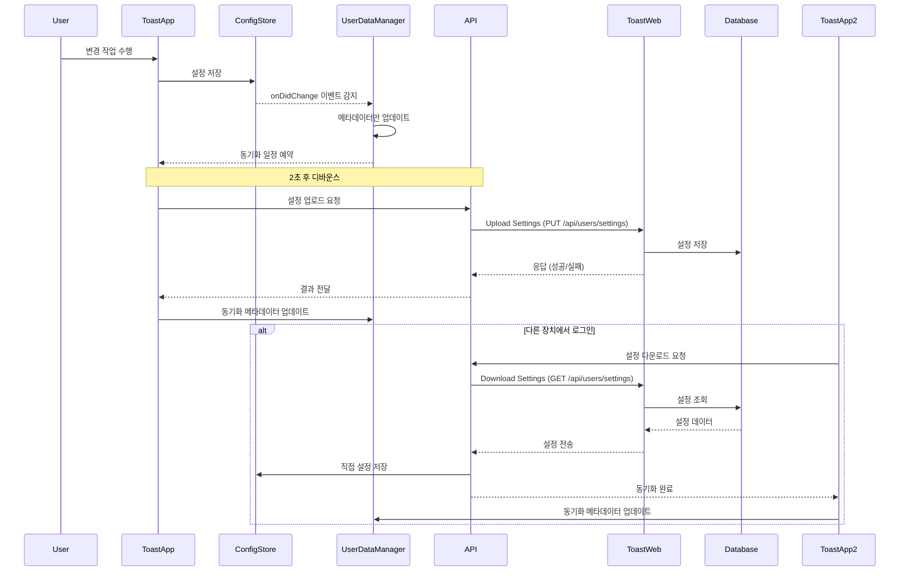

# 클라우드 동기화 가이드

이 문서는 Toast 앱(Electron 애플리케이션)에 구현된 클라우드 동기화 기능에 대한 상세한 설명을 제공합니다.

## 목차

- [개요](#개요)
- [클라우드 동기화 아키텍처](#클라우드-동기화-아키텍처)
- [단일 데이터 소스 원칙](#단일-데이터-소스-원칙)
- [동기화 이벤트](#동기화-이벤트)
- [API 엔드포인트](#API-엔드포인트)
- [동기화 구현](#동기화-구현)
- [사용자 인터페이스](#사용자-인터페이스)
- [로컬 데이터 관리](#로컬-데이터-관리)
- [오류 처리 전략](#오류-처리-전략)
- [충돌 해결 전략](#충돌-해결-전략)
- [보안 고려사항](#보안-고려사항)
- [문제 해결 가이드](#문제-해결-가이드)

## 개요

Toast 앱은 사용자 설정(페이지 구성, 버튼 레이아웃, 테마 등)을 클라우드에 동기화하여 여러 장치에서 일관된 경험을 제공합니다. 이 문서는 클라우드 동기화 구현과 관련 API를 설명합니다.

## 클라우드 동기화 아키텍처



## 단일 데이터 소스 원칙

클라우드 동기화 시스템은 "단일 데이터 소스" 원칙을 따릅니다:

1. **ConfigStore를 단일 소스로 사용**:
   - 모든 설정 데이터는 Electron-Store로 관리되는 `ConfigStore`에서 읽고 씁니다.
   - UI 변경, API 다운로드 등 모든 데이터 변경은 `ConfigStore`에 직접 적용됩니다.

2. **UserSettings 파일의 역할 변경**:
   - `user-settings.json` 파일은 전체 설정 복제본이 아닌 메타데이터(타임스탬프, 장치 정보)만 저장
   - 이 파일의 주요 목적은 동기화 상태 및 충돌 감지를 위한 정보 유지

3. **데이터 흐름 최적화**:
   - 사용자 변경 → ConfigStore 저장 → 메타데이터 갱신 → API 업로드
   - API 다운로드 → ConfigStore 직접 갱신 → 메타데이터 갱신

이 구조는 불필요한 데이터 복제를 방지하고 일관성을 유지하여 데이터 불일치 가능성을 최소화합니다.

## 동기화 이벤트

설정 동기화는 다음 이벤트에서 발생합니다:

### 서버에서 다운로드 트리거
1. **로그인 성공 시**: 사용자가 성공적으로 로그인하면 최신 설정이 즉시 서버에서 다운로드됩니다.
   ```javascript
   // 로그인 후 설정 다운로드 예시
   async function syncAfterLogin() {
     logger.info('Performing cloud synchronization after login');
     const result = await downloadSettings();

     // 다운로드 성공 후 UI 업데이트
     if (result.success) {
       const configData = {
         pages: configStore.get('pages'),
         appearance: configStore.get('appearance'),
         advanced: configStore.get('advanced'),
         subscription: configStore.get('subscription'),
       };
       authManager.notifySettingsSynced(configData);
     }

     // 주기적 동기화 시작
     if (state.enabled) {
       startPeriodicSync();
     }

     return result;
   }
   ```

2. **앱 시작 시**: 사용자가 이미 로그인한 상태라면 앱 시작 시 동기화합니다.

### 설정 변경 트리거
1. **페이지 변경 시**: configStore의 'pages' 변경 감지 시
2. **앱 외관 변경 시**: configStore의 'appearance' 변경 감지 시
3. **고급 설정 변경 시**: configStore의 'advanced' 변경 감지 시

각 변경은 메타데이터를 업데이트하고 2초 디바운스 후 동기화를 예약합니다:

```javascript
// 설정 변경 감지 예시
configStore.onDidChange('pages', async (newValue, oldValue) => {
  // 동기화 가능 상태 확인
  if (!state.enabled || !(await canSync())) {
    return;
  }

  // 변경 유형 감지
  let changeType = 'Unknown change';
  if (Array.isArray(newValue) && Array.isArray(oldValue)) {
    if (newValue.length > oldValue.length) {
      changeType = 'Page added';
    } else if (newValue.length < oldValue.length) {
      changeType = 'Page deleted';
    } else {
      changeType = 'Button modified';
    }
  }

  // 메타데이터만 업데이트
  const timestamp = getCurrentTimestamp();
  userDataManager.updateSyncMetadata({
    lastModifiedAt: timestamp,
    lastModifiedDevice: state.deviceId,
  });

  // 동기화 예약
  scheduleSync(changeType);
});
```

### 기타 트리거
1. **주기적 동기화**: 기본 15분 간격으로 자동 동기화 (`SYNC_INTERVAL_MS`)
2. **네트워크 복구 시**: (미구현 - 향후 추가 가능)
3. **수동 동기화 요청 시**: 사용자가 수동으로 동기화 요청 시

## API 엔드포인트

### 설정 다운로드 API

```http
GET /api/users/settings HTTP/1.1
Host: toast.sh
Authorization: Bearer ACCESS_TOKEN
```

#### 응답

```json
{
  "pages": [...],
  "appearance": {...},
  "advanced": {...},
  "lastSyncedAt": "2025-04-01T12:30:45Z",
  "lastModifiedAt": "2025-04-01T12:30:45Z",
  "lastSyncedDevice": "macbook-pro-m1",
  "lastModifiedDevice": "macbook-pro-m1"
}
```

### 설정 업로드 API

```http
PUT /api/users/settings HTTP/1.1
Host: toast.sh
Authorization: Bearer ACCESS_TOKEN
Content-Type: application/json

{
  "pages": [...],
  "appearance": {...},
  "advanced": {...},
  "lastSyncedAt": "2025-04-01T12:45:30Z",
  "lastSyncedDevice": "macbook-pro-m1"
}
```

#### 응답

```json
{
  "success": true,
  "message": "Settings updated successfully",
  "lastSyncedAt": "2025-04-01T12:45:30Z"
}
```

## 동기화 구현

클라우드 동기화는 세 가지 핵심 모듈로 구현됩니다:

### 1. Cloud-Sync 모듈 (src/main/cloud-sync.js)

동기화 프로세스를 조정하고 다양한 이벤트를 처리합니다:

```javascript
// 주요 상수
const SYNC_INTERVAL_MS = 15 * 60 * 1000; // 15분마다 자동 동기화
const SYNC_DEBOUNCE_MS = 2000; // 마지막 변경 후 2초 후에 동기화
const MAX_RETRY_COUNT = 3; // 최대 재시도 횟수

// 모듈 상태 관리
const state = {
  enabled: true,
  isSyncing: false,
  lastSyncTime: 0,
  lastChangeType: null,
  pendingSync: false,
  retryCount: 0,
  deviceId: null,
  timers: {
    sync: null,
    debounce: null,
  },
};

// 동기화 가능 여부 확인
async function canSync() {
  if (!state.enabled || !authManager) {
    return false;
  }

  return await apiSync.isCloudSyncEnabled({
    hasValidToken: authManager.hasValidToken,
    configStore,
  });
}

// 설정 업로드 함수
async function uploadSettings() {
  // 동기화 상태 확인
  if (!state.enabled || !(await canSync()) || state.isSyncing) {
    return { success: false, error: '동기화 불가 상태' };
  }

  try {
    state.isSyncing = true;

    // ConfigStore에서 직접 데이터 추출 (단일 소스)
    const advanced = configStore.get('advanced');
    const appearance = configStore.get('appearance');
    const pages = configStore.get('pages') || [];

    // 타임스탬프 업데이트
    const timestamp = getCurrentTimestamp();

    // 업로드 데이터 구성
    const uploadData = {
      advanced,
      appearance,
      lastSyncedAt: timestamp,
      lastSyncedDevice: state.deviceId,
      pages,
    };

    // API 호출
    const result = await apiSync.uploadSettings({
      hasValidToken: authManager.hasValidToken,
      onUnauthorized: authManager.refreshAccessToken,
      configStore,
      directData: uploadData,
    });

    // 성공 시 메타데이터만 업데이트
    if (result.success) {
      state.lastSyncTime = timestamp;
      userDataManager.updateSyncMetadata({
        lastSyncedAt: timestamp,
        lastSyncedDevice: state.deviceId,
      });
    }

    return result;
  } catch (error) {
    return {
      success: false,
      error: error.message || '알 수 없는 오류',
    };
  } finally {
    state.isSyncing = false;
  }
}
```

### 2. API Sync 모듈 (src/main/api/sync.js)

API 호출을 처리하고 서버와 통신합니다:

```javascript
// 클라우드 동기화 가능 여부 확인
async function isCloudSyncEnabled({ hasValidToken, configStore }) {
  // 인증 상태 확인
  const isAuthenticated = await hasValidToken();
  if (!isAuthenticated) {
    return false;
  }

  // 구독 정보 확인
  const subscription = configStore.get('subscription') || {};
  let hasSyncFeature = false;

  // 다양한 구독 형식 지원
  if (subscription.isSubscribed || subscription.active || subscription.is_subscribed) {
    hasSyncFeature = true;
  }

  // features 객체에서 확인
  if (subscription.features?.cloud_sync === true) {
    hasSyncFeature = true;
  }

  // Premium/Pro 플랜 확인
  if (subscription.plan &&
      (subscription.plan.toLowerCase().includes('premium') ||
       subscription.plan.toLowerCase().includes('pro'))) {
    hasSyncFeature = true;
  }

  return hasSyncFeature;
}

// 설정 다운로드 함수
async function downloadSettings({ hasValidToken, onUnauthorized, configStore }) {
  // API 호출
  return await authenticatedRequest(
    async () => {
      const headers = getAuthHeaders();
      const apiClient = createApiClient();
      const response = await apiClient.get(ENDPOINTS.SETTINGS, { headers });

      const settings = response.data;

      // 데이터 추출 및 저장
      if (settings && settings.pages) {
        configStore.set('pages', settings.pages);

        if (settings.appearance) {
          configStore.set('appearance', settings.appearance);
        }

        if (settings.advanced) {
          configStore.set('advanced', settings.advanced);
        }
      }

      // 메타데이터 추출
      const syncMetadata = {
        lastSyncedAt: settings.lastSyncedAt || Date.now(),
        lastSyncedDevice: settings.lastSyncedDevice || 'server',
        lastModifiedAt: settings.lastModifiedAt,
        lastModifiedDevice: settings.lastModifiedDevice,
      };

      return {
        success: true,
        data: settings,
        syncMetadata,
      };
    },
    { onUnauthorized }
  );
}
```

### 3. User-Data-Manager 모듈 (src/main/user-data-manager.js)

로컬 파일 관리와 메타데이터 업데이트를 처리합니다:

```javascript
// 동기화 메타데이터 업데이트
function updateSyncMetadata(metadata) {
  try {
    // 기존 설정 파일 읽기
    const currentSettings = readFromFile(SETTINGS_FILE_PATH);

    // 파일이 없거나 손상되었을 경우 새로 생성
    if (!currentSettings) {
      const newSettings = {
        lastSyncedAt: metadata.lastSyncedAt || Date.now(),
        lastModifiedAt: metadata.lastModifiedAt || Date.now(),
        lastSyncedDevice: metadata.lastSyncedDevice || 'unknown',
        lastModifiedDevice: metadata.lastModifiedDevice || 'unknown',
      };

      return updateSettings(newSettings);
    }

    // 메타데이터만 업데이트
    const updatedSettings = {
      ...currentSettings,
      lastSyncedAt: metadata.lastSyncedAt || currentSettings.lastSyncedAt,
      lastModifiedAt: metadata.lastModifiedAt || currentSettings.lastModifiedAt,
      lastSyncedDevice: metadata.lastSyncedDevice || currentSettings.lastSyncedDevice,
      lastModifiedDevice: metadata.lastModifiedDevice || currentSettings.lastModifiedDevice,
    };

    return updateSettings(updatedSettings);
  } catch (error) {
    logger.error('동기화 메타데이터 업데이트 오류:', error);
    return false;
  }
}
```

## 사용자 인터페이스

클라우드 동기화는 설정 창의 "Cloud Sync" 탭을 통해 사용자에게 제공됩니다. 이 탭은 동기화 상태 확인 및 수동 동기화 작업을 위한 인터페이스를 제공합니다.

### 클라우드 동기화 UI 구성

설정 창의 Cloud Sync 탭은 다음과 같은 요소로 구성됩니다:

1. **동기화 상태 표시 영역**:
   - 동기화 상태 배지(활성화/비활성화)
   - 동기화 상태 텍스트
   - 마지막 동기화 시간
   - 현재 장치 정보

2. **동기화 제어 영역**:
   - 클라우드 동기화 활성화/비활성화 체크박스
   - 수동 동기화 버튼들(업로드, 다운로드, 충돌 해결)
   - 동기화 중 로딩 표시기

```html
<!-- HTML 구조 예시 -->
<div id="cloud-sync" class="settings-tab">
  <h2>Cloud Sync</h2>

  <!-- 동기화 상태 섹션 -->
  <div id="sync-status-section" class="settings-group">
    <div class="subscription-container">
      <div class="subscription-details">
        <div class="subscription-status">
          <span id="sync-status-badge" class="badge">Disabled</span>
          <span id="sync-status-text">Cloud Sync Status</span>
        </div>
        <p id="last-synced-time">Last Synced: -</p>
        <p id="sync-device-info">Current Device: -</p>
      </div>
    </div>
  </div>

  <!-- 동기화 제어 섹션 -->
  <div class="settings-group">
    <h3>Sync Settings</h3>
    <div class="settings-group">
      <label>
        <input type="checkbox" id="enable-cloud-sync" />
        Enable Cloud Sync
      </label>
      <p class="help-text">
        Synchronize settings and pages across multiple devices.
        Premium subscription required.
      </p>
    </div>

    <div class="settings-group">
      <div class="subscription-actions">
        <button id="manual-sync-upload" class="primary-button">
          Upload to Server
        </button>
        <button id="manual-sync-download" class="primary-button">
          Download from Server
        </button>
        <button id="manual-sync-resolve" class="secondary-button">
          Resolve Conflicts
        </button>
      </div>
      <div id="sync-loading" class="loading-indicator hidden">
        <div class="spinner"></div>
        <p>Syncing...</p>
      </div>
    </div>
  </div>
</div>
```

### 클라우드 동기화 UI 초기화

Cloud Sync 탭이 렌더링될 때 동기화 상태를 업데이트하고 권한에 따라 UI 요소를 활성화/비활성화합니다:

```javascript
function initializeCloudSyncUI() {
  try {
    // Premium 구독 사용자는 항상 Cloud Sync 기능 활성화
    if (authState.subscription?.plan) {
      const plan = authState.subscription.plan.toLowerCase();
      if (plan.includes('premium') || plan.includes('pro')) {
        enableCloudSyncCheckbox.disabled = false;

        // 구독 정보에 cloud_sync 기능 활성화 설정
        if (!authState.subscription.features) {
          authState.subscription.features = {};
        }
        authState.subscription.features.cloud_sync = true;
      }
    }

    // VIP 사용자 확인
    if (authState.subscription?.isVip || authState.subscription?.vip) {
      enableCloudSyncCheckbox.disabled = false;
    }

    // 클라우드 동기화 활성화/비활성화 상태 설정
    const cloudSyncEnabled = config.cloudSync?.enabled !== false;
    enableCloudSyncCheckbox.checked = cloudSyncEnabled;

    // 현재 동기화 상태 가져오기
    window.settings.getSyncStatus()
      .then(status => {
        updateSyncStatusUI(status);
      })
      .catch(error => {
        console.error('동기화 상태 가져오기 오류:', error);
      });
  } catch (error) {
    console.error('클라우드 동기화 UI 초기화 오류:', error);
  }
}
```

### 동기화 상태 UI 업데이트

동기화 상태에 따라 UI 요소를 업데이트합니다:

```javascript
function updateSyncStatusUI(status) {
  // 구독/VIP 여부 확인
  let hasCloudSyncPermission = checkCloudSyncPermission();
  const canUseCloudSync = hasCloudSyncPermission && authState.isLoggedIn;

  // 권한이 없으면 UI 비활성화
  if (!canUseCloudSync) {
    disableCloudSyncUI();
    return;
  }

  // 동기화 상태 배지 업데이트
  if (status.enabled) {
    // 활성화 상태 - 애니메이션 스피너 표시
    syncStatusBadge.textContent = '';
    syncStatusBadge.className = 'badge premium badge-with-spinner';

    const spinner = document.createElement('div');
    spinner.className = 'spinner-inline';
    syncStatusBadge.appendChild(spinner);
  } else {
    // 비활성화 상태 - 정지 아이콘 표시
    syncStatusBadge.textContent = '⏹️';
    syncStatusBadge.className = 'badge secondary';
  }

  // 상태 텍스트 업데이트
  syncStatusText.textContent = status.enabled ?
    'Cloud Sync Enabled' : 'Cloud Sync Disabled';

  // 마지막 동기화 시간 업데이트
  const lastSyncTime = status.lastSyncTime ?
    new Date(status.lastSyncTime) : new Date();
  const formattedDate = formatDate(lastSyncTime);

  lastSyncedTime.textContent = status.lastSyncTime ?
    `Last Synced: ${formattedDate}` :
    `Sync Status: Ready to sync (${formattedDate})`;

  // 장치 정보 업데이트
  syncDeviceInfo.textContent = status.deviceId ?
    `Current Device: ${status.deviceId}` :
    'Current Device: Unknown';

  // 컨트롤 활성화/비활성화
  enableCloudSyncCheckbox.disabled = !canUseCloudSync;
  enableCloudSyncCheckbox.checked = status.enabled;

  // 동기화 버튼 활성화/비활성화
  manualSyncUploadButton.disabled = !canUseCloudSync || !status.enabled;
  manualSyncDownloadButton.disabled = !canUseCloudSync || !status.enabled;
  manualSyncResolveButton.disabled = !canUseCloudSync || !status.enabled;
}
```

### 수동 동기화 작업

사용자가 수동으로 동기화를 수행할 수 있는 기능을 제공합니다:

1. **서버에 업로드**: 로컬 설정을 서버로 업로드
2. **서버에서 다운로드**: 서버 설정을 로컬로 다운로드 (기존 설정 덮어쓰기)
3. **충돌 해결**: 로컬 설정과 서버 설정 간 충돌 자동 해결

```javascript
// 서버에 업로드 처리
function handleManualSyncUpload() {
  // 로딩 표시 및 버튼 비활성화
  setLoading(syncLoading, true);
  disableSyncButtons();

  // 업로드 실행
  window.settings.manualSync('upload')
    .then(result => {
      if (result.success) {
        manualSyncUploadButton.textContent = '업로드 완료!';
      } else {
        throw new Error(result.error || '알 수 없는 오류');
      }
    })
    .catch(error => {
      manualSyncUploadButton.textContent = '업로드 실패';
    })
    .finally(() => {
      // 상태 복원
      setLoading(syncLoading, false);

      setTimeout(() => {
        resetSyncButtons();
      }, 1500);
    });
}

// 서버에서 다운로드 처리
function handleManualSyncDownload() {
  // 확인 대화상자
  if (!confirm('서버에서 설정을 다운로드하면 로컬 설정을 덮어씁니다. 계속하시겠습니까?')) {
    return;
  }

  // 로딩 표시 및 버튼 비활성화
  setLoading(syncLoading, true);
  disableSyncButtons();

  // 다운로드 실행
  window.settings.manualSync('download')
    .then(result => {
      if (result.success) {
        manualSyncDownloadButton.textContent = '다운로드 완료!';
        return window.settings.getConfig();
      } else {
        throw new Error(result.error || '알 수 없는 오류');
      }
    })
    .then(loadedConfig => {
      // 설정 UI 업데이트
      config = loadedConfig;
      initializeUI();
    })
    .catch(error => {
      manualSyncDownloadButton.textContent = '다운로드 실패';
    })
    .finally(() => {
      // 상태 복원
      setLoading(syncLoading, false);

      setTimeout(() => {
        resetSyncButtons();
      }, 1500);
    });
}
```

### 구독 기반 동기화 권한 제어

클라우드 동기화 기능은 프리미엄 구독 사용자에게만 제공됩니다:

```javascript
function checkCloudSyncPermission() {
  let hasPermission = false;

  // 1. 직접적인 구독 상태 확인
  if (
    authState.subscription?.isSubscribed === true ||
    authState.subscription?.active === true ||
    authState.subscription?.is_subscribed === true
  ) {
    hasPermission = true;
  }

  // 2. VIP 사용자 확인
  if (authState.subscription?.isVip || authState.subscription?.vip) {
    hasPermission = true;
  }

  // 3. Premium/Pro 플랜 확인
  if (authState.subscription?.plan) {
    const plan = authState.subscription.plan.toLowerCase();
    if (plan.includes('premium') || plan.includes('pro')) {
      hasPermission = true;
    }
  }

  // 4. 특정 기능 확인
  if (authState.subscription?.features?.cloud_sync === true) {
    hasPermission = true;
  }

  return hasPermission;
}
```

### UI 및 서버 상태 동기화

UI 액션이 서버 상태와 일치하도록 동기화합니다:

```javascript
// 클라우드 동기화 활성화/비활성화 처리
function handleCloudSyncToggle() {
  const enabled = enableCloudSyncCheckbox.checked;

  // 로딩 표시 및 체크박스 비활성화
  setLoading(syncLoading, true);
  enableCloudSyncCheckbox.disabled = true;

  // 서버에 상태 동기화
  window.settings.setCloudSyncEnabled(enabled)
    .then(() => {
      // 상태 업데이트 후 UI 갱신
      return window.settings.getSyncStatus();
    })
    .then(status => {
      // UI 업데이트
      updateSyncStatusUI(status);
    })
    .catch(error => {
      console.error('동기화 상태 변경 오류:', error);
      // 오류 시 상태 복원
      enableCloudSyncCheckbox.checked = !enabled;
    })
    .finally(() => {
      // 로딩 숨김 및 컨트롤 활성화
      setLoading(syncLoading, false);
      enableCloudSyncCheckbox.disabled = false;
    });
}
```

## 로컬 데이터 관리

클라우드 동기화 시스템은 로컬 설정 파일을 효율적으로 관리합니다:

### 데이터 저장소 구조

1. **ConfigStore**:
   - `electron-store`를 사용하여 사용자 설정을 저장하는 주요 저장소
   - 페이지, 버튼, 외관 및 고급 설정과 같은 모든 앱 데이터를 포함
   - 앱이 실행 중일 때 메모리와 디스크에서 모두 사용 가능

2. **UserDataManager**:
   - 로컬 설정 파일을 관리하는 모듈
   - 단일 데이터 소스 원칙에 따라 메타데이터만 관리
   - 파일 시스템 작업 추상화 및 오류 처리

### 중요 파일 경로

동기화 관련 파일은 Electron의 표준 경로에 저장됩니다:

```javascript
// 파일 경로 예시
const SETTINGS_DIR = app.getPath('userData');
const SETTINGS_FILE_PATH = path.join(SETTINGS_DIR, 'user-settings.json');
const CONFIG_STORE_PATH = path.join(SETTINGS_DIR, 'config.json');
```

### 데이터 저장 최적화

데이터 저장은 다음과 같이 최적화되어 있습니다:

1. **부분 업데이트**: 전체 데이터가 아닌 변경된 부분만 업데이트
2. **디바운싱**: 짧은 시간 내 여러 변경 사항을 하나의 업데이트로 그룹화
3. **비동기 저장**: 파일 쓰기 작업을 백그라운드에서 수행하여 UI 응답성 보장

## 오류 처리 전략

클라우드 동기화 시스템은 다양한 오류 상황에 대응합니다:

### 네트워크 관련 오류

1. **연결 오류**:
   - 오류 로깅 및 사용자 알림
   - 자동 재시도 메커니즘 (`MAX_RETRY_COUNT`까지)
   - 다음 동기화 시도까지 동기화 상태 저장

   ```javascript
   // 재시도 로직 예시
   if (error.code === 'ECONNRESET' || error.code === 'ETIMEDOUT') {
     state.retryCount++;
     logger.info(`네트워크 오류, 재시도 ${state.retryCount}/${MAX_RETRY_COUNT}`);

     if (state.retryCount <= MAX_RETRY_COUNT) {
       setTimeout(() => {
         uploadSettingsWithRetry();
       }, RETRY_DELAY_MS);
     }
   }
   ```

2. **타임아웃 오류**:
   - 요청 중단 및 더 긴 대기 시간으로 재시도
   - 로컬에서 작업 가능하도록 사용자에게 오프라인 모드 제안

### 서버 관련 오류

1. **4xx 오류**:
   - 인증 관련 오류 (401/403): 토큰 새로고침 시도 및 실패 시 재로그인 요청
   - 데이터 형식 오류 (400): 오류 세부 정보 로깅 및 개발팀에 보고
   - 리소스 없음 (404): 새 계정 설정으로 처리

   ```javascript
   // 서버 오류 처리 예시
   if (error.response) {
     const status = error.response.status;

     if (status === 401 || status === 403) {
       // 토큰 새로고침 시도
       return authManager.refreshAccessToken().then(() => {
         return uploadSettings();
       }).catch(() => {
         // 실패 시 사용자에게 재로그인 요청
         return { success: false, error: 'Authentication required', requireRelogin: true };
       });
     } else if (status === 404) {
       // 서버에 설정이 없는 경우 새로 생성
       return createInitialServerSettings();
     }
   }
   ```

2. **5xx 오류**:
   - 일시적인 오류로 간주하고 점진적 백오프로 재시도
   - 지속적인 오류의 경우 나중에 재시도하도록 동기화 일시 중지

### 데이터 관련 오류

1. **데이터 형식 오류**:
   - 다양한 서버 응답 형식 처리 (정규화 로직)
   - 응답 데이터 구조 검증 및 오류 복구

   ```javascript
   // 데이터 검증 예시
   if (!pagesData || !Array.isArray(pagesData)) {
     logger.error('유효하지 않은 페이지 데이터 형식');

     // 마지막으로 알려진 유효한 데이터 사용
     const lastKnownPages = configStore.get('pages') || [];
     if (lastKnownPages.length > 0) {
       logger.info('마지막으로 알려진 설정 복원 중');
       return { success: true, recovered: true };
     }
   }
   ```

2. **병합 충돌**:
   - 타임스탬프 기반 충돌 감지 및 해결
   - 필요한 경우 수동 해결 옵션 제공

## 충돌 해결 전략

동기화 과정에서 발생할 수 있는 충돌을 해결하기 위한 전략:

### 자동 충돌 감지

1. **타임스탬프 비교**:
   - 로컬 및 서버 데이터의 `lastModifiedAt` 타임스탬프 비교
   - 더 최신 타임스탬프를 가진 데이터를 우선 처리

   ```javascript
   // 타임스탬프 기반 충돌 감지 예시
   function detectConflict(localMeta, serverMeta) {
     // 동일한 장치에서 마지막 수정 및 동기화가 이루어진 경우 충돌 없음
     if (localMeta.lastModifiedDevice === serverMeta.lastModifiedDevice &&
         localMeta.lastSyncedDevice === serverMeta.lastSyncedDevice) {
       return false;
     }

     // 로컬 수정 후 서버 수정이 있었는지 확인
     const localModified = localMeta.lastModifiedAt || 0;
     const serverModified = serverMeta.lastModifiedAt || 0;
     const lastSynced = localMeta.lastSyncedAt || 0;

     // 마지막 동기화 이후 로컬과 서버 모두 수정된 경우 충돌 존재
     return localModified > lastSynced && serverModified > lastSynced;
   }
   ```

2. **장치 ID 활용**:
   - 각 장치의 고유 ID를 통해 여러 장치 간의 변경 사항 추적
   - 동일 장치의 연속 수정은 충돌로 간주하지 않음

### 충돌 해결 방법

1. **자동 병합**:
   - 타임스탬프 기반 우선순위 적용: 가장 최근에 수정된 데이터 사용
   - 다른 장치에서 동시 수정된 경우 서버 데이터 우선

   ```javascript
   // 충돌 자동 해결 예시
   function mergeSettings(localSettings, serverSettings) {
     if (!localSettings) return serverSettings;
     if (!serverSettings) return localSettings;

     const localTime = localSettings.lastModifiedAt || 0;
     const serverTime = serverSettings.lastModifiedAt || 0;

     logger.info(`설정 병합: 로컬(${new Date(localTime).toISOString()}) vs 서버(${new Date(serverTime).toISOString()})`);

     // 서버 설정이 더 최신인 경우 서버 데이터 사용
     if (serverTime > localTime) {
       logger.info('서버 설정이 더 최신. 서버 설정 우선 적용.');
       return {
         ...serverSettings,
         lastSyncedAt: getCurrentTimestamp(),
       };
     }

     // 로컬 설정이 더 최신인 경우 로컬 데이터 사용
     logger.info('로컬 설정이 더 최신. 로컬 설정 우선 적용.');
     return {
       ...localSettings,
       lastSyncedAt: getCurrentTimestamp(),
     };
   }
   ```

2. **수동 충돌 해결**:
   - 심각한 충돌 감지 시 사용자에게 옵션 제시:
     - 로컬 설정 유지 및 업로드
     - 서버 설정 다운로드 및 적용
     - 내장된 충돌 해결 알고리즘 신뢰

## 보안 고려사항

클라우드 동기화 기능 사용 시 고려해야 할 보안 측면:

### 데이터 전송 보안

1. **HTTPS 전용**:
   - 모든 API 통신은 TLS/SSL을 통한 암호화된 연결 사용
   - 자체 서명 인증서 또는 불안전한 연결 거부

   ```javascript
   // 안전한 API 클라이언트 생성 예시
   function createApiClient() {
     return axios.create({
       baseURL: API_BASE_URL,
       timeout: 10000,
       headers: {
         'Content-Type': 'application/json',
         'Accept': 'application/json'
       },
       httpsAgent: new https.Agent({
         rejectUnauthorized: true // 자체 서명 인증서 거부
       })
     });
   }
   ```

2. **토큰 관리**:
   - JWT 기반 인증 시스템 사용
   - 토큰은 메모리에 저장되며 필요한 경우에만 보안 저장소에 보관
   - 만료된 토큰 자동 새로고침 및 무효한 토큰 감지

### 사용자 데이터 보호

1. **최소 권한 원칙**:
   - 동기화에 필요한 데이터만 서버로 전송
   - 민감한 로컬 설정은 제외하고 동기화

   ```javascript
   // 민감한 정보 필터링 예시
   function prepareUploadData(configData) {
     // 깊은 복사로 원본 데이터 보존
     const uploadData = JSON.parse(JSON.stringify(configData));

     // 민감한 로컬 경로 제거
     if (uploadData.advanced && uploadData.advanced.localPaths) {
       delete uploadData.advanced.localPaths;
     }

     // 자격 증명 정보 제거
     if (uploadData.credentials) {
       delete uploadData.credentials;
     }

     return uploadData;
   }
   ```

2. **사용자 인증 연계**:
   - 동기화는 성공적인 사용자 인증 후에만 활성화
   - 로그아웃 시 동기화 자동 비활성화 및 메모리 내 데이터 정리

## 문제 해결 가이드

클라우드 동기화 문제를 해결하기 위한 단계별 안내:

### 일반적인 문제 해결 단계

1. **동기화가 작동하지 않을 때**:
   - 구독 상태 확인: 프리미엄/프로 구독이 활성 상태인지 확인
   - 로그인 상태 확인: 유효한 세션으로 로그인되어 있는지 확인
   - 인터넷 연결 확인: 앱이 인터넷에 연결되어 있는지 확인
   - 동기화 토글 확인: 설정에서 클라우드 동기화가 활성화되어 있는지 확인

2. **설정이 일치하지 않을 때**:
   - 마지막 동기화 시간 확인: 일부 설정이 동기화되지 않았을 수 있음
   - 수동 동기화 시도: "Resolve Conflicts" 버튼을 클릭하여 수동 동기화 시도
   - 강제 동기화: 문제가 지속되면 "Download from Server" 또는 "Upload to Server" 사용

### 로그 확인 방법

개발자가 문제를 진단할 수 있도록 로그 수집:

1. **로그 파일 위치**:
   - macOS: `~/Library/Logs/Toast-App/main.log`
   - Windows: `%USERPROFILE%\AppData\Roaming\Toast-App\logs\main.log`
   - Linux: `~/.config/Toast-App/logs/main.log`

2. **관련 로그 항목 필터링**:
   - CloudSync, ApiSync, UserDataManager 태그가 있는 로그 항목 찾기
   - 오류 및 경고 메시지 식별하기

   ```bash
   # macOS/Linux 로그 필터링 예시
   grep -E "CloudSync|ApiSync|UserDataManager" ~/Library/Logs/Toast-App/main.log | grep -E "ERROR|WARN"
   ```

### 일반적인 오류 메시지 및 해결 방법

| 오류 메시지 | 가능한 원인 | 해결 방법 |
|------------|------------|----------|
| "Cloud sync disabled" | 클라우드 동기화 기능이 꺼져 있음 | 설정 창에서 클라우드 동기화 활성화 |
| "Cloud sync not enabled" | 구독이 없거나 만료됨 | 프리미엄 구독 확인 및 갱신 |
| "Authentication required" | 인증 토큰 만료 또는 유효하지 않음 | 로그아웃 후 다시 로그인 |
| "Invalid settings data" | 서버 응답 데이터 형식 불일치 | "Resolve Conflicts" 버튼으로 수동 해결 시도 |
| "Network error" | 인터넷 연결 문제 | 네트워크 연결 확인 및 나중에 다시 시도 |
| "Sync already in progress" | 다른 동기화 작업이 진행 중 | 현재 동기화가 완료될 때까지 대기 |

이 문제 해결 가이드는 대부분의 일반적인 동기화 문제를 해결하는 데 도움이 됩니다. 문제가 지속되면 지원팀에 로그 파일과 함께 문의하세요.
