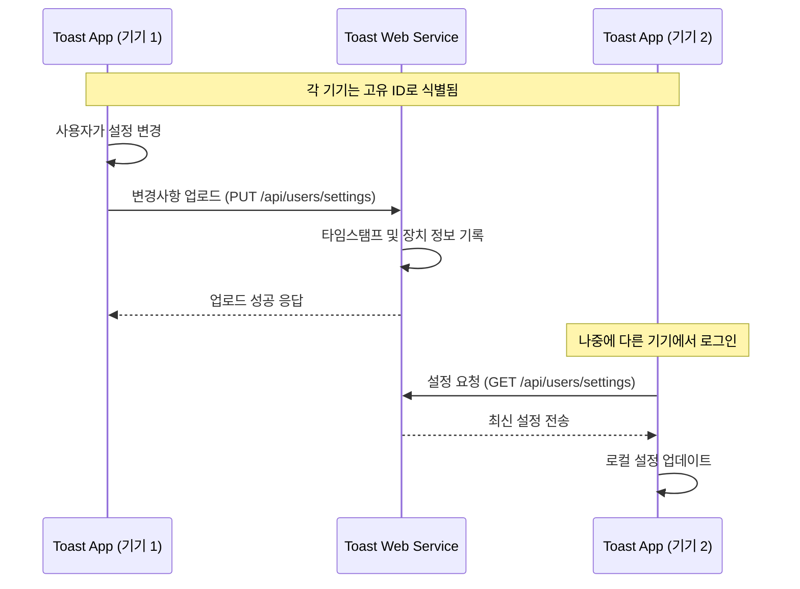

# 클라우드 동기화 기능 가이드

이 문서는 Toast App(Electron)과 Toast Web(Next.js) 간의 클라우드 동기화 기능에 대한 상세한 설명을 제공합니다.

## 목차

- [기능 개요](#기능-개요)
- [동기화 흐름도](#동기화-흐름도)
- [핵심 기능](#핵심-기능)
  - [자동 동기화](#자동-동기화)
  - [수동 동기화](#수동-동기화)
  - [충돌 해결](#충돌-해결)
  - [오프라인 지원](#오프라인-지원)
- [기술적 구현](#기술적-구현)
  - [데이터 구조](#데이터-구조)
  - [단일 데이터 소스 원칙](#단일-데이터-소스-원칙)
  - [API 엔드포인트](#api-엔드포인트)
- [상태 관리](#상태-관리)
  - [동기화 상태 모니터링](#동기화-상태-모니터링)
  - [오류 처리](#오류-처리)
- [보안 고려사항](#보안-고려사항)
- [구독 연동](#구독-연동)
- [부록: 문제 해결](#부록-문제-해결)
- [결론 및 발전 방향](#결론-및-발전-방향)

## 기능 개요

클라우드 동기화는 Toast App의 핵심 기능으로, 사용자가 여러 기기에서 동일한 설정을 유지할 수 있게 해줍니다. 이 기능은 다음과 같은 사용자 경험을 제공합니다:

- **설정 자동 동기화**: 페이지 구성, 버튼 레이아웃, 앱 테마 등의 설정이 사용자의 모든 기기에 자동으로 반영됩니다.
- **새 기기 설정 복원**: 새 기기에 Toast App을 설치하고 로그인하면 기존 설정이 자동으로 복원됩니다.
- **실시간 업데이트**: 한 기기에서 변경한 설정이 다른 기기에서 거의 실시간으로 반영됩니다.
- **구독 혜택**: 클라우드 동기화는 프리미엄 구독자를 위한 추가 기능으로 제공됩니다.

## 동기화 흐름도

아래 흐름도는 Toast App과 Toast Web 간의 동기화 프로세스를 보여줍니다:



## 핵심 기능

### 자동 동기화

설정 변경이 자동으로 클라우드와 동기화되는 방식:

1. **변경 감지**: ConfigStore의 변경사항 감지 (pages, appearance, advanced 섹션)
2. **디바운싱**: 2초 내에 여러 변경이 있을 경우 한 번만 동기화 수행
3. **주기적 동기화**: 15분마다 자동으로 동기화 수행 (기본값)
4. **로그인 동기화**: 로그인 성공 시 서버에서 최신 설정 자동 다운로드

```javascript
// 설정 변경 감지 예시
configStore.onDidChange('pages', async () => {
  // 타임스탬프 업데이트
  const timestamp = Date.now();

  // 2초 디바운싱으로 동기화 예약
  scheduleSync('pages_changed', timestamp);
});
```

### 수동 동기화

사용자가 직접 제어할 수 있는 동기화 기능:

1. **서버에 업로드**: 현재 로컬 설정을 서버로 강제 업로드
2. **서버에서 다운로드**: 서버 설정을 로컬로 가져와 현재 설정 덮어쓰기
3. **충돌 해결**: 로컬과 서버 설정 간의 충돌 자동 해결

사용자는 Toast App의 설정 메뉴에서 이러한 기능에 접근할 수 있습니다:


### 충돌 해결

여러 기기에서 동시에 설정을 변경할 경우 발생하는 충돌 해결 방법:

1. **타임스탬프 비교**: 마지막 수정 시간(lastModifiedAt)을 비교하여 최신 설정 결정
2. **장치 ID 기반 구분**: 각 장치는 고유 ID로 식별되어 충돌 상황 파악
3. **필드별 병합 전략**:
   - 페이지/버튼 설정: 가장 최신 변경사항 우선
   - 테마/언어 설정: 필드별로 최신 값 적용
   - 알림 설정: 개별 알림 타입별로 최신 값 적용

```javascript
// 충돌 해결 예시 (타임스탬프 기반)
function mergeSettings(local, server) {
  if (server.lastModifiedAt > local.lastModifiedAt) {
    return { ...local, ...server }; // 서버 설정 우선
  } else {
    return { ...server, ...local }; // 로컬 설정 우선
  }
}
```

### 오프라인 지원

네트워크 연결이 없는 상황에서도 앱의 동작 보장:

1. **로컬 작동**: 오프라인 상태에서도 앱은 로컬 설정으로 정상 작동
2. **변경사항 큐잉**: 오프라인 상태에서 설정 변경 시 메타데이터 업데이트와 함께 큐에 추가
3. **자동 재시도**: 네트워크 연결 복구 시 큐에 있는 변경사항 자동 동기화
4. **충돌 자동 해결**: 오프라인 상태에서 변경 후 온라인 전환 시 발생하는 충돌 자동 해결

## 기술적 구현

### 데이터 구조

동기화되는 설정 데이터의 구조:

```typescript
interface UserSettings {
  // 기본 설정
  theme: 'light' | 'dark' | 'system';
  language: string;
  notifications: {
    email: boolean;
    app: boolean;
    subscriptionReminders: boolean;
    paymentReminders: boolean;
  };

  // 외관 설정
  appearance: {
    theme: 'light' | 'dark' | 'system';
    fontSize: string;
    fontFamily: string;
    customColors: {
      primary: string;
      secondary: string;
      accent: string;
    };
  };

  // 고급 설정
  advanced: {
    startAtLogin: boolean;
    minimizeToTray: boolean;
    menuBarMode: string;
    shortcutEnabled: boolean;
    developerMode: boolean;
    localPaths?: { [key: string]: string }; // 로컬에만 저장됨 (동기화 제외)
  };

  // 페이지/버튼 설정 (앱의 핵심 기능)
  pages: Array<{
    id: string;
    name: string;
    icon?: string;
    buttons: Array<{
      id: string;
      name: string;
      icon?: string;
      action: {
        type: string;
        payload: any;
      };
      color?: string;
      shortcut?: string;
    }>;
  }>;

  // 동기화 메타데이터
  lastSyncedAt: number;
  lastSyncedDevice: string;
  lastModifiedAt: number;
  lastModifiedDevice: string;
}
```

### 단일 데이터 소스 원칙

Toast App은 데이터 불일치를 방지하기 위해 "단일 데이터 소스" 원칙을 따릅니다:

1. **ConfigStore를 단일 소스로 사용**:
   - 모든 설정 데이터는 `ConfigStore`에서 읽고 씁니다.
   - UI 변경, API 다운로드 등 모든 데이터 변경은 `ConfigStore`에 직접 적용됩니다.

2. **로컬 저장소의 역할**:
   - 로컬 설정 파일은 메타데이터(타임스탬프, 장치 정보)만 저장합니다.
   - 주요 목적은 동기화 상태 및 충돌 감지를 위한 정보 유지입니다.

3. **데이터 흐름**:
   ```
   사용자 변경 → ConfigStore 저장 → 메타데이터 갱신 → API 업로드
   API 다운로드 → ConfigStore 직접 갱신 → 메타데이터 갱신
   ```

### API 엔드포인트

Toast Web에서 제공하는 클라우드 동기화 API:

#### 설정 다운로드 (GET)

```http
GET /api/users/settings HTTP/1.1
Host: toast.sh
Authorization: Bearer {access_token}
```

#### 설정 업로드 (PUT)

```http
PUT /api/users/settings HTTP/1.1
Host: toast.sh
Authorization: Bearer {access_token}
Content-Type: application/json

{
  "pages": [...],
  "appearance": {...},
  "advanced": {...},
  "theme": "dark",
  "language": "ko",
  "notifications": {...},
  "lastSyncedDevice": "macOS-App",
  "lastSyncedAt": 1682932768123,
  "lastModifiedDevice": "macOS-App",
  "lastModifiedAt": 1682932768123
}
```

## 상태 관리

### 동기화 상태 모니터링

Toast App은 동기화 상태를 모니터링하는 여러 메커니즘을 제공합니다:

1. **상태 표시기**: 설정 창에서 현재 동기화 상태 표시
   - 활성/비활성 상태
   - 마지막 동기화 시간
   - 현재 장치 정보

2. **이벤트 리스너**: 동기화 이벤트를 수신할 수 있는 API
   ```javascript
   // 동기화 상태 변경 감지
   cloudSync.onStatusChange((status) => {
     console.log('동기화 상태 변경:', status);
   });
   ```

3. **로그**: 동기화 관련 상세 로그 (개발자 모드에서 확인 가능)

### 오류 처리

다양한 오류 상황에 대한 처리 전략:

1. **네트워크 오류**:
   - 자동 재시도 (최대 3회)
   - 사용자에게 오류 알림 제공
   - 오프라인 모드로 전환

2. **인증 오류**:
   - 토큰 자동 새로고침 시도
   - 실패 시 재로그인 요청

3. **충돌 오류**:
   - 자동 해결 시도
   - 해결 불가 시 사용자에게 옵션 제시

## 보안 고려사항

클라우드 동기화 기능의 보안 측면:

1. **데이터 전송 보안**:
   - 모든 API 통신은 HTTPS를 통한 암호화 사용
   - 인증 토큰의 안전한 관리

2. **데이터 보호**:
   - 민감한 정보(localPaths 등)는 동기화에서 제외
   - 각 기기별 고유 ID를 통한 인증

3. **접근 제어**:
   - 사용자 인증 기반 데이터 접근 제한
   - 구독 상태에 따른 기능 접근 제어

## 구독 연동

클라우드 동기화 기능은 구독 상태에 따라 제공 범위가 달라집니다:

| 사용자 유형 | 클라우드 동기화 범위 | 기기 제한 |
|------------|-------------------|--------|
| 기본 사용자 | 제한적 동기화 (테마, 기본 페이지) | 2대 |
| 프리미엄 구독자 | 전체 동기화 | 5대 |
| 프로 구독자 | 전체 동기화 + 자동 백업 | 무제한 |
| VIP 사용자 | 프로 구독자와 동일 | 무제한 |

구독 상태 확인 로직:

```javascript
async function isCloudSyncEnabled() {
  // 인증 상태 확인
  const isAuthenticated = await hasValidToken();
  if (!isAuthenticated) {
    return false;
  }

  // 구독 정보 확인
  const subscription = configStore.get('subscription') || {};
  let hasSyncFeature = false;

  // 다양한 구독 형식 지원
  if (subscription.isSubscribed ||
      subscription.active ||
      subscription.plan?.toLowerCase().includes('premium') ||
      subscription.plan?.toLowerCase().includes('pro') ||
      subscription.features?.cloud_sync === true) {
    hasSyncFeature = true;
  }

  return hasSyncFeature;
}
```

## 부록: 문제 해결

클라우드 동기화 관련 문제 해결 가이드:

| 문제 | 가능한 원인 | 해결 방법 |
|-----|-----------|---------|
| 동기화가 작동하지 않음 | 구독 만료 | 구독 상태 확인 및 갱신 |
| | 인증 토큰 만료 | 로그아웃 후 재로그인 |
| | 동기화 기능 비활성화 | 설정에서 동기화 활성화 확인 |
| 설정이 일치하지 않음 | 부분 동기화 실패 | 수동 동기화 수행 |
| | 충돌 미해결 | "충돌 해결" 기능 사용 |
| 오류 메시지 | "Cloud sync disabled" | 설정에서 동기화 활성화 |
| | "Authentication required" | 토큰 갱신 또는 재로그인 |
| | "Network error" | 네트워크 연결 확인 |

로그 확인 방법:
- macOS: `~/Library/Logs/Toast-App/main.log`
- Windows: `%USERPROFILE%\AppData\Roaming\Toast-App\logs\main.log`
- Linux: `~/.config/Toast-App/logs/main.log`

관련 로그 필터링:
```bash
grep -E "CloudSync|ApiSync" ~/Library/Logs/Toast-App/main.log | grep -E "ERROR|WARN"
```

## 결론 및 발전 방향

클라우드 동기화 기능은 Toast App의 핵심 경쟁력으로, 사용자가 여러 기기에서 일관된 경험을 유지할 수 있게 해줍니다. 이 기능은 다음과 같은 장점을 제공합니다:

1. **사용자 편의성**: 여러 기기 간 설정 수동 복사 불필요
2. **일관된 경험**: 모든 기기에서 동일한 버튼 및 UI 레이아웃
3. **구독 가치 향상**: 프리미엄 기능으로 구독자 유지율 향상

현재 구현은 안정적이고 신뢰할 수 있지만, 다음과 같은 방향으로 개선될 수 있습니다:

### 단기 개선 사항
- **네트워크 복구 감지 개선**: 네트워크 상태 변화 자동 감지 기능 강화
- **동기화 상태 UI 개선**: 사용자 친화적인 동기화 상태 표시 및 문제 해결 안내
- **충돌 해결 알고리즘 고도화**: 더 세밀한 필드별 충돌 해결 전략 구현

### 중장기 개선 방향
- **실시간 동기화**: WebSocket을 활용한 실시간 설정 변경 동기화
- **델타 동기화**: 전체 설정이 아닌 변경된 부분만 전송하여 네트워크 사용량 최적화
- **선택적 동기화**: 사용자가 동기화할 설정 섹션을 선택 가능하도록 개선
- **변경 이력 관리**: 설정 변경 이력 저장 및 이전 상태로 복원 기능 추가

클라우드 동기화는 Toast App 생태계의 핵심 요소로, 꾸준한 개선과 사용자 피드백을 통해 지속적으로 발전시켜 나갈 것입니다.
