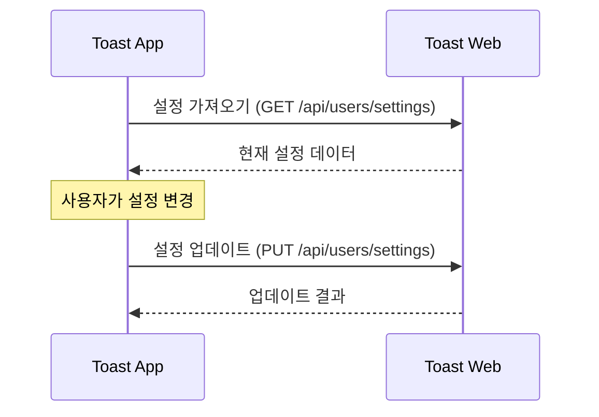

# 클라우드 동기화 가이드

이 문서는 Toast App과 Toast Web 간의 웹 API를 통한 클라우드 동기화 구현 방법을 설명합니다.

## 목차

- [개요](#개요)
- [기본 동기화 흐름](#기본-동기화-흐름)
- [동기화 API](#동기화-api)
- [구현 방법](#구현-방법)
- [문제 해결](#문제-해결)

## 개요

Toast App의 클라우드 동기화는 단순한 REST API 통신을 통해 설정 데이터를 서버(Toast Web)와 동기화합니다. 사용자가 여러 기기에서 일관된 설정을 유지할 수 있게 해주는 핵심 기능입니다.

**핵심 이점:**
- 여러 기기에서 동일한 설정 사용
- 새 기기 설치 시 자동 설정 복원
- 변경 사항 실시간 반영

## 기본 동기화 흐름



## 동기화 API

### 설정 가져오기

```http
GET /api/users/settings HTTP/1.1
Host: toast.sh
Authorization: Bearer {access_token}
```

**응답:**
```json
{
  "success": true,
  "data": {
    "theme": "dark",
    "language": "ko",
    "pages": [
      {
        "id": "page1",
        "name": "메인",
        "buttons": [...]
      }
    ],
    "lastSyncedAt": 1682932134590
  }
}
```

### 설정 업데이트

```http
PUT /api/users/settings HTTP/1.1
Host: toast.sh
Authorization: Bearer {access_token}
Content-Type: application/json

{
  "theme": "dark",
  "language": "ko",
  "pages": [...],
  "lastSyncedAt": 1682932768123
}
```

**응답:**
```json
{
  "success": true,
  "data": {
    "message": "설정이 업데이트되었습니다"
  }
}
```

## 구현 방법

### 1. 기본 동기화 구현

```javascript
// 설정 다운로드
async function downloadSettings() {
  try {
    const response = await fetch('https://toast.sh/api/users/settings', {
      method: 'GET',
      headers: {
        'Authorization': `Bearer ${getAccessToken()}`
      }
    });

    const data = await response.json();

    if (data.success) {
      // 받은 설정을 로컬에 적용
      configStore.set('theme', data.data.theme);
      configStore.set('language', data.data.language);
      configStore.set('pages', data.data.pages);

      return { success: true };
    } else {
      return { success: false, error: data.error };
    }
  } catch (error) {
    return { success: false, error: error.message };
  }
}

// 설정 업로드
async function uploadSettings() {
  try {
    const settings = {
      theme: configStore.get('theme'),
      language: configStore.get('language'),
      pages: configStore.get('pages'),
      lastSyncedAt: Date.now()
    };

    const response = await fetch('https://toast.sh/api/users/settings', {
      method: 'PUT',
      headers: {
        'Authorization': `Bearer ${getAccessToken()}`,
        'Content-Type': 'application/json'
      },
      body: JSON.stringify(settings)
    });

    const data = await response.json();
    return { success: data.success, error: data.error };
  } catch (error) {
    return { success: false, error: error.message };
  }
}
```

### 2. 자동 동기화 구현

설정 변경 감지 및 자동 동기화:

```javascript
// 설정 변경 감지
configStore.onDidChange('pages', () => {
  // 변경 즉시 동기화
  uploadSettings();
});

// 주기적 동기화
setInterval(() => {
  downloadSettings();
}, 15 * 60 * 1000); // 15분마다
```

### 3. 로그인 시 동기화

사용자 로그인 후 설정 동기화:

```javascript
async function onLogin() {
  // 로그인 성공 후 설정 다운로드
  await downloadSettings();
}
```

## 문제 해결

| 문제 | 해결 방법 |
|------|-----------|
| 동기화 실패 | 인터넷 연결 확인, 재로그인 시도 |
| 설정 불일치 | 수동으로 동기화 실행: `await downloadSettings()` |
| 인증 오류 | 토큰 갱신 또는 재로그인 |

**로그 확인:**
- macOS: `~/Library/Logs/Toast-App/main.log`
- Windows: `%USERPROFILE%\AppData\Roaming\Toast-App\logs\main.log`
