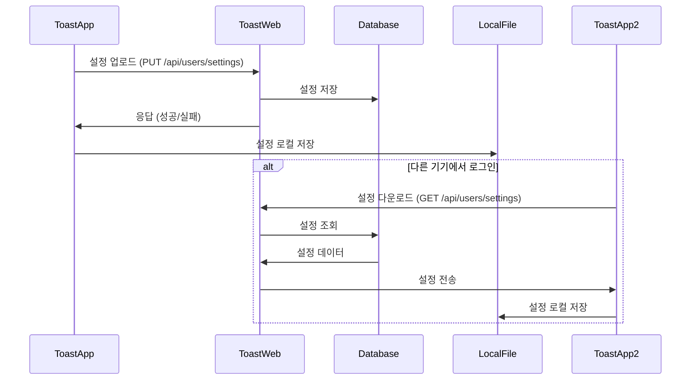

# Toast-App & Toast-Web 연동 가이드

이 문서는 Toast-App(Electron 앱)과 Toast-Web(Next.js 웹 서비스) 간의 연동 설정 및 구현 방법을 상세히 설명합니다.

## 목차

- [개요](#개요)
- [시스템 아키텍처](#시스템-아키텍처)
- [OAuth 2.0 인증 프로토콜](#oauth-20-인증-프로토콜)
- [환경 변수 설정](#환경-변수-설정)
- [프로토콜 핸들러 설정](#프로토콜-핸들러-설정)
- [인증 흐름](#인증-흐름)
- [토큰 관리](#토큰-관리)
- [API 엔드포인트](#api-엔드포인트)
- [사용자 및 구독 정보 API](#사용자-및-구독-정보-api)
- [구독 정보 활용](#구독-정보-활용)
- [설정 동기화](#설정-동기화)
- [로컬 데이터 관리](#로컬-데이터-관리)
- [오류 처리](#오류-처리)
- [보안 고려사항](#보안-고려사항)
- [변경 내역](#변경-내역)

## 설정 동기화

Toast-App과 Toast-Web 간에는 앱의 주요 설정(페이지 구성, 테마 등)을 동기화하는 기능이 있습니다. 이를 통해 사용자는 여러 기기에서 일관된 경험을 얻을 수 있습니다.

### 클라우드 동기화 구조



### 동기화 이벤트

다음과 같은 경우에 설정 동기화가 발생합니다:

1. **로그인 후 자동 동기화**: 로그인 직후에는 서버에서 최신 설정을 자동으로 다운로드합니다.
2. **페이지 추가/삭제**: 사용자가 페이지를 추가하거나 삭제할 때 변경사항을 서버에 업로드합니다.
3. **버튼 수정**: 사용자가 버튼을 수정할 때 변경사항을 서버에 업로드합니다.
4. **주기적 동기화**: 설정된 간격(예: 15분)마다 자동으로 동기화를 시도합니다.

### 설정 다운로드 API

```http
GET /api/users/settings HTTP/1.1
Host: web.toast.sh
Authorization: Bearer ACCESS_TOKEN
```

#### 응답

```json
{
  "pages": [...],
  "appearance": {...},
  "advanced": {...},
  "lastSyncedAt": "2024-04-01T12:30:45Z"
}
```

### 설정 업로드 API

```http
PUT /api/users/settings HTTP/1.1
Host: web.toast.sh
Authorization: Bearer ACCESS_TOKEN
Content-Type: application/json

{
  "pages": [...],
  "appearance": {...},
  "advanced": {...}
}
```

#### 응답

```json
{
  "success": true,
  "message": "Settings updated successfully",
  "lastSyncedAt": "2024-04-01T12:45:30Z"
}
```

### 동기화 구현

설정 동기화는 `cloud-sync.js` 모듈에서 관리됩니다:

```javascript
const { sync: apiSync } = require('./api');
const { createConfigStore } = require('./config');

// 동기화 관련 상수
const SYNC_DEBOUNCE_MS = 2000; // 마지막 변경 후 2초 후에 동기화
const PERIODIC_SYNC_INTERVAL_MS = 15 * 60 * 1000; // 15분마다 자동 동기화

// 설정 변경 감지 및 동기화
configStore.onDidChange('pages', async (newValue, oldValue) => {
  // 변경 유형 감지 (페이지 추가, 삭제, 버튼 수정)
  if (Array.isArray(newValue) && Array.isArray(oldValue)) {
    if (newValue.length > oldValue.length) {
      // 페이지 추가 감지
      console.log('페이지 추가 감지, 동기화 시작...');
    } else if (newValue.length < oldValue.length) {
      // 페이지 삭제 감지
      console.log('페이지 삭제 감지, 동기화 시작...');
    } else if (JSON.stringify(newValue) !== JSON.stringify(oldValue)) {
      // 버튼 수정 감지
      console.log('버튼 수정 감지, 동기화 시작...');
    }
  }

  // 디바운스 처리: 연속적인 변경이 있을 경우 마지막 변경 후 2초 후에 동기화
  clearTimeout(syncTimer);
  syncTimer = setTimeout(async () => {
    await uploadSettings();
  }, SYNC_DEBOUNCE_MS);
});
```

## 로컬 데이터 관리

Toast-App은 사용자 프로필, 구독 정보, 설정 등을 로컬 파일로 저장하고 관리합니다. 이를 통해 오프라인 상태에서도 앱이 정상적으로 동작할 수 있습니다.

### 로컬 파일 저장 위치

사용자 데이터는 각 운영체제의 표준 위치에 저장됩니다:

- **Windows**: `C:\Users\{Username}\AppData\Roaming\toast-app\`
- **macOS**: `/Users/{Username}/Library/Application Support/toast-app/`
- **Linux**: `/home/{username}/.config/toast-app/`

### 저장되는 파일 종류

| 파일명 | 설명 | 내용 |
|--------|------|------|
| `auth-tokens.json` | 인증 토큰 정보 | 액세스 토큰, 리프레시 토큰, 만료 시간 |
| `user-profile.json` | 사용자 프로필 정보 | 이름, 이메일, 아바타, 구독 정보 등 |
| `user-settings.json` | 사용자 설정 정보 | 페이지 구성, 테마, 단축키 등 |
| `config.json` | 앱 구성 정보 | 일반 설정, 창 크기, 위치 등 |

### 파일 관리 모듈

사용자 데이터 파일 관리는 `user-data-manager.js` 모듈에서 처리합니다:

```javascript
const { app } = require('electron');
const path = require('path');
const fs = require('fs');

// 파일 경로 상수
const USER_DATA_PATH = app.getPath('userData');
const PROFILE_FILE_PATH = path.join(USER_DATA_PATH, 'user-profile.json');
const SETTINGS_FILE_PATH = path.join(USER_DATA_PATH, 'user-settings.json');

// 파일 읽기
function readFromFile(filePath) {
  try {
    if (!fs.existsSync(filePath)) {
      return null;
    }
    const data = fs.readFileSync(filePath, 'utf8');
    return JSON.parse(data);
  } catch (error) {
    console.error(`파일 읽기 오류 (${filePath}):`, error);
    return null;
  }
}

// 파일 쓰기
function writeToFile(filePath, data) {
  try {
    const dirPath = path.dirname(filePath);
    if (!fs.existsSync(dirPath)) {
      fs.mkdirSync(dirPath, { recursive: true });
    }
    fs.writeFileSync(filePath, JSON.stringify(data, null, 2), 'utf8');
    return true;
  } catch (error) {
    console.error(`파일 저장 오류 (${filePath}):`, error);
    return false;
  }
}

// 파일 삭제
function deleteFile(filePath) {
  try {
    if (fs.existsSync(filePath)) {
      fs.unlinkSync(filePath);
      return true;
    }
    return false;
  } catch (error) {
    console.error(`파일 삭제 오류 (${filePath}):`, error);
    return false;
  }
}
```

### 주기적 데이터 갱신

프로필 및 설정 정보는 일정 시간마다 자동으로 갱신됩니다:

```javascript
// 주기적 갱신 설정
const REFRESH_INTERVAL_MS = 30 * 60 * 1000; // 30분마다 갱신
let profileRefreshTimer = null;
let settingsRefreshTimer = null;

// 주기적 프로필 갱신 시작
function startProfileRefresh() {
  // 이미 실행 중인 타이머가 있으면 중지
  stopProfileRefresh();

  // 즉시 한 번 실행 후 타이머 시작
  getUserProfile(true).then(profile => {
    console.log('초기 프로필 갱신 완료');
  });

  // 주기적 갱신 타이머 설정
  profileRefreshTimer = setInterval(async () => {
    try {
      await getUserProfile(true);
      console.log('주기적 프로필 갱신 완료');
    } catch (error) {
      console.error('주기적 프로필 갱신 오류:', error);
    }
  }, REFRESH_INTERVAL_MS);
}

// 유사한 방식으로 설정 정보도 주기적 갱신
```

### 로그아웃 시 데이터 정리

```javascript
// 로그아웃 시 데이터 정리
function cleanupOnLogout() {
  try {
    // 주기적 갱신 중지
    stopProfileRefresh();
    stopSettingsRefresh();

    // 저장된 파일 삭제
    deleteFile(PROFILE_FILE_PATH);
    deleteFile(SETTINGS_FILE_PATH);

    console.log('사용자 데이터 정리 완료');
    return true;
  } catch (error) {
    console.error('로그아웃 데이터 정리 오류:', error);
    return false;
  }
}
```

## 오류 처리

Toast-App은 다양한 네트워크 오류와 API 응답 오류를 적절히 처리하여 사용자 경험을 유지합니다.

### 주요 오류 처리 전략

1. **네트워크 연결 오류**: 로컬에 저장된 데이터를 사용하여 오프라인 기능 유지
2. **토큰 만료 오류**: 자동으로 리프레시 토큰으로 갱신 시도
3. **API 요청 실패**: 적절한 재시도 로직 및 사용자에게 통보

### 오류 응답 형식

```json
{
  "success": false,
  "error": "error_code",
  "message": "Human readable error message",
  "details": { ... }
}
```

### 오류 코드 및 처리 방법

| 오류 코드 | 설명 | 처리 방법 |
|-----------|------|-----------|
| `TOKEN_EXPIRED` | 액세스 토큰 만료 | 리프레시 토큰으로 갱신 |
| `REFRESH_TOKEN_EXPIRED` | 리프레시 토큰 만료 | 재로그인 요청 |
| `NETWORK_ERROR` | 네트워크 연결 오류 | 로컬 데이터 사용, 재연결 시 동기화 |
| `API_ERROR` | API 서버 오류 | 일정 시간 후 재시도 |
| `PERMISSION_DENIED` | 리소스 접근 권한 없음 | 구독 요구 메시지 표시 |

### 비어있는 파일 처리

파일이 손상되었거나 비어있는 경우 기본값을 제공하여 오류를 방지합니다:

```javascript
function getUserProfile() {
  try {
    const profileData = readFromFile(PROFILE_FILE_PATH);

    if (!profileData) {
      // 파일이 없거나 비어있는 경우 익명 프로필 반환
      return {
        id: 'anonymous',
        name: 'Anonymous User',
        email: '',
        subscription: {
          plan: 'free',
          active: false,
          features: { page_groups: 1 }
        }
      };
    }

    return profileData;
  } catch (error) {
    // 오류 발생 시 익명 프로필 반환
    console.error('프로필 정보 가져오기 오류:', error);
    return getAnonymousProfile();
  }
}
```

## 보안 고려사항

Toast-App은 사용자 인증 정보와 개인 데이터를 안전하게 보호하기 위한 여러 보안 조치를 구현합니다.

### 토큰 보안

1. **안전한 저장**: 토큰은 OS의 보안 키체인/자격 증명 저장소에 저장
2. **HTTPS 통신**: 모든 API 통신은 HTTPS를 통해 암호화됨
3. **토큰 만료 관리**: 액세스 토큰의 짧은 만료 시간(1시간)을 통한 보안 강화

### CSRF 보호

OAuth 인증 과정에서 `state` 파라미터를 사용하여 CSRF(Cross-Site Request Forgery) 공격을 방지합니다:

```javascript
// 인증 요청 시 상태 생성 및 저장
const state = uuidv4();
storeStateParam(state);

// 인증 응답에서 상태 검증
const storedState = retrieveStoredState();
if (!storedState || state !== storedState) {
  // CSRF 공격 가능성 대응
  console.error('State mismatch. Possible CSRF attack');
  return { success: false, error: 'state_mismatch' };
}
```

### 로컬 데이터 보호

1. **민감 정보 필터링**: 로컬에 저장되는 정보에서 민감한 정보 제외
2. **파일 접근 제한**: 사용자 데이터 디렉토리의 적절한 접근 권한 설정
3. **항상 검증**: 파일에서 로드된 데이터는 사용 전 항상 유효성 검증

### 벤더별 보안 고려사항

| 운영체제 | 토큰 저장 방식 | 보안 고려사항 |
|---------|---------------|-------------|
| macOS | Keychain | 앱 샌드박스 권한 필요 |
| Windows | Credential Manager | 사용자 계정 권한 필요 |
| Linux | libsecret / Secret Service API | 환경에 따라 추가 구성 필요 |

## 변경 내역

### 2025.04.22 (v2.5.0)
- 사용자 데이터 관리 모듈 추가
- 프로필 및 설정 정보 파일 저장 기능 구현
- 파일-API 연동 및 주기적 갱신 구현
- 로그아웃 시 로컬 데이터 정리 기능 추가

### 2025.03.15 (v2.4.0)
- 클라우드 동기화 기능 개선
- 페이지 추가/삭제, 버튼 수정 시 자동 동기화 구현
- 주기적 동기화 기능 구현 (15분 간격)

### 2025.02.01 (v2.3.0)
- OAuth 2.0 인증 개선
- 토큰 리프레시 메커니즘 강화
- 인증 데이터의 안전한 저장 및 관리 개선

### 2025.01.15 (v2.2.0)
- 사용자 프로필 및 구독 정보 API 통합
- 구독 상태에 따른 기능 제한 구현
- VIP 사용자 지원 추가
