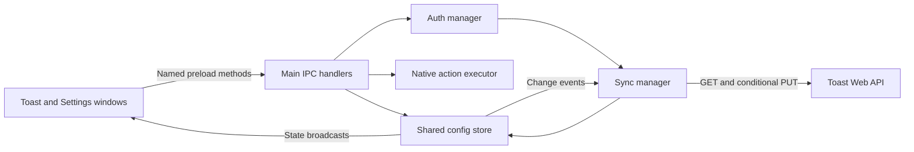

# Toast App Architecture

## System Overview

Toast App is the Electron desktop launcher. It executes local buttons and expands Snippets.
Toast Web owns browser accounts, subscriptions, cloud storage, and the Buttons/Snippets editors.
The `opspresso/toast` repository distributes desktop releases. See the [project README](../../README.md).

## High-Level Architecture

The main process owns persistent state and native capabilities. The context-isolated renderers
own forms and drafts. They cannot replace the bridge or write authentication and sync metadata.
Custom scripts execute locally through action handlers; the web API does not execute them.

## Main Process Architecture

| Module | Responsibility |
|---|---|
| `src/index.js` | App lifecycle, initialization order, queued OAuth callbacks |
| `config.js` | One schema-enforced store, supported legacy migration, import/export/reset |
| `ipc.js` and `ipc/` | Register narrow domain handlers using the shared store |
| `auth-manager.js` | Login/logout lifecycle, verified profile and subscription, broadcasts |
| `auth.js` and `api/client.js` | Token persistence, session-bound transport and refresh |
| `user-data-manager.js` | Five-minute verified profile cache scoped to the credential session |
| `cloud-sync.js` | Serialized read/merge/write lifecycle and account recovery metadata |
| `cloud-sync/merge.js` | Pure baseline/local/remote merge and explicit conflicts |
| `action-validation.js`, `action-approval.js` | Input validation and per-device remote-action approval |
| `executor.js` and `actions/` | Application, exec, open, script, and chain execution |
| `native-preferences.js` | Apply local and downloaded preferences to native windows and OS settings |
| `windows.js`, `shortcuts.js`, `tray.js` | Window lifecycle, shortcut registration, tray controls |
| `text-expander/` | Pure keyword matching plus optional macOS hook/clipboard integration |
| `updater.js`, `logger.js`, `broadcast.js` | Updates, logging, and guarded window notifications |

Read [Main Process API](../api/main-process.md) for entry points and
[security](security.md) for trust boundaries. Invalid local config preserves the file and
stops initialization before windows or synchronization start.

## Renderer Process Architecture

The Toast window shows pages and actions. Its editor captures the original pages and login
session. `savePages` merges independent main-process changes and rejects stale conflicting
edits. Temporary icon/file/dialog results belong to their originating edit context.

Settings contains Settings, Account, Snippets, and About tabs. Preferences save immediately.
Each tab initializes once; tab switching changes visibility. Configuration broadcasts update
hidden controls too, while unchanged snippet drafts and hotkey recording remain intact.
Snippet mutations target one item against its original value. See [Renderer API](../api/renderer.md).

## Page Architecture

Pages contain up to 15 button slots. The verified account controls adding pages: anonymous 1,
authenticated Basic 3, and eligible Premium/VIP up to 9. Reduced access does not delete stored
pages. New pages and edited buttons have stable IDs. Button shortcuts follow position in
`qwertasdfgzxcvb` order. See [pages](../guide/pages.md) and [shortcuts](../guide/shortcuts.md).

## Authentication System

The browser returns an OAuth code and state through `toast-app://auth`. Main validates state,
exchanges the code, and persists the token pair atomically. One verified profile supplies both
windows, normalized entitlement, and initial sync. A `401` shares one forced refresh; late
responses cannot cross login sessions. Profiles are never restored from disk as authenticated
fallbacks. See [integration](../development/integration.md).

## Cloud Sync System

On login or authenticated startup, the manager reads cloud settings before an upload. It then
polls every 15 minutes and debounces local changes for 5 seconds. It synchronizes pages,
Snippets, appearance, and advanced preferences. Credentials, global shortcuts, text-expander
permissions/enabled state, and action approvals remain on the device.

The last acknowledged settings and server revision are the merge baseline. Conditional PUTs
prevent lost cloud writes. Independent edits merge; conflicting values or delete-versus-edit
require a choice. Empty arrays are deletions. Device timestamps are diagnostic metadata rather
than a conflict winner. Account backups preserve pending work when accounts change.

See [Cloud Sync](../features/cloud-sync.md) for compatibility, errors, recovery, and verification.
