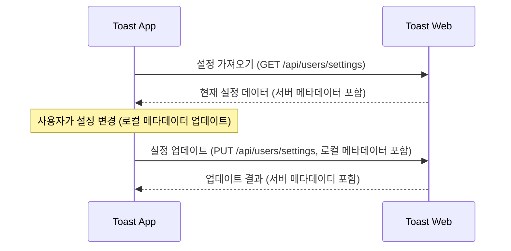

# 클라우드 동기화 가이드

이 문서는 Toast App과 Toast Web 간의 웹 API를 통한 클라우드 동기화 구현 방법을 설명합니다.

## 목차

- [개요](#개요)
- [인증 및 토큰 관리](#인증-및-토큰-관리)
- [기본 동기화 흐름](#기본-동기화-흐름)
- [동기화 API](#동기화-api)
- [구현 방법](#구현-방법)
- [문제 해결](#문제-해결)

## 개요

Toast App의 클라우드 동기화는 REST API 통신을 통해 설정 데이터를 서버(Toast Web)와 동기화합니다. 사용자가 여러 기기에서 일관된 설정을 유지할 수 있게 해주는 핵심 기능입니다. 동기화 시 데이터 일관성 확보와 충돌 해결이 중요합니다.

**핵심 이점:**
- 여러 기기에서 동일한 설정 사용
- 새 기기 설치 시 설정 복원 (충돌 해결 로직에 따라 최신 또는 병합된 설정 적용)
- 변경 사항 반영 (양방향 동기화)
- 무기한 토큰으로 지속적인 동기화 보장

## 인증 및 토큰 관리

클라우드 동기화를 위해서는 안정적인 인증 시스템이 필요합니다. Toast App은 OAuth 2.0 기반의 토큰 인증을 사용하며, 동기화 중단을 방지하기 위해 토큰 만료를 무기한으로 설정했습니다.

### 토큰 만료 설정

**서버 측 (toast-web):**
- **액세스 토큰**: 1년 (365일)
- **리프레시 토큰**: 10년
- 실질적으로 무기한에 가까운 긴 시간으로 설정

**클라이언트 측 (toast-app):**
- **기본 토큰 만료 시간**: 1년 (31,536,000초)
- **무기한 토큰 처리**: JavaScript 최대 날짜값(8640000000000000) 사용
- **환경 변수 지원**: `TOKEN_EXPIRES_IN` 환경 변수로 커스터마이징 가능

### 토큰 만료 처리 로직

```javascript
// 토큰 만료 확인 (무기한 토큰 지원)
async function isTokenExpired() {
  try {
    const expiresAt = await getStoredTokenExpiry();

    if (!expiresAt) {
      return true; // 만료 시간이 없으면 만료된 것으로 처리
    }

    // 무기한 토큰인 경우 (매우 먼 미래 날짜) 만료되지 않은 것으로 처리
    if (expiresAt >= 8640000000000000) {
      logger.info('Token is set to unlimited expiration');
      return false;
    }

    // 일반 토큰의 경우 현재 시간과 비교
    const now = Date.now();
    const safetyMargin = 30 * 1000; // 30초 안전 마진
    const isNearExpiry = now >= expiresAt - safetyMargin;

    if (isNearExpiry) {
      logger.info('Token is about to expire or already expired');
      return true;
    }

    return false;
  } catch (error) {
    logger.error('Error checking token expiration:', error);
    return true; // 오류 발생 시 안전을 위해 만료된 것으로 처리
  }
}

// 토큰 저장 (무기한 지원)
async function storeToken(token, expiresIn = 31536000) {
  try {
    let expiresAt;
    if (expiresIn <= 0) {
      // 0 이하 값은 무기한으로 처리
      expiresAt = 8640000000000000; // JavaScript 최대 날짜값
      logger.info('Token expiration time set to unlimited.');
    } else {
      expiresAt = Date.now() + expiresIn * 1000;
    }

    // 토큰과 만료 시간 저장
    const tokenData = readTokenFile() || {};
    tokenData[TOKEN_KEY] = token;
    tokenData[TOKEN_EXPIRES_KEY] = expiresAt;

    if (!writeTokenFile(tokenData)) {
      throw new Error('Failed to save token file');
    }

    logger.info(`Token saved successfully, expiration time: ${new Date(expiresAt).toLocaleString()}`);
  } catch (error) {
    logger.error('Failed to save token:', error);
    throw error;
  }
}
```

### 환경 변수 설정

토큰 만료 시간은 환경 변수로 커스터마이징할 수 있습니다:

```bash
# 1년 (기본값)
TOKEN_EXPIRES_IN=31536000

# 무기한 (0 이하 값)
TOKEN_EXPIRES_IN=0

# 커스텀 시간 (초 단위)
TOKEN_EXPIRES_IN=86400  # 1일
```

### 토큰 관리 모범 사례

1. **무기한 토큰 사용**: 동기화 중단 방지를 위해 토큰을 무기한으로 설정
2. **안전한 저장**: 토큰을 암호화된 로컬 파일에 저장
3. **원자적 쓰기**: 파일 손상 방지를 위한 임시 파일 사용
4. **오류 처리**: 토큰 관련 오류 시 적절한 로깅 및 복구 로직
5. **보안 고려**: 토큰 파일 접근 권한 제한

## 기본 동기화 흐름



## 동기화 API

동기화 API는 서버(Toast Web)에서 제공하며, 클라이언트는 이 API를 통해 설정을 주고받습니다. 모든 API 요청에는 Bearer 토큰이 필요합니다.

### 설정 가져오기

```http
GET /api/users/settings HTTP/1.1
Host: app.toast.sh
Authorization: Bearer {access_token}
```

**응답:**
```json
{
  "success": true,
  "data": {
    "theme": "dark",
    "language": "ko",
    "pages": [
      {
        "id": "uuid-page-1", // 각 페이지에 고유 ID 부여 권장
        "name": "메인",
        "buttons": [...],
        "clientLastModifiedAt": 1682932100000 // 페이지별 최종 수정 시간
      }
    ],
    "clientLastModifiedAt": 1682932130000, // 클라이언트 전체 설정 최종 수정 시간
    "clientLastModifiedDevice": "device-id-1", // 클라이언트 최종 수정 기기 ID
    "serverLastUpdatedAt": 1682932134590 // 서버에서 이 설정이 마지막으로 업데이트된 시간
  }
}
```
*참고: 위 응답 예시는 권장되는 메타데이터 필드를 포함합니다. 실제 API 응답은 서버 구현에 따라 다를 수 있습니다.*

### 설정 업데이트

```http
PUT /api/users/settings HTTP/1.1
Host: app.toast.sh
Authorization: Bearer {access_token}
Content-Type: application/json

{
  "globalHotkey": "CmdOrCtrl+Shift+S",
  "appearance": { // appearance 객체 전체를 동기화
    "theme": "dark",
    "position": "center",
    // ... other appearance fields
  },
  "advanced": { // advanced 객체 전체를 동기화
    "launchAtLogin": true,
    // ... other advanced fields
  },
  "language": "ko", // language 필드 (로컬 스키마에 추가 가정)
  "pages": [
    {
      "id": "uuid-page-1", // 각 페이지는 고유 ID를 가져야 함
      "name": "메인 수정됨",
      "buttons": [...],
      "clientLastModifiedAt": 1682932700000 // 페이지별 최종 수정 시간
    }
  ],
  "clientLastModifiedAt": 1682932768123, // 클라이언트 전체 설정 최종 수정 시간
  "clientLastModifiedDevice": "device-id-1" // 현재 기기 ID
}
```

**응답 (예시):**
```json
{
  "success": true,
  "data": {
    "message": "설정이 업데이트되었습니다",
    "serverLastUpdatedAt": 1682932769000, // 서버에서 업데이트된 시간
    // 업데이트된 전체 설정 또는 주요 메타데이터를 포함할 수 있음
    "settings": {
        "globalHotkey": "CmdOrCtrl+Shift+S",
        "appearance": {
            "theme": "dark",
            // ...
        },
        "advanced": {
            "launchAtLogin": true,
            // ...
        },
        "language": "ko",
        "pages": [...], // 각 페이지는 id, clientLastModifiedAt 포함
        "clientLastModifiedAt": 1682932768123,
        "clientLastModifiedDevice": "device-id-1",
        "serverLastUpdatedAt": 1682932769000
    }
  }
}
```
*참고: API 응답 형식은 서버 구현에 따라 달라질 수 있으며, 클라이언트는 이에 맞춰 처리해야 합니다.*

## 구현 방법

### 1. 기본 동기화 로직 (개선된 메타데이터 관리 포함)

```javascript
// 설정 다운로드
async function downloadSettingsFromServer() {
  try {
    const response = await fetch('https://app.toast.sh/api/users/settings', {
      method: 'GET',
      headers: {
        'Authorization': `Bearer ${getAccessToken()}`,
        // 'If-None-Match': localETag // ETag를 활용한 조건부 요청 (서버 지원 시)
      }
    });

    // if (response.status === 304) {
    //   return { success: true, message: 'No changes on server' };
    // }

    const result = await response.json();

    if (result.success) {
      const serverSettings = result.data;
      // 로컬 설정과 서버 설정 병합 (충돌 해결 로직 적용)
      const mergedSettings = resolveConflictAndMerge(configStore.getAll(), serverSettings);

      // 병합된 설정을 로컬에 적용
      configStore.set('theme', mergedSettings.theme);
      configStore.set('language', mergedSettings.language);
      configStore.set('pages', mergedSettings.pages);
      // 관련 메타데이터 업데이트 (예: serverLastUpdatedAt)
      updateLocalMetadata(mergedSettings);

      return { success: true, data: mergedSettings };
    } else {
      // 서버에서 구체적인 오류 코드 반환 시 그에 따른 처리
      // 예: if (result.statusCode === 401) handleAuthError();
      return { success: false, error: result.error, statusCode: result.statusCode };
    }
  } catch (error) {
    // 네트워크 오류 등
    return { success: false, error: error.message };
  }
}

// 설정 업로드
async function uploadSettingsToServer() {
  try {
    const localSettings = configStore.getAll(); // 현재 로컬 설정 전체 가져오기
    const payload = {
      globalHotkey: localSettings.globalHotkey,
      appearance: localSettings.appearance, // appearance 객체 전체
      advanced: localSettings.advanced,   // advanced 객체 전체
      language: localSettings.language || 'en', // language 필드 (없을 경우 기본값)
      pages: localSettings.pages.map(page => ({ // 각 페이지에 id와 clientLastModifiedAt이 있는지 확인/추가
        id: page.id || generateUUID(), // ID가 없으면 생성
        ...page,
        clientLastModifiedAt: page.clientLastModifiedAt || Date.now() // 수정 시간이 없으면 현재 시간
      })),
      clientLastModifiedAt: localSettings.clientLastModifiedAt || Date.now(), // 로컬 전체 설정 최종 수정 시간
      clientLastModifiedDevice: getDeviceId() // 현재 기기 ID
    };

    const response = await fetch('https://app.toast.sh/api/users/settings', {
      method: 'PUT',
      headers: {
        'Authorization': `Bearer ${getAccessToken()}`,
        'Content-Type': 'application/json'
      },
      body: JSON.stringify(payload)
    });

    const result = await response.json();
    if (result.success) {
      // 업로드 성공 시 서버로부터 받은 메타데이터(예: serverLastUpdatedAt)로 로컬 메타데이터 업데이트
      if (result.data && result.data.settings) {
         updateLocalMetadata(result.data.settings);
      }
      return { success: true, data: result.data };
    } else {
      return { success: false, error: result.error, statusCode: result.statusCode };
    }
  } catch (error) {
    return { success: false, error: error.message };
  }
}

// 충돌 해결 및 병합 로직 (예시)
function resolveConflictAndMerge(localSettings, serverSettings) {
  // 단순 예시: 서버 설정을 우선으로 하되, 향후 정교한 병합 로직 구현 필요
  // 예: 페이지별 ID와 clientLastModifiedAt을 비교하여 최신 항목 선택 또는 병합
  // 메타데이터(clientLastModifiedAt, serverLastUpdatedAt 등)를 적극 활용
  if (!serverSettings || !serverSettings.serverLastUpdatedAt) {
    return localSettings; // 서버 데이터가 없거나 유효하지 않으면 로컬 유지
  }
  if (!localSettings || !localSettings.clientLastModifiedAt) {
    return serverSettings; // 로컬 데이터가 없거나 유효하지 않으면 서버 데이터 사용
  }

  // 서버 데이터가 더 최신이면 서버 데이터 사용
  if (serverSettings.serverLastUpdatedAt > (localSettings.serverLastUpdatedAt || 0)) {
     // 여기에 페이지 단위 등 세부 항목 병합 로직 추가 가능
    return { ...localSettings, ...serverSettings }; // 단순 덮어쓰기 예시
  }
  // 로컬에서 변경되었고, 그 변경이 서버의 마지막 업데이트보다 최신인 경우
  if (localSettings.clientLastModifiedAt > (serverSettings.serverLastUpdatedAt || 0)) {
    // 이 경우, 로컬 변경사항을 우선하되, 서버에서 그동안 다른 기기에 의해 변경된 사항이 있다면 병합 필요
    // 실제로는 이 부분이 복잡한 병합 로직이 필요한 지점
    return { ...serverSettings, ...localSettings }; // 단순 덮어쓰기 예시
  }
  return serverSettings; // 기본적으로 서버 우선 (또는 다른 정책 적용)
}

// 로컬 메타데이터 업데이트 함수 (예시)
function updateLocalMetadata(settings) {
  if (settings.serverLastUpdatedAt) {
    configStore.set('serverLastUpdatedAt', settings.serverLastUpdatedAt);
  }
  // 필요시 clientLastModifiedAt 등 다른 메타데이터도 업데이트
}

// 기기 ID 가져오기 함수 (예시)
function getDeviceId() {
  // 고유한 기기 ID 생성 또는 저장된 ID 반환 로직
  return 'unique-device-identifier';
}
```

### 2. 자동 동기화 구현

설정 변경 감지 및 자동 동기화:

```javascript
// 설정 변경 감지 (예: pages 변경 시)
configStore.onDidChange('pages', (newValue, oldValue) => {
  // 로컬 메타데이터 업데이트 (clientLastModifiedAt, clientLastModifiedDevice 등)
  configStore.set('clientLastModifiedAt', Date.now());
  configStore.set('clientLastModifiedDevice', getDeviceId());
  // 변경 후 일정 시간 뒤에 업로드 (디바운싱 적용 권장)
  debouncedUploadSettings();
});

// 주기적 동기화 (서버 변경 사항 가져오기)
setInterval(async () => {
  await downloadSettingsFromServer();
}, 15 * 60 * 1000); // 15분마다

// 디바운스된 업로드 함수 (예시)
let debounceTimer;
function debouncedUploadSettings() {
  clearTimeout(debounceTimer);
  debounceTimer = setTimeout(async () => {
    await uploadSettingsToServer();
  }, 5000); // 5초 후 업로드
}
```

### 3. 로그인 시 동기화

사용자 로그인 후 설정 동기화:

```javascript
async function onLogin() {
  // 로그인 성공 후, 로컬 설정과 서버 설정을 비교하여 병합하는 동기화 실행
  // 예: 먼저 서버 설정을 가져온 후, 충돌 해결 로직을 통해 병합하고 필요한 경우 업로드
  const downloadResult = await downloadSettingsFromServer();
  if (downloadResult.success) {
    // 병합된 설정이 로컬 변경사항을 포함하여 서버의 것과 다르고, 로컬이 최신일 경우 업로드 고려
    // (resolveConflictAndMerge 함수 내에서 이러한 판단 로직이 포함될 수 있음)
    // 또는, 로그인 시에는 서버 우선 동기화를 기본으로 할 수도 있음 (정책에 따라 결정)
  }
}
```

## 충돌 해결 전략

여러 기기에서 동시에 설정을 변경할 경우 충돌이 발생할 수 있습니다. 효과적인 충돌 해결 전략이 중요합니다.

1.  **타임스탬프 기반 해결:**
    *   각 설정 항목(예: 페이지 객체) 및 전체 설정에 `clientLastModifiedAt` (클라이언트 최종 수정 시간)과 `serverLastUpdatedAt` (서버 최종 업데이트 시간) 같은 타임스탬프를 기록합니다.
    *   동기화 시 이 타임스탬프들을 비교하여 최신 데이터를 결정합니다.
2.  **항목 레벨 병합:**
    *   `pages`와 같은 배열 데이터의 경우, 배열 전체를 덮어쓰기보다 각 항목(페이지)에 고유 ID를 부여하고, ID별로 변경 사항(추가, 수정, 삭제)을 식별하여 병합합니다.
    *   이를 위해 각 페이지 객체 내에도 `clientLastModifiedAt`과 같은 메타데이터를 포함하는 것이 좋습니다.
3.  **사용자 알림 및 선택 (선택적):**
    *   자동으로 해결하기 어려운 복잡한 충돌 발생 시, 사용자에게 알리고 어떤 버전의 설정을 유지할지 선택하도록 할 수 있습니다. (구현 복잡도 높음)

## 문제 해결

| 문제 | 해결 방법 |
|------|-----------|
| 동기화 실패 | 인터넷 연결 확인, 재로그인 시도. 서버 API 응답 코드(4xx, 5xx) 및 오류 메시지 확인. |
| 설정 불일치 | 수동 동기화 실행 (예: `await downloadSettingsFromServer()` 후 필요한 경우 `await uploadSettingsToServer()`). 충돌 해결 로직 점검. |
| 인증 오류 (401) | 토큰 갱신 또는 재로그인. `getAccessToken()` 함수 및 토큰 저장/관리 로직 확인. 무기한 토큰 설정 확인. |
| 토큰 만료 | 무기한 토큰 설정이 적용되었는지 확인. 환경 변수 `TOKEN_EXPIRES_IN` 값 점검. |
| 잘못된 요청 (400) | 업로드하는 데이터의 형식 및 내용이 서버 API 요구사항과 일치하는지 확인. |
| 서버 오류 (5xx) | 서버 측 문제일 가능성이 높음. 잠시 후 재시도 또는 관리자에게 문의. |

### 토큰 관련 문제 해결

**토큰 파일 확인:**
- macOS: `~/Library/Application Support/Toast-App/auth-tokens.json`
- Windows: `%APPDATA%\Toast-App\auth-tokens.json`

**토큰 상태 확인:**
```javascript
// 토큰 만료 시간 확인
const expiresAt = await getStoredTokenExpiry();
console.log('Token expires at:', new Date(expiresAt));

// 무기한 토큰 여부 확인
if (expiresAt >= 8640000000000000) {
  console.log('Token is set to unlimited expiration');
}
```

**로그 확인:**
- macOS: `~/Library/Logs/Toast-App/main.log`
- Windows: `%USERPROFILE%\AppData\Roaming\Toast-App\logs\main.log`
- 개발자 도구 콘솔에서도 네트워크 요청/응답 및 로그 확인 가능.

### 동기화 상태 모니터링

정기적으로 동기화 상태를 모니터링하여 문제를 조기에 발견할 수 있습니다:

```javascript
// 동기화 상태 확인
async function checkSyncStatus() {
  const hasValidToken = await hasValidToken();
  const lastSync = configStore.get('lastSyncTime');
  const syncEnabled = configStore.get('cloudSyncEnabled', true);

  return {
    authenticated: hasValidToken,
    lastSync: lastSync ? new Date(lastSync) : null,
    syncEnabled,
    tokenUnlimited: await isTokenUnlimited()
  };
}

// 무기한 토큰 여부 확인
async function isTokenUnlimited() {
  const expiresAt = await getStoredTokenExpiry();
  return expiresAt >= 8640000000000000;
}
