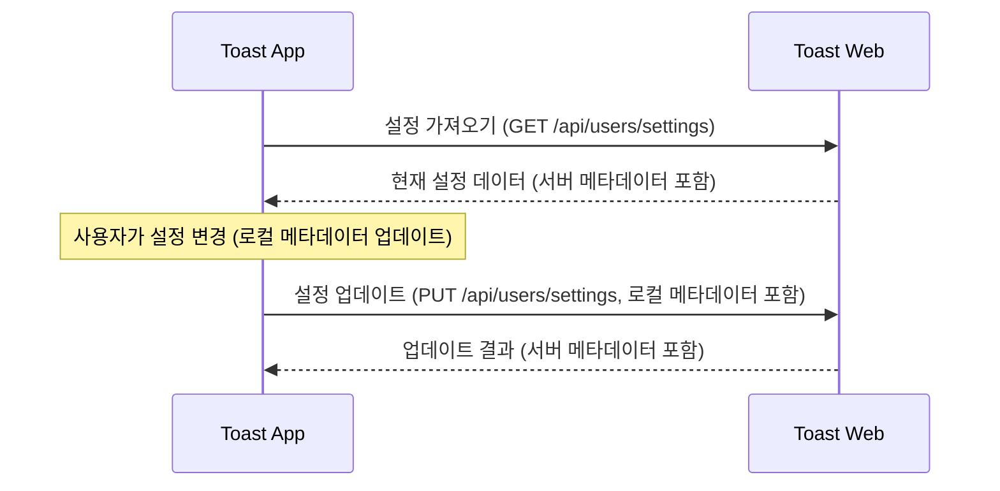

# 클라우드 동기화 가이드

이 문서는 Toast App과 Toast Web 간의 웹 API를 통한 클라우드 동기화 구현 방법을 설명합니다.

## 목차

- [개요](#개요)
- [인증 및 토큰 관리](#인증-및-토큰-관리)
- [기본 동기화 흐름](#기본-동기화-흐름)
- [동기화 API](#동기화-api)
- [구현 방법](#구현-방법)
- [문제 해결](#문제-해결)

## 개요

Toast App의 클라우드 동기화는 REST API 통신을 통해 설정 데이터를 서버(Toast Web)와 동기화합니다. 사용자가 여러 기기에서 일관된 설정을 유지할 수 있게 해주는 핵심 기능입니다. 동기화 시 데이터 일관성 확보와 충돌 해결이 중요합니다.

**핵심 이점:**
- 여러 기기에서 동일한 설정 사용
- 새 기기 설치 시 설정 복원 (충돌 해결 로직에 따라 최신 또는 병합된 설정 적용)
- 변경 사항 반영 (양방향 동기화)
- 무기한 토큰으로 지속적인 동기화 보장

## 인증 및 토큰 관리

클라우드 동기화를 위해서는 안정적인 인증 시스템이 필요합니다. Toast App은 OAuth 2.0 기반의 토큰 인증을 사용하며, 동기화 중단을 방지하기 위해 토큰 만료를 무기한으로 설정했습니다.

### 토큰 만료 설정

**서버 측 (toast-web):**
- 액세스/리프레시 토큰의 만료 정책은 서버가 결정합니다. 동기화 중단을 최소화하기 위해 매우 긴 만료 시간을 사용하지만, 정확한 값은 서버 설정에 따라 달라질 수 있습니다.

**클라이언트 측 (toast-app):**
- **기본 토큰 만료 시간**: 1년 (31,536,000초)
- **무기한 토큰 처리**: `TOKEN_EXPIRES_IN` 이 0 이하면 JavaScript 최대 날짜값(8640000000000000) 사용
- **환경 변수 지원**: `TOKEN_EXPIRES_IN` 환경 변수로 커스터마이징 가능

### 토큰 만료 처리 로직

```javascript
// 토큰 만료 확인 (무기한 토큰 지원)
async function isTokenExpired() {
  try {
    const expiresAt = await getStoredTokenExpiry();

    if (!expiresAt) {
      return true; // 만료 시간이 없으면 만료된 것으로 처리
    }

    // 무기한 토큰인 경우 (매우 먼 미래 날짜) 만료되지 않은 것으로 처리
    if (expiresAt >= 8640000000000000) {
      logger.info('Token is set to unlimited expiration');
      return false;
    }

    // 일반 토큰의 경우 현재 시간과 비교
    const now = Date.now();
    const safetyMargin = 30 * 1000; // 30초 안전 마진
    const isNearExpiry = now >= expiresAt - safetyMargin;

    if (isNearExpiry) {
      logger.info('Token is about to expire or already expired');
      return true;
    }

    return false;
  } catch (error) {
    logger.error('Error checking token expiration:', error);
    return true; // 오류 발생 시 안전을 위해 만료된 것으로 처리
  }
}

// 토큰 저장 (무기한 지원)
async function storeToken(token, expiresIn = 31536000) {
  try {
    let expiresAt;
    if (expiresIn <= 0) {
      // 0 이하 값은 무기한으로 처리
      expiresAt = 8640000000000000; // JavaScript 최대 날짜값
      logger.info('Token expiration time set to unlimited.');
    } else {
      expiresAt = Date.now() + expiresIn * 1000;
    }

    // 토큰과 만료 시간 저장
    const tokenData = readTokenFile() || {};
    tokenData[TOKEN_KEY] = token;
    tokenData[TOKEN_EXPIRES_KEY] = expiresAt;

    if (!writeTokenFile(tokenData)) {
      throw new Error('Failed to save token file');
    }

    logger.info(`Token saved successfully, expiration time: ${new Date(expiresAt).toLocaleString()}`);
  } catch (error) {
    logger.error('Failed to save token:', error);
    throw error;
  }
}
```

### 환경 변수 설정

토큰 만료 시간은 환경 변수로 커스터마이징할 수 있습니다:

```bash
# 1년 (기본값)
TOKEN_EXPIRES_IN=31536000

# 무기한 (0 이하 값)
TOKEN_EXPIRES_IN=0

# 커스텀 시간 (초 단위)
TOKEN_EXPIRES_IN=86400  # 1일
```

### 토큰 관리 모범 사례

1. **무기한 토큰 사용**: 동기화 중단 방지를 위해 토큰을 무기한으로 설정
2. **로컬 파일 저장**: 토큰을 로컬 JSON 파일(`auth-tokens.json`)에 평문으로 저장
3. **원자적 쓰기**: 파일 손상 방지를 위한 임시 파일 사용
4. **오류 처리**: 토큰 관련 오류 시 적절한 로깅 및 복구 로직
5. **보안 고려**: 토큰 파일 접근 권한 제한

## 기본 동기화 흐름


```mermaid
sequenceDiagram
    Toast App->>Toast Web: 설정 가져오기 (GET /api/users/settings)
    Toast Web-->>Toast App: 현재 설정 데이터 (서버 메타데이터 포함)

    Note over Toast App: 사용자가 설정 변경 (로컬 메타데이터 업데이트)

    Toast App->>Toast Web: 설정 업데이트 (PUT /api/users/settings, 로컬 메타데이터 포함)
    Toast Web-->>Toast App: 업데이트 결과 (서버 메타데이터 포함)
```

## 동기화 API

동기화 API는 서버(Toast Web)에서 제공하며, 클라이언트는 이 API를 통해 설정을 주고받습니다. 모든 API 요청에는 Bearer 토큰이 필요합니다.

### 설정 가져오기

```http
GET /api/users/settings HTTP/1.1
Host: app.toast.sh
Authorization: Bearer {access_token}
```

**응답:**
```json
{
  "success": true,
  "data": {
    "pages": [
      {
        "name": "메인",
        "buttons": [...]
      }
    ],
    "appearance": {
      "theme": "dark",
      "position": "center"
    },
    "advanced": {
      "launchAtLogin": true
    },
    "lastModifiedAt": 1682932130000,     // 마지막으로 로컬에서 설정이 수정된 시간
    "lastModifiedDevice": "device-id-1", // 마지막으로 설정을 수정한 기기 ID
    "lastSyncedAt": 1682932134590,       // 마지막으로 서버와 동기화된 시간
    "lastSyncedDevice": "device-id-1"    // 마지막으로 서버와 동기화한 기기 ID
  }
}
```
*참고: 서버 응답 구조는 구현에 따라 다를 수 있으며, 클라이언트는 `pages`가 최상위 또는 `data` 하위에 오는 형식을 모두 처리합니다.*

### 설정 업데이트

```http
PUT /api/users/settings HTTP/1.1
Host: app.toast.sh
Authorization: Bearer {access_token}
Content-Type: application/json

{
  "pages": [
    {
      "name": "메인 수정됨",
      "buttons": [...]
    }
  ],
  "appearance": {          // appearance 객체 전체를 동기화
    "theme": "dark",
    "position": "center"
  },
  "advanced": {            // advanced 객체 전체를 동기화
    "launchAtLogin": true
  },
  "lastModifiedAt": 1682932768123,     // 마지막으로 로컬에서 설정이 수정된 시간
  "lastModifiedDevice": "device-id-1", // 마지막으로 설정을 수정한 기기 ID
  "lastSyncedAt": 1682932769000,       // 이번 업로드(동기화) 시간
  "lastSyncedDevice": "device-id-1"    // 현재 기기 ID
}
```

**응답 (예시):**
```json
{
  "success": true,
  "data": {
    "message": "설정이 업데이트되었습니다",
    "lastSyncedAt": 1682932769000, // 서버에서 동기화가 완료된 시간
    // 업데이트된 전체 설정 또는 주요 메타데이터를 포함할 수 있음
    "settings": {
        "pages": [...],
        "appearance": {
            "theme": "dark"
        },
        "advanced": {
            "launchAtLogin": true
        },
        "lastModifiedAt": 1682932768123,
        "lastModifiedDevice": "device-id-1",
        "lastSyncedAt": 1682932769000,
        "lastSyncedDevice": "device-id-1"
    }
  }
}
```
*참고: API 응답 형식은 서버 구현에 따라 달라질 수 있으며, 클라이언트는 이에 맞춰 처리합니다.*

## 구현 방법

클라우드 동기화는 다음 모듈로 구성됩니다:

- **`src/main/cloud-sync.js`**: 동기화 오케스트레이션 — 변경 감지, 디바운싱, 재시도, 충돌 해결을 담당합니다.
- **`src/main/api/sync.js`**: 서버와의 HTTP 통신(`uploadSettings`, `downloadSettings`)과 동기화 가능 여부 판단(`isCloudSyncEnabled`)을 담당합니다. 동기화 시점 자격 판정은 `src/main/subscription.js`의 `isCloudSyncAllowed`에 위임합니다.
- **`src/main/cloud-sync/conflict-resolver.js`**: 충돌 분석(`analyzeConflict`)과 섹션별 병합(`mergePages`/`mergeAppearance`/`mergeAdvanced`)을 담당하는 순수 로직 모듈입니다.

ConfigStore가 단일 진실 원천(single source of truth)이며, `pages`·`appearance`·`advanced`가 동기화 대상입니다.

### 동기화 가능 조건

`isCloudSyncEnabled`는 다음을 모두 만족할 때 `true`를 반환합니다(`src/main/api/sync.js`):

- 유효한 인증 토큰 보유
- 구독 활성화(`subscription.isSubscribed` 또는 `subscription.active`)
- `cloud_sync` 기능 보유(`features.cloud_sync` 또는 `additionalFeatures.cloudSync`) **또는** 플랜 이름이 `premium`/`vip`로 시작

### 자동 동기화

`cloud-sync.js`는 ConfigStore의 `pages`·`appearance`·`advanced` 변경을 `onDidChange`로 감지합니다.

- **디바운스 업로드**: 변경 감지 시 `scheduleSync`가 `SYNC_DEBOUNCE_MS`(5초) 뒤에 업로드를 예약합니다. 짧은 시간 내 연속 변경은 마지막 변경 기준으로 병합됩니다.
- **재시도**: 업로드 실패 시 `uploadSettingsWithRetry`가 `RETRY_DELAY_MS`(5초) 간격으로 최대 `MAX_RETRY_COUNT`(3회)까지 재시도합니다. 단, 응답에 따라 다르게 처리합니다:
  - 업로드할 `pages`가 비어 있으면 서버 데이터 보호를 위해 업로드를 건너뜁니다(스킵, 재시도 없음).
  - `400`(검증 실패)은 재시도해도 동일하게 실패하므로 재시도하지 않습니다.
  - `409`(stale write)는 재시도 대신 서버 데이터를 내려받아 병합 후 재업로드하는 재조정(`reconcileStaleUpload`)을 예약합니다. 로컬 변경이 유실되지 않습니다.
- **주기적 동기화**: `SYNC_INTERVAL_MS`(15분)마다 서버에서 설정을 다운로드합니다(`startPeriodicSync`).
- **원격 적용 중 변경 감지 억제**: 다운로드·병합으로 원격 데이터를 ConfigStore에 쓰는 동안에는 변경 감지를 무시하여, 다운로드가 다시 업로드를 유발하는 피드백 루프를 차단합니다.

업로드 데이터에는 `pages`·`appearance`·`advanced`와 메타데이터(`lastModifiedAt`, `lastModifiedDevice`, `lastSyncedAt`, `lastSyncedDevice`)가 포함되며, 성공 시 `markAsSynced`로 동기화 메타데이터를 갱신합니다.

### 충돌 해결

수동 동기화(`syncSettings('resolve')`)는 서버 설정을 임시로 내려받아 `analyzeConflict`로 전략을 결정합니다. 로컬 `lastModifiedAt`과 서버 타임스탬프를 비교하며, 시간 차이가 `TIME_THRESHOLD`(60초) 이내이면 동일한 것으로 간주합니다.

- **`upload_local`**: 로컬이 더 최신 → 서버로 업로드
- **`download_server`**: 서버가 더 최신 → 서버에서 다운로드
- **`merge_required`**: 시간이 비슷한 동시 변경 → 병합 후 업로드

병합(`performIntelligentMerge`)은 페이지를 로컬 우선으로 유지하되(`mergePages`), 로컬 페이지의 버튼이 비어 있고 이름이 같은 서버 페이지에 버튼이 있으면 서버 버전을 유지해 데이터 유실을 막습니다. `appearance`·`advanced`는 로컬 값을 우선합니다(`mergeAppearance`/`mergeAdvanced`). 병합 후에는 `lastModifiedAt`이 서버 타임스탬프 이하이면 서버 값보다 크게 보정하여, 시계가 느린 기기가 stale write(409) 루프에 갇히지 않도록 합니다.

### 로그인 시 동기화

로그인 성공 후 `syncAfterLogin`이 먼저 서버 설정을 다운로드하고, 성공하면 토스트 창 UI에 갱신을 알립니다(`notifySettingsSynced`).

### 다운로드 검증 및 액션 승인

다른 기기에서 만든 `exec`/`script` 액션이 동기화로 내려와 임의 코드가 자동 실행되는 것을 막기 위해, 다운로드한 페이지에는 두 단계 보호가 적용됩니다 (`src/main/action-approval.js`).

1. **구조 검증** (`sanitizeRemotePages`): 저장 전에 모든 버튼 액션을 `validateAction`으로 검증하고, 유효하지 않은 액션은 제거합니다. 형식이 잘못되었거나 악의적인 동기화 데이터가 로컬 구성에 들어오지 못하게 합니다. 단, 빈 슬롯 버튼(자리표시자)은 검증 대상에서 제외하고 그대로 보존하여 페이지의 15슬롯 레이아웃이 유지됩니다.
2. **기기별 1회 승인** (`recordRemoteChanges` → `ensureApproved`): 원격 데이터에서 처음 나타난 위험 액션은 승인 대기 목록(`security.pendingApprovals`)에 등록됩니다. 해당 액션을 실행하는 시점에 확인 다이얼로그가 표시되며, 사용자가 승인하면 신뢰 목록(`security.trustedActions`)으로 이동해 이후 다이얼로그 없이 실행됩니다. 사용자가 거부하면 실행이 차단됩니다.

로컬에서 생성·편집한 액션은 저장 시 `trustCurrentConfig`로 신뢰 처리되므로 자신의 액션에 대해서는 승인을 요구받지 않습니다. 신뢰·대기 목록은 fingerprint 형태로 config `security` 키에 **기기 로컬로만** 저장되며 클라우드에 업로드되지 않습니다 (스키마는 [구성 스키마 – 보안](../config/schema.md#보안-기기-로컬) 참조).

## 충돌 해결 전략

여러 기기에서 동시에 설정을 변경할 경우 충돌이 발생할 수 있습니다. 효과적인 충돌 해결 전략이 중요합니다.

1.  **타임스탬프 기반 해결:**
    *   각 설정 항목(예: 페이지 객체) 및 전체 설정에 `lastModifiedAt` (로컬 최종 수정 시간)과 `lastSyncedAt` (서버 최종 동기화 시간) 같은 타임스탬프를 기록합니다.
    *   동기화 시 이 타임스탬프들을 비교하여 최신 데이터를 결정합니다.
2.  **항목 레벨 병합:**
    *   `pages`와 같은 배열 데이터의 경우, 배열 전체를 덮어쓰기보다 각 항목(페이지)에 고유 ID를 부여하고, ID별로 변경 사항(추가, 수정, 삭제)을 식별하여 병합합니다.
    *   이를 위해 각 페이지 객체 내에도 `lastModifiedAt`과 같은 메타데이터를 포함하는 것이 좋습니다.
3.  **사용자 알림 및 선택 (선택적):**
    *   자동으로 해결하기 어려운 복잡한 충돌 발생 시, 사용자에게 알리고 어떤 버전의 설정을 유지할지 선택하도록 할 수 있습니다. (구현 복잡도 높음)

## 문제 해결

| 문제 | 해결 방법 |
|------|-----------|
| 동기화 실패 | 인터넷 연결 확인, 재로그인 시도. 서버 API 응답 코드(4xx, 5xx) 및 오류 메시지 확인. |
| 설정 불일치 | 수동 동기화 실행 (예: `await downloadSettingsFromServer()` 후 필요한 경우 `await uploadSettingsToServer()`). 충돌 해결 로직 점검. |
| 인증 오류 (401) | 토큰 갱신 또는 재로그인. `getAccessToken()` 함수 및 토큰 저장/관리 로직 확인. 무기한 토큰 설정 확인. |
| 토큰 만료 | 무기한 토큰 설정이 적용되었는지 확인. 환경 변수 `TOKEN_EXPIRES_IN` 값 점검. |
| 잘못된 요청 (400) | 업로드하는 데이터의 형식 및 내용이 서버 API 요구사항과 일치하는지 확인. 앱은 400 응답을 재시도하지 않음. |
| 충돌 거부 (409) | 서버에 더 최신 데이터가 있는 상태(stale write). 앱이 자동으로 서버 데이터와 병합 후 재업로드하므로 별도 조치 불필요. |
| 서버 오류 (5xx) | 서버 측 문제일 가능성이 높음. 잠시 후 재시도 또는 관리자에게 문의. |

### 토큰 관련 문제 해결

**토큰 파일 확인:**
- macOS: `~/Library/Application Support/Toast/auth-tokens.json`
- Windows: `%APPDATA%\Toast\auth-tokens.json`

**토큰 상태 확인:**
```javascript
// 토큰 만료 시간 확인
const expiresAt = await getStoredTokenExpiry();
console.log('Token expires at:', new Date(expiresAt));

// 무기한 토큰 여부 확인
if (expiresAt >= 8640000000000000) {
  console.log('Token is set to unlimited expiration');
}
```

**로그 확인:**
- macOS: `~/Library/Application Support/Toast/logs/toast-app.log`
- Windows: `%APPDATA%\Toast\logs\toast-app.log`
- 개발자 도구 콘솔에서도 네트워크 요청/응답 및 로그 확인 가능.

### 동기화 상태 모니터링

정기적으로 동기화 상태를 모니터링하여 문제를 조기에 발견할 수 있습니다:

```javascript
// 동기화 상태 확인
async function checkSyncStatus() {
  const hasValidToken = await hasValidToken();
  const lastSync = configStore.get('lastSyncTime');
  const syncEnabled = configStore.get('cloudSync.enabled');

  return {
    authenticated: hasValidToken,
    lastSync: lastSync ? new Date(lastSync) : null,
    syncEnabled,
    tokenUnlimited: await isTokenUnlimited()
  };
}

// 무기한 토큰 여부 확인
async function isTokenUnlimited() {
  const expiresAt = await getStoredTokenExpiry();
  return expiresAt >= 8640000000000000;
}
