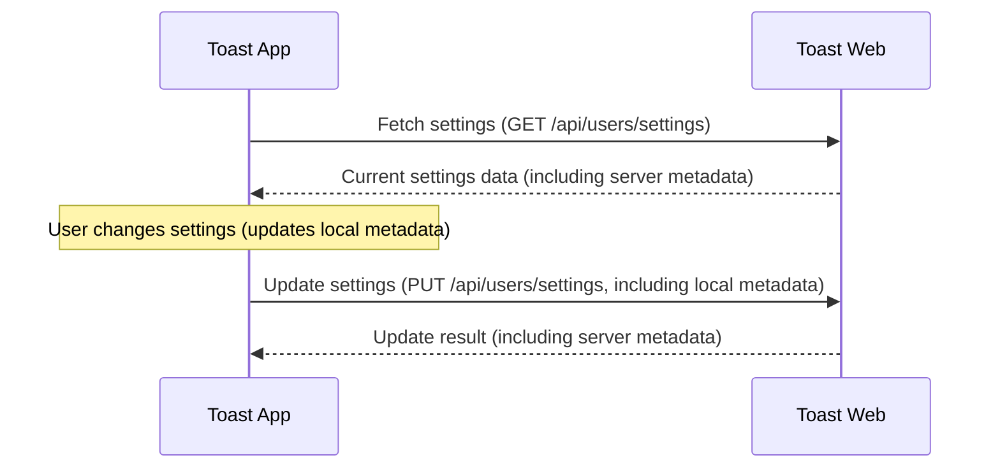

# Cloud Sync Guide

This document explains how cloud synchronization is implemented between Toast App and Toast Web via the web API.

## Table of Contents

- [Overview](#overview)
- [Authentication and Token Management](#authentication-and-token-management)
- [Basic Sync Flow](#basic-sync-flow)
- [Sync API](#sync-api)
- [Implementation](#implementation)
- [Troubleshooting](#troubleshooting)

## Overview

Toast App's cloud sync synchronizes configuration data with the server (Toast Web) through REST API communication. It is a core feature that lets users maintain consistent settings across multiple devices. Ensuring data consistency and resolving conflicts are critical during synchronization.

**Key Benefits:**
- Use the same settings across multiple devices
- Restore settings when installing on a new device (the latest or merged settings are applied according to the conflict-resolution logic)
- Reflect changes (two-way synchronization)
- Ensure continuous sync with unlimited tokens

## Authentication and Token Management

Cloud sync requires a reliable authentication system. Toast App uses OAuth 2.0-based token authentication, and to prevent sync interruptions, token expiration is set to unlimited.

### Token Expiration Settings

**Server side (toast-web):**
- The expiration policy for access/refresh tokens is determined by the server. Very long expiration times are used to minimize sync interruptions, but the exact values may vary depending on server configuration.

**Client side (toast-app):**
- **Default token expiration**: 1 year (31,536,000 seconds)
- **Unlimited token handling**: When `TOKEN_EXPIRES_IN` is negative, the JavaScript maximum date value (8640000000000000) is used (0 is falsy, so it falls back to the default of 1 year)
- **Environment variable support**: Customizable via the `TOKEN_EXPIRES_IN` environment variable

### Token Expiration Handling Logic

```javascript
// Check token expiration (supports unlimited tokens)
async function isTokenExpired() {
  try {
    const expiresAt = await getStoredTokenExpiry();

    if (!expiresAt) {
      return true; // Treat as expired if there is no expiration time
    }

    // For unlimited tokens (very far future date), treat as not expired
    if (expiresAt >= 8640000000000000) {
      logger.info('Token is set to unlimited expiration');
      return false;
    }

    // For regular tokens, compare with the current time
    const now = Date.now();
    const safetyMargin = 30 * 1000; // 30-second safety margin
    const isNearExpiry = now >= expiresAt - safetyMargin;

    if (isNearExpiry) {
      logger.info('Token is about to expire or already expired');
      return true;
    }

    return false;
  } catch (error) {
    logger.error('Error checking token expiration:', error);
    return true; // Treat as expired for safety if an error occurs
  }
}

// Store access and refresh tokens in a single atomic write (supports unlimited)
async function storeTokens(token, refreshToken, expiresIn = 31536000) {
  try {
    let expiresAt;
    if (expiresIn <= 0) {
      // Values of 0 or less are treated as unlimited
      expiresAt = 8640000000000000; // JavaScript maximum date value
      logger.info('Token expiration time set to unlimited.');
    } else {
      expiresAt = Date.now() + expiresIn * 1000;
    }

    // Store the token and expiration time together (readTokenFile/writeTokenFile
    // handle reading/writing the plaintext JSON file and setting 0600 permissions)
    const tokenData = readTokenFile() || {};
    tokenData[TOKEN_KEY] = token;
    if (refreshToken) {
      tokenData[REFRESH_TOKEN_KEY] = refreshToken;
    }
    tokenData[TOKEN_EXPIRES_KEY] = expiresAt;

    if (!writeTokenFile(tokenData)) {
      throw new Error('Failed to save token file');
    }

    logger.info(`Token saved successfully, expiration time: ${new Date(expiresAt).toLocaleString()}`);
  } catch (error) {
    logger.error('Failed to save token:', error);
    throw error;
  }
}
```

### Environment Variable Configuration

The token expiration time can be customized via an environment variable:

```bash
# 1 year (default)
TOKEN_EXPIRES_IN=31536000

# Unlimited (negative value — 0 falls back to the default of 1 year)
TOKEN_EXPIRES_IN=-1

# Custom time (in seconds)
TOKEN_EXPIRES_IN=86400  # 1 day
```

### Token Management Best Practices

1. **Use unlimited tokens**: Set tokens to unlimited to prevent sync interruptions
2. **Local file storage**: Store tokens in a local JSON file (`auth-tokens.json`) in plaintext, protected with owner-only read/write permissions (`0600`). OS-level secure stores such as the macOS Keychain are not used (see [Security](../architecture/security.md#token-management) for details). Legacy files that were previously encrypted with `safeStorage` are automatically recognized on read and migrated to plaintext.
3. **Atomic writes**: Store access and refresh tokens together in a single `storeTokens()` write (using a temporary file). Because the server rotates the refresh token on every renewal, storing the two tokens separately could leave only an already-discarded refresh token if a crash occurs in between, forcing a re-login.
4. **Error handling**: Appropriate logging and recovery logic for token-related errors
5. **Server revocation on logout**: On logout, send a revoke request for the stored refresh token to the server (`/oauth/revoke`) so it cannot be reused on the server even after the local file is deleted.

## Basic Sync Flow


```mermaid
sequenceDiagram
    Toast App->>Toast Web: Fetch settings (GET /api/users/settings)
    Toast Web-->>Toast App: Current settings data (including server metadata)

    Note over Toast App: User changes settings (updates local metadata)

    Toast App->>Toast Web: Update settings (PUT /api/users/settings, including local metadata)
    Toast Web-->>Toast App: Update result (including server metadata)
```

## Sync API

The sync API is provided by the server (Toast Web), and the client exchanges settings through this API. All API requests require a Bearer token.

### Fetch Settings

```http
GET /api/users/settings HTTP/1.1
Host: app.toast.sh
Authorization: Bearer {access_token}
```

**Response:**
```json
{
  "success": true,
  "data": {
    "pages": [
      {
        "name": "Main",
        "buttons": [...]
      }
    ],
    "appearance": {
      "theme": "dark",
      "position": "center"
    },
    "advanced": {
      "launchAtLogin": true
    },
    "lastModifiedAt": 1682932130000,     // Time settings were last modified locally
    "lastModifiedDevice": "device-id-1", // ID of the device that last modified settings
    "lastSyncedAt": 1682932134590,       // Time last synced with the server
    "lastSyncedDevice": "device-id-1"    // ID of the device that last synced with the server
  }
}
```
*Note: The server response structure may vary by implementation; the client handles both formats where `pages` appears at the top level or under `data`.*

### Update Settings

```http
PUT /api/users/settings HTTP/1.1
Host: app.toast.sh
Authorization: Bearer {access_token}
Content-Type: application/json

{
  "pages": [
    {
      "name": "Main Modified",
      "buttons": [...]
    }
  ],
  "appearance": {          // Sync the entire appearance object
    "theme": "dark",
    "position": "center"
  },
  "advanced": {            // Sync the entire advanced object
    "launchAtLogin": true
  },
  "lastModifiedAt": 1682932768123,     // Time settings were last modified locally
  "lastModifiedDevice": "device-id-1", // ID of the device that last modified settings
  "lastSyncedAt": 1682932769000,       // Time of this upload (sync)
  "lastSyncedDevice": "device-id-1"    // Current device ID
}
```

**Response (example):**
```json
{
  "success": true,
  "data": {
    "message": "Settings updated",
    "lastSyncedAt": 1682932769000, // Time the sync completed on the server
    // May include the full updated settings or key metadata
    "settings": {
        "pages": [...],
        "appearance": {
            "theme": "dark"
        },
        "advanced": {
            "launchAtLogin": true
        },
        "lastModifiedAt": 1682932768123,
        "lastModifiedDevice": "device-id-1",
        "lastSyncedAt": 1682932769000,
        "lastSyncedDevice": "device-id-1"
    }
  }
}
```
*Note: The API response format may vary by server implementation, and the client handles it accordingly.*

## Implementation

Cloud sync consists of the following modules:

- **`src/main/cloud-sync.js`**: Sync orchestration — responsible for change detection, debouncing, retries, and conflict resolution.
- **`src/main/api/sync.js`**: Responsible for HTTP communication with the server (`uploadSettings`, `downloadSettings`) and determining sync eligibility (`isCloudSyncEnabled`). Point-in-time eligibility decisions are delegated to `isCloudSyncAllowed` in `src/main/subscription.js`.
- **`src/main/cloud-sync/conflict-resolver.js`**: A pure logic module responsible for conflict analysis (`analyzeConflict`) and section-level merging (`mergePages`/`mergeButtons`/`mergeSnippets`/`mergeAppearance`/`mergeAdvanced`).

ConfigStore is the single source of truth, and `pages`, `snippets`, `appearance`, and `advanced` are the sync targets.

### Sync Eligibility Conditions

`isCloudSyncEnabled` returns `true` when all of the following are satisfied (`src/main/api/sync.js`):

- Holds a valid authentication token
- Subscription is active (`subscription.isSubscribed` or `subscription.active`)
- Has the `cloud_sync` feature (`features.cloud_sync` or `additionalFeatures.cloudSync`) **or** the plan name starts with `premium`/`vip` **or** `subscription.isVip` is `true`
- Exception: in development mode, the `Basic` plan is also allowed if it has the `cloud_sync` feature flag

### Automatic Sync

`cloud-sync.js` detects changes to `pages`, `snippets`, `appearance`, and `advanced` in ConfigStore via `onDidChange`.

- **Debounced upload**: When a change is detected, `scheduleSync` schedules an upload after `SYNC_DEBOUNCE_MS` (5 seconds). Consecutive changes within a short window are merged based on the last change.
- **Retry**: When an upload fails, `uploadSettingsWithRetry` retries. The delay is increased exponentially by `computeRetryDelay` based on the number of attempts (default 5s → 10s → 20s, capped by `MAX_RETRY_DELAY_MS` at 30 seconds) plus up to 20% random jitter, to prevent multiple devices that failed at the same moment from retrying simultaneously and colliding again. It retries up to `MAX_RETRY_COUNT` (3 times), and handles responses differently:
  - If both `pages` and `snippets` to upload are empty, the upload is skipped to protect server data (skip, no retry). Empty `pages` are rejected by the server, so `pages` is included in the payload only when there are pages.
  - `400` (validation failure) is not retried because it would fail identically on retry.
  - `409` (stale write) schedules a reconciliation (`reconcileStaleUpload`) that downloads server data, merges, and re-uploads instead of retrying. No local changes are lost.
- **Periodic sync**: Every `SYNC_INTERVAL_MS` (15 minutes), `syncSettings('resolve')` is called to sync through the conflict-resolution path (`startPeriodicSync`). Rather than unconditionally downloading server data, if there are local changes still waiting on the upload debounce, they are prioritized or merged.
- **Suppressing change detection during remote application**: While writing remote data to ConfigStore via download/merge, change detection is ignored to block the feedback loop where a download triggers another upload.

The upload data includes `pages`, `snippets`, `appearance`, `advanced`, and metadata (`lastModifiedAt`, `lastModifiedDevice`, `lastSyncedAt`, `lastSyncedDevice`), and on success, `markAsSynced` updates the sync metadata.

### Conflict Resolution

Manual sync (`syncSettings('resolve')`) temporarily downloads the server settings and uses `analyzeConflict` to decide the strategy. It compares the local `lastModifiedAt` with the server timestamp, and if the time difference is within `TIME_THRESHOLD` (60 seconds), they are considered identical.

- **`upload_local`**: Local is newer → upload to the server
- **`download_server`**: Server is newer → download from the server
- **`merge_required`**: Concurrent changes with similar times → merge then upload

Merging (`performIntelligentMerge`) keeps pages local-first (`mergePages`), but:
- If a local page's buttons are empty and a server page with the same name has buttons, the server version is kept to prevent data loss.
- If both local and server have buttons on a page with the same name, the page is not replaced entirely but **merged at the button level** (`mergeButtons`). Because the policy is name-based local-first plus appending server-only buttons, even if two devices add/modify different buttons on the same page at the same time, neither side's changes are lost wholesale.

Snippets are merged keyword-based local-first, preserving server-only keywords at the end (`mergeSnippets`). `appearance` and `advanced` prioritize local values (`mergeAppearance`/`mergeAdvanced`). After merging, if `lastModifiedAt` is less than or equal to the server timestamp, it is adjusted to be greater than the server value so that a device with a slow clock does not get stuck in a stale-write (409) loop.

### Sync on Login

After a successful login, `syncAfterLogin` synchronizes through the conflict-resolution path via `syncSettings('resolve')` (identical to periodic sync). If there are local edits made while offline between logins, server data is not unconditionally overwritten but uploaded/merged, and server settings are downloaded only when there are no local changes. On success, it notifies the toast window UI of the update (`notifySettingsSynced`).

### Download Validation and Action Approval

To prevent `exec`/`script` actions created on another device from being downloaded via sync and automatically executing arbitrary code, downloaded pages are subject to two-stage protection (`src/main/action-approval.js`).

1. **Structural validation** (`sanitizeRemotePages`): Before saving, all button actions are validated with `validateAction`, and invalid actions are removed. This prevents malformed or malicious sync data from entering the local configuration. However, empty-slot buttons (placeholders) are excluded from validation and preserved as-is, so the page's 15-slot layout is maintained.
2. **One-time per-device approval** (`recordRemoteChanges` → `ensureApproved`): Dangerous actions that first appear in remote data are registered in the pending-approval list (`security.pendingApprovals`). When such an action is executed, a confirmation dialog is shown; if the user approves, it moves to the trusted list (`security.trustedActions`) and runs without a dialog thereafter. If the user rejects, execution is blocked.

Actions created or edited locally are trusted via `trustCurrentConfig` when saved, so you are never asked to approve your own actions. The trusted and pending lists are stored as fingerprints under the config `security` key **device-locally only** and are not uploaded to the cloud (see [Configuration Schema – Security](../config/schema.md#security-device-local) for the schema).

## Conflict Resolution Strategy

When settings are changed simultaneously on multiple devices, conflicts can occur. An effective conflict-resolution strategy is important.

1.  **Timestamp-based resolution:**
    *   Record timestamps such as `lastModifiedAt` (local last-modified time) and `lastSyncedAt` (server last-synced time) on each settings item (e.g., a page object) and on the overall settings.
    *   During sync, compare these timestamps to determine the latest data.
2.  **Item-level merging:**
    *   For array data such as `pages`, rather than overwriting the entire array, assign a unique ID to each item (page) and identify and merge changes (additions, modifications, deletions) by ID.
    *   To support this, it is helpful to include metadata such as `lastModifiedAt` inside each page object as well.
3.  **User notification and choice (optional):**
    *   For complex conflicts that are hard to resolve automatically, you can notify the user and let them choose which version of the settings to keep. (High implementation complexity.)

## Troubleshooting

| Issue | Resolution |
|------|-----------|
| Sync failure | Check the internet connection and try logging in again. Check the server API response codes (4xx, 5xx) and error messages. |
| Settings mismatch | Run a manual sync (e.g., `await downloadSettingsFromServer()` followed by `await uploadSettingsToServer()` if needed). Review the conflict-resolution logic. |
| Authentication error (401) | Refresh the token or log in again. Check the `getAccessToken()` function and the token storage/management logic. Verify the unlimited token setting. |
| Token expiration | Verify that the unlimited token setting is applied. Check the value of the `TOKEN_EXPIRES_IN` environment variable. |
| Bad request (400) | Verify that the format and content of the uploaded data match the server API requirements. The app does not retry 400 responses. |
| Conflict rejected (409) | The server has newer data (stale write). The app automatically merges with server data and re-uploads, so no separate action is needed. |
| Server error (5xx) | Likely a server-side problem. Retry after a while or contact the administrator. |

### Troubleshooting Token Issues

**Check the token file:**
- macOS: `~/Library/Application Support/Toast/auth-tokens.json`
- Windows: `%APPDATA%\Toast\auth-tokens.json`

**Check the token status:**
```javascript
// Check the token expiration time
const expiresAt = await getStoredTokenExpiry();
console.log('Token expires at:', new Date(expiresAt));

// Check whether the token is unlimited
if (expiresAt >= 8640000000000000) {
  console.log('Token is set to unlimited expiration');
}
```

**Check the logs:**
- macOS: `~/Library/Application Support/Toast/logs/toast-app.log`
- Windows: `%APPDATA%\Toast\logs\toast-app.log`
- Network requests/responses and logs can also be checked in the DevTools console.

### Monitoring Sync Status

You can monitor sync status regularly to catch problems early:

```javascript
// Check sync status
async function checkSyncStatus() {
  const hasValidToken = await hasValidToken();
  const lastSync = configStore.get('lastSyncTime');
  const syncEnabled = configStore.get('cloudSync.enabled');

  return {
    authenticated: hasValidToken,
    lastSync: lastSync ? new Date(lastSync) : null,
    syncEnabled,
    tokenUnlimited: await isTokenUnlimited()
  };
}

// Check whether the token is unlimited
async function isTokenUnlimited() {
  const expiresAt = await getStoredTokenExpiry();
  return expiresAt >= 8640000000000000;
}
```
